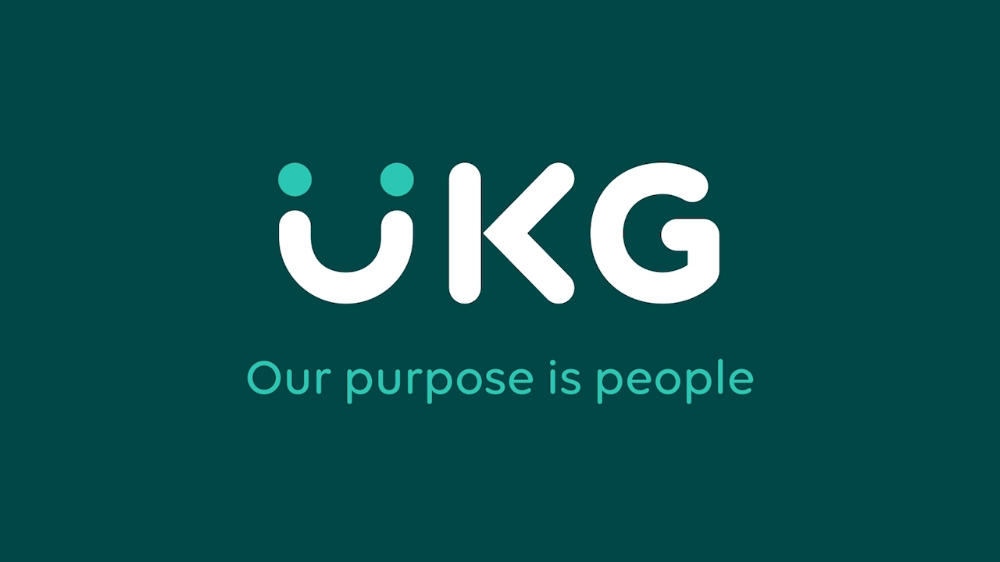

<div align="center">

[](https://ukg.com)

# [Ukg](https://ukg.com)<a id="ukg"></a>

Configure your UKG Pro Configuration Codes through UKG Pro APIs. Status: R1 deployment

</div>

## Table of Contents<a id="table-of-contents"></a>

<!-- toc -->

- [Installation](#installation)
- [Getting Started](#getting-started)
- [Reference](#reference)
  * [`ukg.activities.getAll`](#ukgactivitiesgetall)
  * [`ukg.assignedHolidays.getAll`](#ukgassignedholidaysgetall)
  * [`ukg.auditDetails.getData`](#ukgauditdetailsgetdata)
  * [`ukg.businessRuleImportTool.businessRuleImportFileUpload`](#ukgbusinessruleimporttoolbusinessruleimportfileupload)
  * [`ukg.businessRuleImportTool.getFileUploadStatus`](#ukgbusinessruleimporttoolgetfileuploadstatus)
  * [`ukg.businessRuleImportTool.getStagingStatus`](#ukgbusinessruleimporttoolgetstagingstatus)
  * [`ukg.businessRuleImportTool.importsBusinessRuleStagingData`](#ukgbusinessruleimporttoolimportsbusinessrulestagingdata)
  * [`ukg.businessStructureStatus.listEmployeesChangeBusinessStructure`](#ukgbusinessstructurestatuslistemployeeschangebusinessstructure)
  * [`ukg.candidateRequest.addBackgroundCheck`](#ukgcandidaterequestaddbackgroundcheck)
  * [`ukg.candidateRequest.updateBackgroundCheck`](#ukgcandidaterequestupdatebackgroundcheck)
  * [`ukg.changesByDate.getAllEmployeeChangesSinceLastCall`](#ukgchangesbydategetallemployeechangessincelastcall)
  * [`ukg.codeTables.createCodeTables`](#ukgcodetablescreatecodetables)
  * [`ukg.codeTables.getInfo`](#ukgcodetablesgetinfo)
  * [`ukg.companyDetails.getCompanyDetails`](#ukgcompanydetailsgetcompanydetails)
  * [`ukg.companyPayStatement.getByDateRange`](#ukgcompanypaystatementgetbydaterange)
  * [`ukg.companyPayStatement.getPaySummaries`](#ukgcompanypaystatementgetpaysummaries)
  * [`ukg.compensationDetails.getAllByCompany`](#ukgcompensationdetailsgetallbycompany)
  * [`ukg.compensationDetails.getAllDetails`](#ukgcompensationdetailsgetalldetails)
  * [`ukg.compensationDetails.getByCompanyAndEmployee`](#ukgcompensationdetailsgetbycompanyandemployee)
  * [`ukg.compensationDetails.getByEmployee`](#ukgcompensationdetailsgetbyemployee)
  * [`ukg.contact.getPersonnelContactDetails`](#ukgcontactgetpersonnelcontactdetails)
  * [`ukg.contact.getPersonnelDetails`](#ukgcontactgetpersonneldetails)
  * [`ukg.dependentDeductions.get`](#ukgdependentdeductionsget)
  * [`ukg.directDeposit.listDirectDepositDetailsByCompany`](#ukgdirectdepositlistdirectdepositdetailsbycompany)
  * [`ukg.directDeposit.listEmployeeDirectDepositDetails`](#ukgdirectdepositlistemployeedirectdepositdetails)
  * [`ukg.earnings.addTimeClockData`](#ukgearningsaddtimeclockdata)
  * [`ukg.earnings.deleteEarning`](#ukgearningsdeleteearning)
  * [`ukg.earnings.getConfigurationsFilteredByParameter`](#ukgearningsgetconfigurationsfilteredbyparameter)
  * [`ukg.earnings.getStatusDetails`](#ukgearningsgetstatusdetails)
  * [`ukg.earnings.listEarningsConfigurations`](#ukgearningslistearningsconfigurations)
  * [`ukg.earnings.specificConfigurationGet`](#ukgearningsspecificconfigurationget)
  * [`ukg.earningsHistory.getInsRate`](#ukgearningshistorygetinsrate)
  * [`ukg.empDedBenOptionDate.get`](#ukgempdedbenoptiondateget)
  * [`ukg.empDeductions.list`](#ukgempdeductionslist)
  * [`ukg.empGlobalLocalizationElement.get`](#ukgempgloballocalizationelementget)
  * [`ukg.empMultiplePositions.get`](#ukgempmultiplepositionsget)
  * [`ukg.employeeChanges.get`](#ukgemployeechangesget)
  * [`ukg.employeeDeductionHistoryEffectiveDate.getByDeductionCodeAndField`](#ukgemployeedeductionhistoryeffectivedategetbydeductioncodeandfield)
  * [`ukg.employeeDemographicDetails.get`](#ukgemployeedemographicdetailsget)
  * [`ukg.employeeIdLookup.byCompanyIds`](#ukgemployeeidlookupbycompanyids)
  * [`ukg.employeeJobs.getAll`](#ukgemployeejobsgetall)
  * [`ukg.employeeSecurityUserDetails.getDetails`](#ukgemployeesecurityuserdetailsgetdetails)
  * [`ukg.employeeCobraDetails.get`](#ukgemployeecobradetailsget)
  * [`ukg.employeeContract.get`](#ukgemployeecontractget)
  * [`ukg.employeeEducation.get`](#ukgemployeeeducationget)
  * [`ukg.employeeEmploymentDetails.getDetails`](#ukgemployeeemploymentdetailsgetdetails)
  * [`ukg.employeeExtendedElements.get`](#ukgemployeeextendedelementsget)
  * [`ukg.employeeGlobalBank.get`](#ukgemployeeglobalbankget)
  * [`ukg.employeeJobHistoryDetail.get`](#ukgemployeejobhistorydetailget)
  * [`ukg.employeeJobHistoryDetail.getSingleRecord`](#ukgemployeejobhistorydetailgetsinglerecord)
  * [`ukg.employeeMultiPhoneNumbers.get`](#ukgemployeemultiphonenumbersget)
  * [`ukg.employeeMultipleJobsOPP.listDetails`](#ukgemployeemultiplejobsopplistdetails)
  * [`ukg.employeePayDeductionElement.get`](#ukgemployeepaydeductionelementget)
  * [`ukg.employeePayStatement.getByDateRange`](#ukgemployeepaystatementgetbydaterange)
  * [`ukg.employeePayStatement.getByPayIdentifier`](#ukgemployeepaystatementgetbypayidentifier)
  * [`ukg.employeePayStatement.getLastPayStatement`](#ukgemployeepaystatementgetlastpaystatement)
  * [`ukg.employeeSupervisorDetails.get`](#ukgemployeesupervisordetailsget)
  * [`ukg.employees.getAll`](#ukgemployeesgetall)
  * [`ukg.employmentDetails.getByCompanyIdAndEmployeeId`](#ukgemploymentdetailsgetbycompanyidandemployeeid)
  * [`ukg.employmentDetails.getDetails`](#ukgemploymentdetailsgetdetails)
  * [`ukg.employmentDetails.listByCompany`](#ukgemploymentdetailslistbycompany)
  * [`ukg.generalLedgerRunDetailsV2.get`](#ukggeneralledgerrundetailsv2get)
  * [`ukg.generalLedgerRunDetailsV2.getByRunId`](#ukggeneralledgerrundetailsv2getbyrunid)
  * [`ukg.getAllPtoPlans.information`](#ukggetallptoplansinformation)
  * [`ukg.getJobPostings.details`](#ukggetjobpostingsdetails)
  * [`ukg.getSpecificEmployeesPtoPlans.info`](#ukggetspecificemployeesptoplansinfo)
  * [`ukg.getSpecificPtoPlan.info`](#ukggetspecificptoplaninfo)
  * [`ukg.hourTypes.obtainAll`](#ukghourtypesobtainall)
  * [`ukg.importTool.getStatus`](#ukgimporttoolgetstatus)
  * [`ukg.importTool.post`](#ukgimporttoolpost)
  * [`ukg.insRate.getInsRate`](#ukginsrategetinsrate)
  * [`ukg.integrationAuditConfiguration.getData`](#ukgintegrationauditconfigurationgetdata)
  * [`ukg.internationalEmployee.get`](#ukginternationalemployeeget)
  * [`ukg.internationalEmployee.getDetails`](#ukginternationalemployeegetdetails)
  * [`ukg.jobGroup.get`](#ukgjobgroupget)
  * [`ukg.kronosEmployeeProfiles.getList`](#ukgkronosemployeeprofilesgetlist)
  * [`ukg.kronosEmployeeStatus.get`](#ukgkronosemployeestatusget)
  * [`ukg.nationalDocument.get`](#ukgnationaldocumentget)
  * [`ukg.newHires.createSingleNewHire`](#ukgnewhirescreatesinglenewhire)
  * [`ukg.newHires.getById`](#ukgnewhiresgetbyid)
  * [`ukg.openEnrollmentDependentDeductions.getData`](#ukgopenenrollmentdependentdeductionsgetdata)
  * [`ukg.openEnrollmentEmployeeDeductions.getAuditDetails`](#ukgopenenrollmentemployeedeductionsgetauditdetails)
  * [`ukg.optionRate.getData`](#ukgoptionrategetdata)
  * [`ukg.orderRequests.backgroundCheckDetails`](#ukgorderrequestsbackgroundcheckdetails)
  * [`ukg.organizationReportingCategory.get`](#ukgorganizationreportingcategoryget)
  * [`ukg.ptoPlanPatch.onePtoPlan`](#ukgptoplanpatchoneptoplan)
  * [`ukg.ptoPlanPost.ultiproRecord`](#ukgptoplanpostultiprorecord)
  * [`ukg.payGroupPayPeriod.getPayGroupPayPeriod`](#ukgpaygrouppayperiodgetpaygrouppayperiod)
  * [`ukg.payRegister.get`](#ukgpayregisterget)
  * [`ukg.payrollDeductionsHistory.get`](#ukgpayrolldeductionshistoryget)
  * [`ukg.personDetails.getAllDetails`](#ukgpersondetailsgetalldetails)
  * [`ukg.personDetails.getSingleCompanyDetails`](#ukgpersondetailsgetsinglecompanydetails)
  * [`ukg.personDetails.getSingleDetailRecord`](#ukgpersondetailsgetsingledetailrecord)
  * [`ukg.personDetails.getSingleRecord`](#ukgpersondetailsgetsinglerecord)
  * [`ukg.platformConfigurationCustomFieldsSchema.getFieldsSchema`](#ukgplatformconfigurationcustomfieldsschemagetfieldsschema)
  * [`ukg.positionReport.get`](#ukgpositionreportget)
  * [`ukg.positions.listFiltered`](#ukgpositionslistfiltered)
  * [`ukg.postNewTokenRequest.obtainOAuthToken`](#ukgpostnewtokenrequestobtainoauthtoken)
  * [`ukg.rolesGet.securityRoles`](#ukgrolesgetsecurityroles)
  * [`ukg.scheduleDetails.publishDetails`](#ukgscheduledetailspublishdetails)
  * [`ukg.shiftCode.getData`](#ukgshiftcodegetdata)
  * [`ukg.singleOrganizationLevel.get`](#ukgsingleorganizationlevelget)
  * [`ukg.singleOrganizationLevel.updateOrgLevel`](#ukgsingleorganizationlevelupdateorglevel)
  * [`ukg.singleOrganizationLevel.updateProperties`](#ukgsingleorganizationlevelupdateproperties)
  * [`ukg.taxGroups.getAllDetails`](#ukgtaxgroupsgetalldetails)
  * [`ukg.teams.getAll`](#ukgteamsgetall)
  * [`ukg.timeCodes.getAll`](#ukgtimecodesgetall)
  * [`ukg.timeOffRequests.getAll`](#ukgtimeoffrequestsgetall)
  * [`ukg.utaEmployee.getByCoIdAndEeId`](#ukgutaemployeegetbycoidandeeid)
  * [`ukg.userPreferences.getUserPreferencesDetails`](#ukguserpreferencesgetuserpreferencesdetails)
  * [`ukg.userProfileDetails.getAllDetails`](#ukguserprofiledetailsgetalldetails)
  * [`ukg.userDefinedFields.get`](#ukguserdefinedfieldsget)
  * [`ukg.userDefinedFields.getSingleCompany`](#ukguserdefinedfieldsgetsinglecompany)
  * [`ukg.userDefinedFields.getSingleEmployee`](#ukguserdefinedfieldsgetsingleemployee)
  * [`ukg.userDetails.getUserDetails`](#ukguserdetailsgetuserdetails)
  * [`ukg.viewOrCreateOrganizationLevels.createOrgLevelConfig`](#ukgvieworcreateorganizationlevelscreateorglevelconfig)
  * [`ukg.viewOrCreateOrganizationLevels.getAllOrgLevels`](#ukgvieworcreateorganizationlevelsgetallorglevels)
  * [`ukg.allergy.configurationsGet`](#ukgallergyconfigurationsget)
  * [`ukg.allergy.createConfiguration`](#ukgallergycreateconfiguration)
  * [`ukg.allergy.updateSingleConfiguration`](#ukgallergyupdatesingleconfiguration)
  * [`ukg.awardType.createConfiguration`](#ukgawardtypecreateconfiguration)
  * [`ukg.awardType.getAllConfigurations`](#ukgawardtypegetallconfigurations)
  * [`ukg.awardType.updateConfiguration`](#ukgawardtypeupdateconfiguration)
  * [`ukg.careerProvider.createConfigurationUkgPro`](#ukgcareerprovidercreateconfigurationukgpro)
  * [`ukg.careerProvider.getConfigurations`](#ukgcareerprovidergetconfigurations)
  * [`ukg.careerProvider.updateConfiguration`](#ukgcareerproviderupdateconfiguration)
  * [`ukg.childSupportType.createConfigurationUkgPro`](#ukgchildsupporttypecreateconfigurationukgpro)
  * [`ukg.childSupportType.getConfigurations`](#ukgchildsupporttypegetconfigurations)
  * [`ukg.childSupportType.updateConfiguration`](#ukgchildsupporttypeupdateconfiguration)
  * [`ukg.cobraStatus.createConfiguration`](#ukgcobrastatuscreateconfiguration)
  * [`ukg.cobraStatus.getConfigurations`](#ukgcobrastatusgetconfigurations)
  * [`ukg.cobraStatus.updateSingleConfiguration`](#ukgcobrastatusupdatesingleconfiguration)
  * [`ukg.companyProperty.createConfigurationUkgPro`](#ukgcompanypropertycreateconfigurationukgpro)
  * [`ukg.companyProperty.getConfigurations`](#ukgcompanypropertygetconfigurations)
  * [`ukg.companyProperty.updateConfiguration`](#ukgcompanypropertyupdateconfiguration)
  * [`ukg.courseCategory.createConfigurationUkgPro`](#ukgcoursecategorycreateconfigurationukgpro)
  * [`ukg.courseCategory.getAllConfigurations`](#ukgcoursecategorygetallconfigurations)
  * [`ukg.courseCategory.updateConfiguration`](#ukgcoursecategoryupdateconfiguration)
  * [`ukg.courseDeliveryMet.createConfigurationUkgPro`](#ukgcoursedeliverymetcreateconfigurationukgpro)
  * [`ukg.courseDeliveryMet.getConfigurations`](#ukgcoursedeliverymetgetconfigurations)
  * [`ukg.courseDeliveryMet.updateConfiguration`](#ukgcoursedeliverymetupdateconfiguration)
  * [`ukg.courseSubCategory.createConfigurationUkgPro`](#ukgcoursesubcategorycreateconfigurationukgpro)
  * [`ukg.courseSubCategory.getConfigurations`](#ukgcoursesubcategorygetconfigurations)
  * [`ukg.courseSubCategory.updateConfiguration`](#ukgcoursesubcategoryupdateconfiguration)
  * [`ukg.disability.createConfigurationUkgPro`](#ukgdisabilitycreateconfigurationukgpro)
  * [`ukg.disability.getConfigurations`](#ukgdisabilitygetconfigurations)
  * [`ukg.disability.updateConfiguration`](#ukgdisabilityupdateconfiguration)
  * [`ukg.employeeType.createConfigurationUkgPro`](#ukgemployeetypecreateconfigurationukgpro)
  * [`ukg.employeeType.getConfigurations`](#ukgemployeetypegetconfigurations)
  * [`ukg.employeeType.updateConfiguration`](#ukgemployeetypeupdateconfiguration)
  * [`ukg.jobFamily.createConfiguration`](#ukgjobfamilycreateconfiguration)
  * [`ukg.jobFamily.getAllConfigurations`](#ukgjobfamilygetallconfigurations)
  * [`ukg.jobFamily.updateConfiguration`](#ukgjobfamilyupdateconfiguration)
  * [`ukg.jobs.getAllConfigurations`](#ukgjobsgetallconfigurations)
  * [`ukg.jobs.getConfiguration`](#ukgjobsgetconfiguration)
  * [`ukg.licenseType.createConfiguration`](#ukglicensetypecreateconfiguration)
  * [`ukg.licenseType.getConfigurations`](#ukglicensetypegetconfigurations)
  * [`ukg.licenseType.updateConfiguration`](#ukglicensetypeupdateconfiguration)
  * [`ukg.loanType.createConfiguration`](#ukgloantypecreateconfiguration)
  * [`ukg.loanType.getConfigurations`](#ukgloantypegetconfigurations)
  * [`ukg.loanType.updateConfiguration`](#ukgloantypeupdateconfiguration)
  * [`ukg.locations.getConfiguration`](#ukglocationsgetconfiguration)
  * [`ukg.locations.getConfigurations`](#ukglocationsgetconfigurations)
  * [`ukg.maritalStatus.createConfigurationUkgPro`](#ukgmaritalstatuscreateconfigurationukgpro)
  * [`ukg.maritalStatus.getConfigurations`](#ukgmaritalstatusgetconfigurations)
  * [`ukg.maritalStatus.updateConfiguration`](#ukgmaritalstatusupdateconfiguration)
  * [`ukg.militaryBranches.configureUkgPro`](#ukgmilitarybranchesconfigureukgpro)
  * [`ukg.militaryBranches.getAllConfigurations`](#ukgmilitarybranchesgetallconfigurations)
  * [`ukg.militaryBranches.updateConfiguration`](#ukgmilitarybranchesupdateconfiguration)
  * [`ukg.militaryEra.createConfigurationUkgPro`](#ukgmilitaryeracreateconfigurationukgpro)
  * [`ukg.militaryEra.getConfigurations`](#ukgmilitaryeragetconfigurations)
  * [`ukg.militaryEra.updateConfiguration`](#ukgmilitaryeraupdateconfiguration)
  * [`ukg.namePrefix.configureNamePrefix`](#ukgnameprefixconfigurenameprefix)
  * [`ukg.namePrefix.getConfigurations`](#ukgnameprefixgetconfigurations)
  * [`ukg.namePrefix.updateConfiguration`](#ukgnameprefixupdateconfiguration)
  * [`ukg.otherPhoneTypes.createConfigurationUkgPro`](#ukgotherphonetypescreateconfigurationukgpro)
  * [`ukg.otherPhoneTypes.getConfigurations`](#ukgotherphonetypesgetconfigurations)
  * [`ukg.otherPhoneTypes.updateConfiguration`](#ukgotherphonetypesupdateconfiguration)
  * [`ukg.project.createConfiguration`](#ukgprojectcreateconfiguration)
  * [`ukg.project.getAllConfigurations`](#ukgprojectgetallconfigurations)
  * [`ukg.project.updateConfiguration`](#ukgprojectupdateconfiguration)
  * [`ukg.school.createConfiguration`](#ukgschoolcreateconfiguration)
  * [`ukg.school.getConfigurations`](#ukgschoolgetconfigurations)
  * [`ukg.school.updateConfiguration`](#ukgschoolupdateconfiguration)
  * [`ukg.skillProficiencyLevel.createConfigurationUkgPro`](#ukgskillproficiencylevelcreateconfigurationukgpro)
  * [`ukg.skillProficiencyLevel.getAllConfigurations`](#ukgskillproficiencylevelgetallconfigurations)
  * [`ukg.skillProficiencyLevel.updateConfiguration`](#ukgskillproficiencylevelupdateconfiguration)
  * [`ukg.skills.createConfiguration`](#ukgskillscreateconfiguration)
  * [`ukg.skills.getConfigurations`](#ukgskillsgetconfigurations)
  * [`ukg.skills.updateConfiguration`](#ukgskillsupdateconfiguration)
  * [`ukg.termType.createConfiguration`](#ukgtermtypecreateconfiguration)
  * [`ukg.termType.getConfigurations`](#ukgtermtypegetconfigurations)
  * [`ukg.termType.updateConfiguration`](#ukgtermtypeupdateconfiguration)
  * [`ukg.time.addTimeEntries`](#ukgtimeaddtimeentries)
  * [`ukg.time.getPendingTransactions`](#ukgtimegetpendingtransactions)
  * [`ukg.time.getProcessedTransactions`](#ukgtimegetprocessedtransactions)
  * [`ukg.time.getWorkSummaries`](#ukgtimegetworksummaries)
  * [`ukg.time.getWorkSummaryById`](#ukgtimegetworksummarybyid)
  * [`ukg.v1PlatformConfigurationCustomFieldsData.getFieldsData`](#ukgv1platformconfigurationcustomfieldsdatagetfieldsdata)
  * [`ukg.v2PlatformConfigurationCustomFieldsData.getFieldsData`](#ukgv2platformconfigurationcustomfieldsdatagetfieldsdata)
  * [`ukg.waiveReason.createConfigurationUkgPro`](#ukgwaivereasoncreateconfigurationukgpro)
  * [`ukg.waiveReason.getConfigurations`](#ukgwaivereasongetconfigurations)
  * [`ukg.waiveReason.updateSingleConfiguration`](#ukgwaivereasonupdatesingleconfiguration)

<!-- tocstop -->

## Installation<a id="installation"></a>
<div align="center">
  <a href="https://konfigthis.com/sdk-sign-up?company=UKG&language=TypeScript">
    
  </a>
</div>

## Getting Started<a id="getting-started"></a>

```typescript
import { Ukg } from "ukg-typescript-sdk";

const ukg = new Ukg({
  // Defining the base path is optional and defaults to http://http:
  // basePath: "http://http:",
  apiKey: "API_KEY",
});

const getAllResponse = await ukg.activities.getAll();

console.log(getAllResponse);
```

## Reference<a id="reference"></a>


### `ukg.activities.getAll`<a id="ukgactivitiesgetall"></a>

Obtains all activities.

#### 🛠️ Usage<a id="🛠️-usage"></a>

```typescript
const getAllResponse = await ukg.activities.getAll();
```

#### 🔄 Return<a id="🔄-return"></a>

[ResultDtoActivityDto](./models/result-dto-activity-dto.ts)

#### 🌐 Endpoint<a id="🌐-endpoint"></a>

`/simpleschedule/activities` `GET`

[🔙 **Back to Table of Contents**](#table-of-contents)

---


### `ukg.assignedHolidays.getAll`<a id="ukgassignedholidaysgetall"></a>

Obtains all assigned holidays for a given employee.  Employee can be specified by their emp_name or emp_id.  At least one parameter must be specified.

#### 🛠️ Usage<a id="🛠️-usage"></a>

```typescript
const getAllResponse = await ukg.assignedHolidays.getAll({
  from: "1970-01-01T00:00:00.00Z",
  to: "1970-01-01T00:00:00.00Z",
});
```

#### ⚙️ Parameters<a id="⚙️-parameters"></a>

##### from: `string`<a id="from-string"></a>

Start range for holidays

##### to: `string`<a id="to-string"></a>

End range for holidays

##### empName: `string`<a id="empname-string"></a>

##### empId: `number`<a id="empid-number"></a>

#### 🔄 Return<a id="🔄-return"></a>

[ResultDtoHolidayDto](./models/result-dto-holiday-dto.ts)

#### 🌐 Endpoint<a id="🌐-endpoint"></a>

`/simpleschedule/assigned_holidays` `GET`

[🔙 **Back to Table of Contents**](#table-of-contents)

---


### `ukg.auditDetails.getData`<a id="ukgauditdetailsgetdata"></a>

If no pagination parameters specified, the default/max is applied. Permissions - UKG Pro service account must have \"View\" role for the \"Personnel Integration\" Web Service. Headers - US-Customer-Api-Key, Authorization (base64 encoded {username}:{password}) .

#### 🛠️ Usage<a id="🛠️-usage"></a>

```typescript
const getDataResponse = await ukg.auditDetails.getData({
  startDateTime: "1970-01-01T00:00:00.00Z",
  endDateTime: "1970-01-01T00:00:00.00Z",
  tableName: "tableName_example",
  fieldName: "fieldName_example",
});
```

#### ⚙️ Parameters<a id="⚙️-parameters"></a>

##### startDateTime: `string`<a id="startdatetime-string"></a>

##### endDateTime: `string`<a id="enddatetime-string"></a>

##### tableName: `string`<a id="tablename-string"></a>

##### fieldName: `string`<a id="fieldname-string"></a>

##### action: `string`<a id="action-string"></a>

##### page: `number`<a id="page-number"></a>

##### perPage: `number`<a id="perpage-number"></a>

#### 🔄 Return<a id="🔄-return"></a>

[AuditDetails](./models/audit-details.ts)

#### 🌐 Endpoint<a id="🌐-endpoint"></a>

`/personnel/v1/audit-details` `GET`

[🔙 **Back to Table of Contents**](#table-of-contents)

---


### `ukg.businessRuleImportTool.businessRuleImportFileUpload`<a id="ukgbusinessruleimporttoolbusinessruleimportfileupload"></a>

Takes an XML transaction and feeds it into the Business Rule Import Tool

#### 🛠️ Usage<a id="🛠️-usage"></a>

```typescript
const businessRuleImportFileUploadResponse =
  await ukg.businessRuleImportTool.businessRuleImportFileUpload({});
```

#### ⚙️ Parameters<a id="⚙️-parameters"></a>

##### transaction: `string`<a id="transaction-string"></a>

The XML Serialized transaction

##### uniqueFileName: `string`<a id="uniquefilename-string"></a>

An optionally provided unique file name

#### 🌐 Endpoint<a id="🌐-endpoint"></a>

`/configuration/v1/businessruleimport-tool/fileupload` `POST`

[🔙 **Back to Table of Contents**](#table-of-contents)

---


### `ukg.businessRuleImportTool.getFileUploadStatus`<a id="ukgbusinessruleimporttoolgetfileuploadstatus"></a>

Retrieves the status of an Business Rule Import Tool transaction

#### 🛠️ Usage<a id="🛠️-usage"></a>

```typescript
const getFileUploadStatusResponse =
  await ukg.businessRuleImportTool.getFileUploadStatus({
    fileId: "fileId_example",
  });
```

#### ⚙️ Parameters<a id="⚙️-parameters"></a>

##### fileId: `string`<a id="fileid-string"></a>

#### 🔄 Return<a id="🔄-return"></a>

[FileStatusModel](./models/file-status-model.ts)

#### 🌐 Endpoint<a id="🌐-endpoint"></a>

`/configuration/v1/businessruleimport-tool/filestatus/{fileId}` `GET`

[🔙 **Back to Table of Contents**](#table-of-contents)

---


### `ukg.businessRuleImportTool.getStagingStatus`<a id="ukgbusinessruleimporttoolgetstagingstatus"></a>

Retrieves the status of an Business Rule Import Tool transaction

#### 🛠️ Usage<a id="🛠️-usage"></a>

```typescript
const getStagingStatusResponse =
  await ukg.businessRuleImportTool.getStagingStatus({
    stagingId: "stagingId_example",
  });
```

#### ⚙️ Parameters<a id="⚙️-parameters"></a>

##### stagingId: `string`<a id="stagingid-string"></a>

#### 🔄 Return<a id="🔄-return"></a>

[BusinessRuleImportFileStagingStatus](./models/business-rule-import-file-staging-status.ts)

#### 🌐 Endpoint<a id="🌐-endpoint"></a>

`/configuration/v1/businessruleimport-tool/transactionstatus/{stagingId}` `GET`

[🔙 **Back to Table of Contents**](#table-of-contents)

---


### `ukg.businessRuleImportTool.importsBusinessRuleStagingData`<a id="ukgbusinessruleimporttoolimportsbusinessrulestagingdata"></a>

Takes an XML transaction and feeds it into the Business Rule Import Tool (Staging)

#### 🛠️ Usage<a id="🛠️-usage"></a>

```typescript
const importsBusinessRuleStagingDataResponse =
  await ukg.businessRuleImportTool.importsBusinessRuleStagingData({});
```

#### ⚙️ Parameters<a id="⚙️-parameters"></a>

##### transaction: `string`<a id="transaction-string"></a>

The XML Serialized transaction

##### uniqueFileName: `string`<a id="uniquefilename-string"></a>

An optionally provided unique file name

#### 🔄 Return<a id="🔄-return"></a>

[BusinessRuleImportFileStaging](./models/business-rule-import-file-staging.ts)

#### 🌐 Endpoint<a id="🌐-endpoint"></a>

`/configuration/v1/businessruleimport-tool/transaction` `POST`

[🔙 **Back to Table of Contents**](#table-of-contents)

---


### `ukg.businessStructureStatus.listEmployeesChangeBusinessStructure`<a id="ukgbusinessstructurestatuslistemployeeschangebusinessstructure"></a>

If no pagination parameters specified, the default/max is applied. Permissions - UKG Pro service account must have "View" role for the "Personnel Integration" Web Service. Headers - US-Customer-Api-Key, Authorization (base64 encoded {username}:{password}) .


#### 🛠️ Usage<a id="🛠️-usage"></a>

```typescript
const listEmployeesChangeBusinessStructureResponse =
  await ukg.businessStructureStatus.listEmployeesChangeBusinessStructure({
    modifiedAfterDateTime: "1970-01-01T00:00:00.00Z",
    companyId: "GqWzyBAw2ZuufUOHOEhA8I",
  });
```

#### ⚙️ Parameters<a id="⚙️-parameters"></a>

##### modifiedAfterDateTime: `string`<a id="modifiedafterdatetime-string"></a>

##### companyId: `string`<a id="companyid-string"></a>

##### effectiveDate: `string`<a id="effectivedate-string"></a>

##### employeeId: `string`<a id="employeeid-string"></a>

##### page: `number`<a id="page-number"></a>

##### perPage: `number`<a id="perpage-number"></a>

#### 🌐 Endpoint<a id="🌐-endpoint"></a>

`/personnel/v1/integration/kronos/business-structure-status` `GET`

[🔙 **Back to Table of Contents**](#table-of-contents)

---


### `ukg.candidateRequest.addBackgroundCheck`<a id="ukgcandidaterequestaddbackgroundcheck"></a>

Add Background Check to Candidate

#### 🛠️ Usage<a id="🛠️-usage"></a>

```typescript
const addBackgroundCheckResponse =
  await ukg.candidateRequest.addBackgroundCheck({
    candidateId: "candidateId_example",
    tenantAlias: "tenantAlias_example",
    author: {},
    application: {},
    status: "status_example",
    order_number: "order_number_example",
    packages: {
      id: "id_example",
      name: "name_example",
    },
  });
```

#### ⚙️ Parameters<a id="⚙️-parameters"></a>

##### author: [`BackgroundChecksAuthor`](./models/background-checks-author.ts)<a id="author-backgroundchecksauthormodelsbackground-checks-authorts"></a>

##### application: [`BackgroundChecksApplication`](./models/background-checks-application.ts)<a id="application-backgroundchecksapplicationmodelsbackground-checks-applicationts"></a>

##### status: `string`<a id="status-string"></a>

The status of the background check order.

##### order_number: `string`<a id="order_number-string"></a>

Thebackground check order number. Maximum of 100 characters.

##### packages: [`BackgroundChecksPackages`](./models/background-checks-packages.ts)<a id="packages-backgroundcheckspackagesmodelsbackground-checks-packagests"></a>

##### candidateId: `string`<a id="candidateid-string"></a>


##### tenantAlias: `string`<a id="tenantalias-string"></a>


##### links: [`Links`](./models/links.ts)[]<a id="links-linksmodelslinksts"></a>

#### 🔄 Return<a id="🔄-return"></a>

[BackgroundChecks](./models/background-checks.ts)

#### 🌐 Endpoint<a id="🌐-endpoint"></a>

`/{tenant-alias}/api/candidates/{candidate-id}/background-checks` `POST`

[🔙 **Back to Table of Contents**](#table-of-contents)

---


### `ukg.candidateRequest.updateBackgroundCheck`<a id="ukgcandidaterequestupdatebackgroundcheck"></a>

Update Candidate Background Check

#### 🛠️ Usage<a id="🛠️-usage"></a>

```typescript
const updateBackgroundCheckResponse =
  await ukg.candidateRequest.updateBackgroundCheck({
    candidateId: "candidateId_example",
    backgroundCheckId: "backgroundCheckId_example",
    tenantAlias: "tenantAlias_example",
    author: {},
    application: {},
    status: "status_example",
    order_number: "order_number_example",
    packages: {
      id: "id_example",
      name: "name_example",
    },
  });
```

#### ⚙️ Parameters<a id="⚙️-parameters"></a>

##### author: [`BackgroundChecksAuthor`](./models/background-checks-author.ts)<a id="author-backgroundchecksauthormodelsbackground-checks-authorts"></a>

##### application: [`BackgroundChecksApplication`](./models/background-checks-application.ts)<a id="application-backgroundchecksapplicationmodelsbackground-checks-applicationts"></a>

##### status: `string`<a id="status-string"></a>

The status of the background check order.

##### order_number: `string`<a id="order_number-string"></a>

Thebackground check order number. Maximum of 100 characters.

##### packages: [`BackgroundChecksPackages`](./models/background-checks-packages.ts)<a id="packages-backgroundcheckspackagesmodelsbackground-checks-packagests"></a>

##### candidateId: `string`<a id="candidateid-string"></a>


##### backgroundCheckId: `string`<a id="backgroundcheckid-string"></a>


##### tenantAlias: `string`<a id="tenantalias-string"></a>


##### links: [`Links`](./models/links.ts)[]<a id="links-linksmodelslinksts"></a>

#### 🔄 Return<a id="🔄-return"></a>

[BackgroundChecks](./models/background-checks.ts)

#### 🌐 Endpoint<a id="🌐-endpoint"></a>

`/{tenant-alias}/api/candidates/{candidate-id}/background-checks/{background-check-id}` `PUT`

[🔙 **Back to Table of Contents**](#table-of-contents)

---


### `ukg.changesByDate.getAllEmployeeChangesSinceLastCall`<a id="ukgchangesbydategetallemployeechangessincelastcall"></a>

Gets all of the employee information since the last API call (3 hour minimum). A time span can be defined by the query parameters, but to get near real time updates on when the employee has changed, you should call this service 8 times per day and no more frequent than three hours between calls. It should also be understood that you must compare the results for an employee with the results from a previous call to see what property or properties have changed. Permissions - Ultipro service account must have "View" role for the EmployeeExport Web Service. Headers - US-Customer-Api-Key, Authorization (base64 encoded {username}:{password})

#### 🛠️ Usage<a id="🛠️-usage"></a>

```typescript
const getAllEmployeeChangesSinceLastCallResponse =
  await ukg.changesByDate.getAllEmployeeChangesSinceLastCall({});
```

#### ⚙️ Parameters<a id="⚙️-parameters"></a>

##### startDate: `string`<a id="startdate-string"></a>

Used to lookup employee changes within time span

##### endDate: `string`<a id="enddate-string"></a>

Used to lookup employee changes within time span

##### page: `number`<a id="page-number"></a>

Pagination, which page you want to see

##### perPage: `number`<a id="perpage-number"></a>

Pagination, how many records per page you want to see

#### 🔄 Return<a id="🔄-return"></a>

[EmployeeChangesResponse](./models/employee-changes-response.ts)

#### 🌐 Endpoint<a id="🌐-endpoint"></a>

`/personnel/v1/employee-changes` `GET`

[🔙 **Back to Table of Contents**](#table-of-contents)

---


### `ukg.codeTables.createCodeTables`<a id="ukgcodetablescreatecodetables"></a>

Creates a new UKG Pro Code table configuration, Array of objects is permitted for multi-records support. Permissions - UKG Pro service account must have "Add" role for the "Company Configuration Integration" Web Service. Headers - US-Customer-Api-Key, Authorization (base64 encoded {username}:{password}). There is a white list of code tables that we allow to be written, only these codes can be created: Allergy, Awardtype, Careerprovider, Childsupporttype, Cobrastatus, Coursecategory, Coursedeliverymet, Coursesubcategory, Disability, Educlevel, Educmajor, Emptype, Jobfamily, Licensetype, Loantype, Maritalstatus, Military, Militaryera, Otherphone, Prefix, Proficiency, Project, Property, School, Skills, Suffix, Termtype, Wellness.

#### 🛠️ Usage<a id="🛠️-usage"></a>

```typescript
const createCodeTablesResponse = await ukg.codeTables.createCodeTables([{}]);
```

#### ⚙️ Request Body<a id="⚙️-request-body"></a>

[`CodeTablesPOST`](./models/code-tables-post.ts)[]

#### 🌐 Endpoint<a id="🌐-endpoint"></a>

`/configuration/v1/code-tables` `POST`

[🔙 **Back to Table of Contents**](#table-of-contents)

---


### `ukg.codeTables.getInfo`<a id="ukgcodetablesgetinfo"></a>

UKG Pro codes table lookup, will contain list of all tables with HATEOAS links to make a subsequent call to get all the codes for that table. If no pagination parameters specified, the default/max is applied. Permissions - UKG Pro service account must have "View" role for the "Company Configuration Integration" Web Service. Headers - US-Customer-Api-Key, Authorization (base64 encoded {username}:{password}).

#### 🛠️ Usage<a id="🛠️-usage"></a>

```typescript
const getInfoResponse = await ukg.codeTables.getInfo();
```

#### 🔄 Return<a id="🔄-return"></a>

[CodeTablesGET](./models/code-tables-get.ts)

#### 🌐 Endpoint<a id="🌐-endpoint"></a>

`/configuration/v1/code-tables` `GET`

[🔙 **Back to Table of Contents**](#table-of-contents)

---


### `ukg.companyDetails.getCompanyDetails`<a id="ukgcompanydetailsgetcompanydetails"></a>

Get all master company and component company details. If no pagination parameters specified, the default/max is applied. Permissions - UKG Pro service account must have "View" role for the "Company Configuration Integration" Web Service. Headers - US-Customer-Api-Key, Authorization (base64 encoded {username}:{password}).

#### 🛠️ Usage<a id="🛠️-usage"></a>

```typescript
const getCompanyDetailsResponse = await ukg.companyDetails.getCompanyDetails(
  {}
);
```

#### ⚙️ Parameters<a id="⚙️-parameters"></a>

##### companyId: `string`<a id="companyid-string"></a>

5 character value represents a UKG Pro CompanyID

##### masterCompanyId: `string`<a id="mastercompanyid-string"></a>

5 character value represents a UKG Pro Master CompanyID

##### companyCode: `string`<a id="companycode-string"></a>

5 character value represents a UKG Pro Company Code

##### isMasterCompany: `string`<a id="ismastercompany-string"></a>

true/false values represent if this company is a UKG Pro Master Company

##### page: `number`<a id="page-number"></a>

##### perPage: `number`<a id="perpage-number"></a>

#### 🔄 Return<a id="🔄-return"></a>

[CompanyDetails](./models/company-details.ts)

#### 🌐 Endpoint<a id="🌐-endpoint"></a>

`/configuration/v1/company-details` `GET`

[🔙 **Back to Table of Contents**](#table-of-contents)

---


### `ukg.companyPayStatement.getByDateRange`<a id="ukgcompanypaystatementgetbydaterange"></a>

This method returns zero or more full pay statement documents for a given start date and end date. You may also pass in a PayGroup or CompanyIdentifer to further filter the list of pay summaries returned. <br />If no pagination parameters specified, the default is applied. Permissions - UKG Pro service account must have "View" role for the "Employee Pay Statements" Web Service. Headers - US-Customer-Api-Key, US-Client-id, Authorization ({username}:{password}).

#### 🛠️ Usage<a id="🛠️-usage"></a>

```typescript
const getByDateRangeResponse = await ukg.companyPayStatement.getByDateRange({
  startDate: "1970-01-01T00:00:00.00Z",
  endDate: "1970-01-01T00:00:00.00Z",
});
```

#### ⚙️ Parameters<a id="⚙️-parameters"></a>

##### startDate: `string`<a id="startdate-string"></a>

##### endDate: `string`<a id="enddate-string"></a>

##### companyId: `string`<a id="companyid-string"></a>

##### payGroup: `string`<a id="paygroup-string"></a>

##### page: `number`<a id="page-number"></a>

##### per_Page: `number`<a id="per_page-number"></a>

##### pagesCount: `number`<a id="pagescount-number"></a>

#### 🔄 Return<a id="🔄-return"></a>

[EmployeePayStatementModel](./models/employee-pay-statement-model.ts)

#### 🌐 Endpoint<a id="🌐-endpoint"></a>

`/payroll/v1/companies/pay-statements` `POST`

[🔙 **Back to Table of Contents**](#table-of-contents)

---


### `ukg.companyPayStatement.getPaySummaries`<a id="ukgcompanypaystatementgetpaysummaries"></a>

This method returns zero or more pay statement summaries for a given start date and end date. The pay summary information gives you a quick view of the total earnings, deductions and taxes. You may also pass in a PayGroup or CompanyIdentifer to further filter the list of pay summaries returned. <br />If no pagination parameters specified, the default is applied. Permissions - UKG Pro service account must have "View" role for the "Employee Pay Statements" Web Service. Headers - US-Customer-Api-Key, US-Client-id, Authorization ({username}:{password}).

#### 🛠️ Usage<a id="🛠️-usage"></a>

```typescript
const getPaySummariesResponse = await ukg.companyPayStatement.getPaySummaries({
  startDate: "1970-01-01T00:00:00.00Z",
  endDate: "1970-01-01T00:00:00.00Z",
});
```

#### ⚙️ Parameters<a id="⚙️-parameters"></a>

##### startDate: `string`<a id="startdate-string"></a>

##### endDate: `string`<a id="enddate-string"></a>

##### companyId: `string`<a id="companyid-string"></a>

##### payGroup: `string`<a id="paygroup-string"></a>

##### page: `number`<a id="page-number"></a>

##### per_Page: `number`<a id="per_page-number"></a>

##### pagesCount: `number`<a id="pagescount-number"></a>

#### 🔄 Return<a id="🔄-return"></a>

[CompanyPayStatementModel](./models/company-pay-statement-model.ts)

#### 🌐 Endpoint<a id="🌐-endpoint"></a>

`/payroll/v1/companies/pay-statements-summary` `POST`

[🔙 **Back to Table of Contents**](#table-of-contents)

---


### `ukg.compensationDetails.getAllByCompany`<a id="ukgcompensationdetailsgetallbycompany"></a>

Get all compensation details by company. 
If no pagination parameters specified, the default/max is applied. 
Permissions - UKG Pro service account must have "View" role for the "Employee Compensation Details" Web Service. Headers - US-Customer-Api-Key, Authorization (base64 encoded {username}:{password}).
Correct syntax when using date-time parameters are as follows: 
<ul> 
<li>less than (=<) 
  <ul> 
  <li>Example: /companies/{companyId}/compensation-details?dateInJob=<01-01-1900</li> 
  </ul> 
  </li>
<li>greater than (=>) 
  <ul> 
  <li>Example: /companies/{companyId}/compensation-details?dateInJob=>01-01-1900</li>
  </ul> 
  </li>
<li>equal to (=) 
  <ul>
  <li>Example: /companies/{companyId}/compensation-details?dateInJob=01-01-1900</li> 
  </ul>
  </li>
<li>between (={minimum date,maximum date}) 
  <ul>
  <li>Example: /companies/{companyId}/compensation-details?dateInJob={01-01-1900,01-01-1901}</li> 
  </ul> 
  </li>
</ul>


#### 🛠️ Usage<a id="🛠️-usage"></a>

```typescript
const getAllByCompanyResponse = await ukg.compensationDetails.getAllByCompany({
  companyId: "Cu2LC4aWwWL9Y864DZtaGR",
});
```

#### ⚙️ Parameters<a id="⚙️-parameters"></a>

##### companyId: `string`<a id="companyid-string"></a>

##### companyId2: `string`<a id="companyid2-string"></a>

##### employeeId: `string`<a id="employeeid-string"></a>

##### primaryJobCode: `string`<a id="primaryjobcode-string"></a>

##### jobGroupCode: `string`<a id="jobgroupcode-string"></a>

##### jobTitle: `string`<a id="jobtitle-string"></a>

##### payGroupCode: `string`<a id="paygroupcode-string"></a>

##### fullTimeOrPartTimeCode: `string`<a id="fulltimeorparttimecode-string"></a>

##### salaryOrHourlyCode: `string`<a id="salaryorhourlycode-string"></a>

##### primaryShiftCode: `string`<a id="primaryshiftcode-string"></a>

##### primaryShiftGroupCode: `string`<a id="primaryshiftgroupcode-string"></a>

##### dateInJob: `string`<a id="dateinjob-string"></a>

Used to find date in job less than, greater than, equal to, or between passed date(s)

##### dateLastPaid: `string`<a id="datelastpaid-string"></a>

Used to find date last paid less than, greater than, equal to, or between passed date(s)

##### datePaidThru: `string`<a id="datepaidthru-string"></a>

Used to find date paid through less than, greater than, equal to, or between passed date(s)

##### isAutoAllocated: `string`<a id="isautoallocated-string"></a>

##### isAutoPaid: `string`<a id="isautopaid-string"></a>

##### isSeasonalWorker: `string`<a id="isseasonalworker-string"></a>

##### isHighlyCompensated: `string`<a id="ishighlycompensated-string"></a>

##### isMultipleJob: `string`<a id="ismultiplejob-string"></a>

##### performanceReviewRating: `string`<a id="performancereviewrating-string"></a>

##### performanceReviewType: `string`<a id="performancereviewtype-string"></a>

##### page: `number`<a id="page-number"></a>

##### perPage: `number`<a id="perpage-number"></a>

#### 🔄 Return<a id="🔄-return"></a>

[EmpCompensationDetails](./models/emp-compensation-details.ts)

#### 🌐 Endpoint<a id="🌐-endpoint"></a>

`/personnel/v1/companies/{companyId}/compensation-details` `GET`

[🔙 **Back to Table of Contents**](#table-of-contents)

---


### `ukg.compensationDetails.getAllDetails`<a id="ukgcompensationdetailsgetalldetails"></a>

Get all compensation details. 
If no pagination parameters specified, the default/max is applied. 
Permissions - UKG Pro service account must have "View" role for the "Employee Compensation Details" Web Service. Headers - US-Customer-Api-Key, Authorization (base64 encoded {username}:{password}).
Correct syntax when using date-time parameters are as follows: 
<ul> 
<li>less than (=<) 
  <ul> 
  <li>Example: /compensation-details?dateInJob=<01-01-1900</li> 
  </ul> 
  </li>
<li>greater than (=>) 
  <ul> 
  <li>Example: /compensation-details?dateInJob=>01-01-1900</li>
  </ul> 
  </li>
<li>equal to (=) 
  <ul>
  <li>Example: /compensation-details?dateInJob=01-01-1900</li> 
  </ul>
  </li>
<li>between (={minimum date,maximum date}) 
  <ul>
  <li>Example: /compensation-details?dateInJob={01-01-1900,01-01-1901}</li> 
  </ul> 
  </li>
</ul>


#### 🛠️ Usage<a id="🛠️-usage"></a>

```typescript
const getAllDetailsResponse = await ukg.compensationDetails.getAllDetails({});
```

#### ⚙️ Parameters<a id="⚙️-parameters"></a>

##### companyId: `string`<a id="companyid-string"></a>

##### employeeId: `string`<a id="employeeid-string"></a>

##### primaryJobCode: `string`<a id="primaryjobcode-string"></a>

##### jobGroupCode: `string`<a id="jobgroupcode-string"></a>

##### jobTitle: `string`<a id="jobtitle-string"></a>

##### payGroupCode: `string`<a id="paygroupcode-string"></a>

##### fullTimeOrPartTimeCode: `string`<a id="fulltimeorparttimecode-string"></a>

##### salaryOrHourlyCode: `string`<a id="salaryorhourlycode-string"></a>

##### primaryShiftCode: `string`<a id="primaryshiftcode-string"></a>

##### primaryShiftGroupCode: `string`<a id="primaryshiftgroupcode-string"></a>

##### dateInJob: `string`<a id="dateinjob-string"></a>

Used to find date in job less than, greater than, equal to, or between passed date(s)

##### dateLastPaid: `string`<a id="datelastpaid-string"></a>

Used to find date last paid less than, greater than, equal to, or between passed date(s)

##### datePaidThru: `string`<a id="datepaidthru-string"></a>

Used to find date paid through less than, greater than, equal to, or between passed date(s)

##### isAutoAllocated: `string`<a id="isautoallocated-string"></a>

##### isAutoPaid: `string`<a id="isautopaid-string"></a>

##### isSeasonalWorker: `string`<a id="isseasonalworker-string"></a>

##### isHighlyCompensated: `string`<a id="ishighlycompensated-string"></a>

##### isMultipleJob: `string`<a id="ismultiplejob-string"></a>

##### performanceReviewRating: `string`<a id="performancereviewrating-string"></a>

##### performanceReviewType: `string`<a id="performancereviewtype-string"></a>

##### page: `number`<a id="page-number"></a>

##### perPage: `number`<a id="perpage-number"></a>

#### 🔄 Return<a id="🔄-return"></a>

[EmpCompensationDetails](./models/emp-compensation-details.ts)

#### 🌐 Endpoint<a id="🌐-endpoint"></a>

`/personnel/v1/compensation-details` `GET`

[🔙 **Back to Table of Contents**](#table-of-contents)

---


### `ukg.compensationDetails.getByCompanyAndEmployee`<a id="ukgcompensationdetailsgetbycompanyandemployee"></a>

Get all compensation details by company and employee. 
If no pagination parameters specified, the default/max is applied. 
Permissions - UKG Pro service account must have "View" role for the "Employee Compensation Details" Web Service. Headers - US-Customer-Api-Key, Authorization (base64 encoded {username}:{password}).
Correct syntax when using date-time parameters are as follows: 
<ul> 
<li>less than (=<) 
  <ul> 
  <li>Example: /companies/{companyId}/employees/{employeeId}/compensation-details?dateInJob=<01-01-1900</li> 
  </ul> 
  </li>
<li>greater than (=>) 
  <ul> 
  <li>Example: /companies/{companyId}/employees/{employeeId}/compensation-details?dateInJob=>01-01-1900</li>
  </ul> 
  </li>
<li>equal to (=) 
  <ul>
  <li>Example: /companies/{companyId}/employees/{employeeId}/compensation-details?dateInJob=01-01-1900</li> 
  </ul>
  </li>
<li>between (={minimum date,maximum date}) 
  <ul>
  <li>Example: /companies/{companyId}/employees/{employeeId}/compensation-details?dateInJob={01-01-1900,01-01-1901}</li> 
  </ul> 
  </li>
</ul>


#### 🛠️ Usage<a id="🛠️-usage"></a>

```typescript
const getByCompanyAndEmployeeResponse =
  await ukg.compensationDetails.getByCompanyAndEmployee({
    companyId: "Cu2LC4aWwWL9Y864DZtaGR",
    employeeId: "[q*RgcCecSDVGW8iZx9kSj",
  });
```

#### ⚙️ Parameters<a id="⚙️-parameters"></a>

##### companyId: `string`<a id="companyid-string"></a>

##### employeeId: `string`<a id="employeeid-string"></a>

##### companyId2: `string`<a id="companyid2-string"></a>

##### employeeId2: `string`<a id="employeeid2-string"></a>

##### primaryJobCode: `string`<a id="primaryjobcode-string"></a>

##### jobGroupCode: `string`<a id="jobgroupcode-string"></a>

##### jobTitle: `string`<a id="jobtitle-string"></a>

##### payGroupCode: `string`<a id="paygroupcode-string"></a>

##### fullTimeOrPartTimeCode: `string`<a id="fulltimeorparttimecode-string"></a>

##### salaryOrHourlyCode: `string`<a id="salaryorhourlycode-string"></a>

##### primaryShiftCode: `string`<a id="primaryshiftcode-string"></a>

##### primaryShiftGroupCode: `string`<a id="primaryshiftgroupcode-string"></a>

##### dateInJob: `string`<a id="dateinjob-string"></a>

Used to find date in job less than, greater than, equal to, or between passed date(s)

##### dateLastPaid: `string`<a id="datelastpaid-string"></a>

Used to find date last paid less than, greater than, equal to, or between passed date(s)

##### datePaidThru: `string`<a id="datepaidthru-string"></a>

Used to find date paid through less than, greater than, equal to, or between passed date(s)

##### isAutoAllocated: `string`<a id="isautoallocated-string"></a>

##### isAutoPaid: `string`<a id="isautopaid-string"></a>

##### isSeasonalWorker: `string`<a id="isseasonalworker-string"></a>

##### isHighlyCompensated: `string`<a id="ishighlycompensated-string"></a>

##### isMultipleJob: `string`<a id="ismultiplejob-string"></a>

##### performanceReviewRating: `string`<a id="performancereviewrating-string"></a>

##### performanceReviewType: `string`<a id="performancereviewtype-string"></a>

##### page: `number`<a id="page-number"></a>

##### perPage: `number`<a id="perpage-number"></a>

#### 🔄 Return<a id="🔄-return"></a>

[EmpCompensationDetails](./models/emp-compensation-details.ts)

#### 🌐 Endpoint<a id="🌐-endpoint"></a>

`/personnel/v1/companies/{companyId}/employees/{employeeId}/compensation-details` `GET`

[🔙 **Back to Table of Contents**](#table-of-contents)

---


### `ukg.compensationDetails.getByEmployee`<a id="ukgcompensationdetailsgetbyemployee"></a>

Get all compensation details by employee. 
If no pagination parameters specified, the default/max is applied. 
Permissions - UKG Pro service account must have "View" role for the "Employee Compensation Details" Web Service. Headers - US-Customer-Api-Key, Authorization (base64 encoded {username}:{password}).
Correct syntax when using date-time parameters are as follows: 
<ul> 
<li>less than (=<) 
  <ul> 
  <li>Example: /compensation-details/{employeeId}?dateInJob=<01-01-1900</li> 
  </ul> 
  </li>
<li>greater than (=>) 
  <ul> 
  <li>Example: /compensation-details/{employeeId}?dateInJob=>01-01-1900</li>
  </ul> 
  </li>
<li>equal to (=) 
  <ul>
  <li>Example: /compensation-details/{employeeId}?dateInJob=01-01-1900</li> 
  </ul>
  </li>
<li>between (={minimum date,maximum date}) 
  <ul>
  <li>Example: /compensation-details/{employeeId}?dateInJob={01-01-1900,01-01-1901}</li> 
  </ul> 
  </li>
</ul>


#### 🛠️ Usage<a id="🛠️-usage"></a>

```typescript
const getByEmployeeResponse = await ukg.compensationDetails.getByEmployee({
  employeeId: "employeeId_example",
});
```

#### ⚙️ Parameters<a id="⚙️-parameters"></a>

##### employeeId: `string`<a id="employeeid-string"></a>

#### 🔄 Return<a id="🔄-return"></a>

[EmpCompensationDetails](./models/emp-compensation-details.ts)

#### 🌐 Endpoint<a id="🌐-endpoint"></a>

`/personnel/v1/compensation-details/{employeeId}` `GET`

[🔙 **Back to Table of Contents**](#table-of-contents)

---


### `ukg.contact.getPersonnelContactDetails`<a id="ukgcontactgetpersonnelcontactdetails"></a>

Get all details for a single person assigned to an employee as a contact. 
If no pagination parameters specified, the default/max is applied. 
Permissions - UKG Pro service account must have "View" role for the "Personnel Integration" Web Service. Headers - US-Customer-Api-Key, Authorization (base64 encoded {username}:{password}).
Correct syntax when using date-time parameters are as follows: 
<ul> 
<li>less than (=<) 
  <ul> 
  <li>Example: /contacts/{contactId}?statusAsOfDate=<01-01-1900</li> 
  </ul> 
  </li>
<li>greater than (=>) 
  <ul> 
  <li>Example: /contacts/{contactId}?statusAsOfDate=>01-01-1900</li>
  </ul> 
  </li>
<li>equal to (=) 
  <ul>
  <li>Example: /contacts/{contactId}?statusAsOfDate=01-01-1900</li> 
  </ul>
  </li>
<li>between (={minimum date,maximum date}) 
  <ul>
  <li>Example: /contacts/{contactId}?statusAsOfDate={01-01-1900,01-01-1901}</li> 
  </ul> 
  </li>
</ul>


#### 🛠️ Usage<a id="🛠️-usage"></a>

```typescript
const getPersonnelContactDetailsResponse =
  await ukg.contact.getPersonnelContactDetails({
    contactId: "Cu2LC4aWwWL9Y864DZtaGR",
  });
```

#### ⚙️ Parameters<a id="⚙️-parameters"></a>

##### contactId: `string`<a id="contactid-string"></a>

##### employeeId: `string`<a id="employeeid-string"></a>

##### isActive: `string`<a id="isactive-string"></a>

##### relationshipCode: `string`<a id="relationshipcode-string"></a>

##### contactId2: `string`<a id="contactid2-string"></a>

##### countryCode: `string`<a id="countrycode-string"></a>

##### cobraIsActive: `string`<a id="cobraisactive-string"></a>

##### cobraStatus: `string`<a id="cobrastatus-string"></a>

##### isBeneficiary: `string`<a id="isbeneficiary-string"></a>

##### isDependent: `string`<a id="isdependent-string"></a>

##### dateOfCobraEvent: `string`<a id="dateofcobraevent-string"></a>

Used to find date of COBRA event less than, greater than, equal to, or between passed date(s)

##### statusAsOfDate: `string`<a id="statusasofdate-string"></a>

Used to find contact status as of date less than, greater than, equal to, or between passed date(s)

##### page: `number`<a id="page-number"></a>

##### perPage: `number`<a id="perpage-number"></a>

#### 🔄 Return<a id="🔄-return"></a>

[Contact](./models/contact.ts)

#### 🌐 Endpoint<a id="🌐-endpoint"></a>

`/personnel/v1/contacts/{contactId}` `GET`

[🔙 **Back to Table of Contents**](#table-of-contents)

---


### `ukg.contact.getPersonnelDetails`<a id="ukgcontactgetpersonneldetails"></a>

Get all details for a person assigned to an employee as a contact. 
If no pagination parameters specified, the default/max is applied. 
Permissions - UKG Pro service account must have "View" role for the "Personnel Integration" Web Service. Headers - US-Customer-Api-Key, Authorization (base64 encoded {username}:{password}).
Correct syntax when using date-time parameters are as follows: 
<ul> 
<li>less than (=<) 
  <ul> 
  <li>Example: /contacts?statusAsOfDate=<01-01-1900</li> 
  </ul> 
  </li>
<li>greater than (=>) 
  <ul> 
  <li>Example: /contacts?statusAsOfDate=>01-01-1900</li>
  </ul> 
  </li>
<li>equal to (=) 
  <ul>
  <li>Example: /contacts?statusAsOfDate=01-01-1900</li> 
  </ul>
  </li>
<li>between (={minimum date,maximum date}) 
  <ul>
  <li>Example: /contacts?statusAsOfDate={01-01-1900,01-01-1901}</li> 
  </ul> 
  </li>
</ul>


#### 🛠️ Usage<a id="🛠️-usage"></a>

```typescript
const getPersonnelDetailsResponse = await ukg.contact.getPersonnelDetails({});
```

#### ⚙️ Parameters<a id="⚙️-parameters"></a>

##### employeeId: `string`<a id="employeeid-string"></a>

##### isActive: `string`<a id="isactive-string"></a>

##### relationshipCode: `string`<a id="relationshipcode-string"></a>

##### contactId: `string`<a id="contactid-string"></a>

##### countryCode: `string`<a id="countrycode-string"></a>

##### cobraIsActive: `string`<a id="cobraisactive-string"></a>

##### cobraStatus: `string`<a id="cobrastatus-string"></a>

##### isBeneficiary: `string`<a id="isbeneficiary-string"></a>

##### isDependent: `string`<a id="isdependent-string"></a>

##### dateOfCobraEvent: `string`<a id="dateofcobraevent-string"></a>

Used to find date of COBRA event less than, greater than, equal to, or between passed date(s)

##### statusAsOfDate: `string`<a id="statusasofdate-string"></a>

Used to find contact status as of date less than, greater than,equal to, or between passed date(s)

##### page: `number`<a id="page-number"></a>

##### perPage: `number`<a id="perpage-number"></a>

#### 🔄 Return<a id="🔄-return"></a>

[Contact](./models/contact.ts)

#### 🌐 Endpoint<a id="🌐-endpoint"></a>

`/personnel/v1/contacts` `GET`

[🔙 **Back to Table of Contents**](#table-of-contents)

---


### `ukg.dependentDeductions.get`<a id="ukgdependentdeductionsget"></a>

If no pagination parameters specified, the default/max is applied. Permissions - UKG Pro service account must have "View" role for the "Personnel Integration" Web Service. Headers - US-Customer-Api-Key, Authorization (base64 encoded {username}:{password}).


#### 🛠️ Usage<a id="🛠️-usage"></a>

```typescript
const getResponse = await ukg.dependentDeductions.get({});
```

#### ⚙️ Parameters<a id="⚙️-parameters"></a>

##### companyId: `string`<a id="companyid-string"></a>

##### contactId: `string`<a id="contactid-string"></a>

##### deductionCode: `string`<a id="deductioncode-string"></a>

##### employeeId: `string`<a id="employeeid-string"></a>

##### effectiveDate: `string`<a id="effectivedate-string"></a>

##### currentCOID: `string`<a id="currentcoid-string"></a>

##### page: `number`<a id="page-number"></a>

##### perPage: `number`<a id="perpage-number"></a>

#### 🔄 Return<a id="🔄-return"></a>

[DependentDeductions](./models/dependent-deductions.ts)

#### 🌐 Endpoint<a id="🌐-endpoint"></a>

`/personnel/v1/dep-deductions` `GET`

[🔙 **Back to Table of Contents**](#table-of-contents)

---


### `ukg.directDeposit.listDirectDepositDetailsByCompany`<a id="ukgdirectdepositlistdirectdepositdetailsbycompany"></a>

Get list of direct deposit details for US and Canadian employees by company.  
If no pagination parameters specified, the default/max is applied. Permissions - UltiPro service account must have "View" role for the "Employee Direct Deposit" Web Service. Headers - US-Customer-Api-Key, Authorization (base64 encoded {username}:{password}).
Correct syntax when using date-time parameters are as follows: 
<ul> 
<li>less than (=<) 
  <ul> 
  <li>Example: /companies/{companyId}/direct-deposit?dateTimeChanged=<01-01-1900</li> 
  </ul> 
  </li>
<li>greater than (=>) 
  <ul> 
  <li>Example: /companies/{companyId}/direct-deposit?dateTimeChanged=>01-01-1900</li>
  </ul> 
  </li>
<li>equal to (=) 
  <ul>
  <li>Example: /companies/{companyId}/direct-deposit?dateTimeChanged=01-01-1900</li> 
  </ul>
  </li>
<li>between (={minimum date,maximum date}) 
  <ul>
  <li>Example: /companies/{companyId}/direct-deposit?dateTimeChanged={01-01-1900,01-01-1901}</li> 
  </ul> 
  </li>
</ul>


#### 🛠️ Usage<a id="🛠️-usage"></a>

```typescript
const listDirectDepositDetailsByCompanyResponse =
  await ukg.directDeposit.listDirectDepositDetailsByCompany({
    companyId: "companyId_example",
  });
```

#### ⚙️ Parameters<a id="⚙️-parameters"></a>

##### companyId: `string`<a id="companyid-string"></a>

##### accountIsInactive: `string`<a id="accountisinactive-string"></a>

##### employeeId: `string`<a id="employeeid-string"></a>

##### companyId2: `string`<a id="companyid2-string"></a>

##### employeeBankRoutingNumber: `string`<a id="employeebankroutingnumber-string"></a>

##### countryCode: `string`<a id="countrycode-string"></a>

##### dateTimeChanged: `string`<a id="datetimechanged-string"></a>

Used to find direct deposit record changed date less than, greater than, equal to, or between passed date(s)

##### page: `number`<a id="page-number"></a>

##### perPage: `number`<a id="perpage-number"></a>

#### 🔄 Return<a id="🔄-return"></a>

[DirectDepositModel](./models/direct-deposit-model.ts)

#### 🌐 Endpoint<a id="🌐-endpoint"></a>

`/payroll/v1/companies/{companyId}/direct-deposit` `GET`

[🔙 **Back to Table of Contents**](#table-of-contents)

---


### `ukg.directDeposit.listEmployeeDirectDepositDetails`<a id="ukgdirectdepositlistemployeedirectdepositdetails"></a>

Get list of direct deposit details for US and Canadian employees.  
If no pagination parameters specified, the default/max is applied. Permissions - UltiPro service account must have "View" role for the "Employee Direct Deposit" Web Service. Headers - US-Customer-Api-Key, Authorization (base64 encoded {username}:{password}).
Correct syntax when using date-time parameters are as follows: 
<ul> 
<li>less than (=<) 
  <ul> 
  <li>Example: /direct-deposit?dateTimeChanged=<01-01-1900</li> 
  </ul> 
  </li>
<li>greater than (=>) 
  <ul> 
  <li>Example: /direct-deposit?dateTimeChanged=>01-01-1900</li>
  </ul> 
  </li>
<li>equal to (=) 
  <ul>
  <li>Example: /direct-deposit?dateTimeChanged=01-01-1900</li> 
  </ul>
  </li>
<li>between (={minimum date,maximum date}) 
  <ul>
  <li>Example: /direct-deposit?dateTimeChanged={01-01-1900,01-01-1901}</li> 
  </ul> 
  </li>
</ul>


#### 🛠️ Usage<a id="🛠️-usage"></a>

```typescript
const listEmployeeDirectDepositDetailsResponse =
  await ukg.directDeposit.listEmployeeDirectDepositDetails({});
```

#### ⚙️ Parameters<a id="⚙️-parameters"></a>

##### accountIsInactive: `string`<a id="accountisinactive-string"></a>

##### employeeId: `string`<a id="employeeid-string"></a>

##### companyId: `string`<a id="companyid-string"></a>

##### employeeBankRoutingNumber: `string`<a id="employeebankroutingnumber-string"></a>

##### countryCode: `string`<a id="countrycode-string"></a>

##### dateTimeChanged: `string`<a id="datetimechanged-string"></a>

Used to find direct deposit record changed date less than, greater than, equal to, or between passed date(s)

##### page: `number`<a id="page-number"></a>

##### perPage: `number`<a id="perpage-number"></a>

#### 🔄 Return<a id="🔄-return"></a>

[DirectDepositModel](./models/direct-deposit-model.ts)

#### 🌐 Endpoint<a id="🌐-endpoint"></a>

`/payroll/v1/direct-deposit` `GET`

[🔙 **Back to Table of Contents**](#table-of-contents)

---


### `ukg.earnings.addTimeClockData`<a id="ukgearningsaddtimeclockdata"></a>

Add UKG Pro time clock data

#### 🛠️ Usage<a id="🛠️-usage"></a>

```typescript
const addTimeClockDataResponse = await ukg.earnings.addTimeClockData({
  xCorrelationId: "xCorrelationId_example",
  usClientId: "usClientId_example",
  failAllOnRequest: true,
});
```

#### ⚙️ Parameters<a id="⚙️-parameters"></a>

##### xCorrelationId: `string`<a id="xcorrelationid-string"></a>

##### usClientId: `string`<a id="usclientid-string"></a>

##### earnings: [`Earning`](./models/earning.ts)[]<a id="earnings-earningmodelsearningts"></a>

##### failAllOnRequest: `boolean`<a id="failallonrequest-boolean"></a>

failAllOnRequest, evaluating this to true will cause the entire request to fail given any errors, otherwise valid earnings will be staged for import.

#### 🔄 Return<a id="🔄-return"></a>

[EarningsAddTimeClockDataResponse](./models/earnings-add-time-clock-data-response.ts)

#### 🌐 Endpoint<a id="🌐-endpoint"></a>

`/services/payroll/v1/import-pay-items/earnings` `POST`

[🔙 **Back to Table of Contents**](#table-of-contents)

---


### `ukg.earnings.deleteEarning`<a id="ukgearningsdeleteearning"></a>

Delete a earning

#### 🛠️ Usage<a id="🛠️-usage"></a>

```typescript
const deleteEarningResponse = await ukg.earnings.deleteEarning({
  xCorrelationId: "xCorrelationId_example",
  usClientId: "usClientId_example",
  refId: "refId_example",
});
```

#### ⚙️ Parameters<a id="⚙️-parameters"></a>

##### xCorrelationId: `string`<a id="xcorrelationid-string"></a>

##### usClientId: `string`<a id="usclientid-string"></a>

##### refId: `string`<a id="refid-string"></a>

Earning unique Identifier for earning

#### 🌐 Endpoint<a id="🌐-endpoint"></a>

`/services/payroll/v1/import-pay-items/earnings/{refId}` `DELETE`

[🔙 **Back to Table of Contents**](#table-of-contents)

---


### `ukg.earnings.getConfigurationsFilteredByParameter`<a id="ukgearningsgetconfigurationsfilteredbyparameter"></a>

Get all the earning configuration filtered by the parameter(s) passed. </br>If no pagination parameters specified, the default/max is applied. It is a public API that user can access once they have a valid username and password. Headers - US-Customer-Api-Key, Authorization (base64 encoded {username}:{password}).

#### 🛠️ Usage<a id="🛠️-usage"></a>

```typescript
const getConfigurationsFilteredByParameterResponse =
  await ukg.earnings.getConfigurationsFilteredByParameter({
    calculationRule: "calculationRule_example",
    taxCategory: "taxCategory_example",
    useDeductionOffset: "useDeductionOffset_example",
    countryCode: "countryCode_example",
    includeInShiftDiffrential: "includeInShiftDiffrential_example",
    includeInManualCheck: "includeInManualCheck_example",
  });
```

#### ⚙️ Parameters<a id="⚙️-parameters"></a>

##### calculationRule: `string`<a id="calculationrule-string"></a>

##### taxCategory: `string`<a id="taxcategory-string"></a>

##### useDeductionOffset: `string`<a id="usedeductionoffset-string"></a>

##### countryCode: `string`<a id="countrycode-string"></a>

##### includeInShiftDiffrential: `string`<a id="includeinshiftdiffrential-string"></a>

##### includeInManualCheck: `string`<a id="includeinmanualcheck-string"></a>

##### earningCode: `string`<a id="earningcode-string"></a>

##### includeInAccruals: `string`<a id="includeinaccruals-string"></a>

##### includeInDeferredCompensation: `boolean`<a id="includeindeferredcompensation-boolean"></a>

##### includeInDeferredCompensationHours: `boolean`<a id="includeindeferredcompensationhours-boolean"></a>

##### page: `number`<a id="page-number"></a>

##### perPage: `number`<a id="perpage-number"></a>

#### 🔄 Return<a id="🔄-return"></a>

[EarningsDto](./models/earnings-dto.ts)

#### 🌐 Endpoint<a id="🌐-endpoint"></a>

`/configuration/v1/earnings/{calculationRule}/{taxCategory}/{useDeductionOffset}/{countryCode}/{includeInShiftDiffrential}/{includeInManualCheck}` `GET`

[🔙 **Back to Table of Contents**](#table-of-contents)

---


### `ukg.earnings.getStatusDetails`<a id="ukgearningsgetstatusdetails"></a>

Get status details for specified earning

#### 🛠️ Usage<a id="🛠️-usage"></a>

```typescript
const getStatusDetailsResponse = await ukg.earnings.getStatusDetails({
  xCorrelationId: "xCorrelationId_example",
  usClientId: "usClientId_example",
  refId: "refId_example",
});
```

#### ⚙️ Parameters<a id="⚙️-parameters"></a>

##### xCorrelationId: `string`<a id="xcorrelationid-string"></a>

##### usClientId: `string`<a id="usclientid-string"></a>

##### refId: `string`<a id="refid-string"></a>

Earning unique Identifier for earning

#### 🔄 Return<a id="🔄-return"></a>

[EarningStatusResponse](./models/earning-status-response.ts)

#### 🌐 Endpoint<a id="🌐-endpoint"></a>

`/services/payroll/v1/import-pay-items/earnings/{refId}` `GET`

[🔙 **Back to Table of Contents**](#table-of-contents)

---


### `ukg.earnings.listEarningsConfigurations`<a id="ukgearningslistearningsconfigurations"></a>

Get details of all earnings configuration setup at company level. </br>If no pagination parameters specified, the default/max is applied. It is a public API that user can access once they have a valid username and password. Headers - US-Customer-Api-Key, Authorization (base64 encoded {username}:{password}).

#### 🛠️ Usage<a id="🛠️-usage"></a>

```typescript
const listEarningsConfigurationsResponse =
  await ukg.earnings.listEarningsConfigurations({});
```

#### ⚙️ Parameters<a id="⚙️-parameters"></a>

##### calculationRule: `string`<a id="calculationrule-string"></a>

##### taxCategory: `string`<a id="taxcategory-string"></a>

##### useDeductionOffset: `string`<a id="usedeductionoffset-string"></a>

##### countryCode: `string`<a id="countrycode-string"></a>

##### includeInShiftDiffrential: `string`<a id="includeinshiftdiffrential-string"></a>

##### includeInManualCheck: `string`<a id="includeinmanualcheck-string"></a>

##### earningCode: `string`<a id="earningcode-string"></a>

##### includeInAccruals: `string`<a id="includeinaccruals-string"></a>

##### includeInDeferredCompensation: `boolean`<a id="includeindeferredcompensation-boolean"></a>

##### includeInDeferredCompensationHours: `boolean`<a id="includeindeferredcompensationhours-boolean"></a>

##### page: `number`<a id="page-number"></a>

##### perPage: `number`<a id="perpage-number"></a>

#### 🔄 Return<a id="🔄-return"></a>

[EarningsDto](./models/earnings-dto.ts)

#### 🌐 Endpoint<a id="🌐-endpoint"></a>

`/configuration/v1/earnings` `GET`

[🔙 **Back to Table of Contents**](#table-of-contents)

---


### `ukg.earnings.specificConfigurationGet`<a id="ukgearningsspecificconfigurationget"></a>

Get details of the earning configuration requested. </br>If no pagination parameters specified, the default/max is applied. It is a public API that user can access once they have a valid username and password. Headers - US-Customer-Api-Key, Authorization (base64 encoded {username}:{password}).

#### 🛠️ Usage<a id="🛠️-usage"></a>

```typescript
const specificConfigurationGetResponse =
  await ukg.earnings.specificConfigurationGet({
    earningCode: "earningCode_example",
  });
```

#### ⚙️ Parameters<a id="⚙️-parameters"></a>

##### earningCode: `string`<a id="earningcode-string"></a>

##### calculationRule: `string`<a id="calculationrule-string"></a>

##### taxCategory: `string`<a id="taxcategory-string"></a>

##### useDeductionOffset: `string`<a id="usedeductionoffset-string"></a>

##### countryCode: `string`<a id="countrycode-string"></a>

##### includeInShiftDiffrential: `string`<a id="includeinshiftdiffrential-string"></a>

##### includeInManualCheck: `string`<a id="includeinmanualcheck-string"></a>

##### earningCode2: `string`<a id="earningcode2-string"></a>

##### includeInAccruals: `string`<a id="includeinaccruals-string"></a>

##### includeInDeferredCompensation: `boolean`<a id="includeindeferredcompensation-boolean"></a>

##### includeInDeferredCompensationHours: `boolean`<a id="includeindeferredcompensationhours-boolean"></a>

##### page: `number`<a id="page-number"></a>

##### perPage: `number`<a id="perpage-number"></a>

#### 🔄 Return<a id="🔄-return"></a>

[EarningsDto](./models/earnings-dto.ts)

#### 🌐 Endpoint<a id="🌐-endpoint"></a>

`/configuration/v1/earnings/{earningCode}` `GET`

[🔙 **Back to Table of Contents**](#table-of-contents)

---


### `ukg.earningsHistory.getInsRate`<a id="ukgearningshistorygetinsrate"></a>

If no pagination parameters specified, the default/max is applied. Permissions - UKG Pro service account must have "View" role for the "Payroll Integration" Web Service. Headers - US-Customer-Api-Key, Authorization (base64 encoded {username}:{password}).


#### 🛠️ Usage<a id="🛠️-usage"></a>

```typescript
const getInsRateResponse = await ukg.earningsHistory.getInsRate({});
```

#### ⚙️ Parameters<a id="⚙️-parameters"></a>

##### companyID: `string`<a id="companyid-string"></a>

##### earningCode: `string`<a id="earningcode-string"></a>

##### employeeID: `string`<a id="employeeid-string"></a>

##### employeeNumber: `string`<a id="employeenumber-string"></a>

##### payDate: `string`<a id="paydate-string"></a>

##### payGroup: `string`<a id="paygroup-string"></a>

##### periodControl: `string`<a id="periodcontrol-string"></a>

##### startPerControl: `string`<a id="startpercontrol-string"></a>

##### endPerControl: `string`<a id="endpercontrol-string"></a>

##### includeInDeferredCompensation: `boolean`<a id="includeindeferredcompensation-boolean"></a>

##### includeInDeferredCompensationHours: `boolean`<a id="includeindeferredcompensationhours-boolean"></a>

##### page: `number`<a id="page-number"></a>

##### perPage: `number`<a id="perpage-number"></a>

#### 🔄 Return<a id="🔄-return"></a>

[EarningsHistoryBaseElements](./models/earnings-history-base-elements.ts)

#### 🌐 Endpoint<a id="🌐-endpoint"></a>

`/payroll/v1/earnings-history-base-elements` `GET`

[🔙 **Back to Table of Contents**](#table-of-contents)

---


### `ukg.empDedBenOptionDate.get`<a id="ukgempdedbenoptiondateget"></a>

If no pagination parameters specified, the default/max is applied. Permissions - UKG Pro service account must have "View" role for the "Personnel Integration" Web Service. Headers - US-Customer-Api-Key, Authorization (base64 encoded {username}:{password}).


#### 🛠️ Usage<a id="🛠️-usage"></a>

```typescript
const getResponse = await ukg.empDedBenOptionDate.get({});
```

#### ⚙️ Parameters<a id="⚙️-parameters"></a>

##### companyId: `string`<a id="companyid-string"></a>

##### deductionCode: `string`<a id="deductioncode-string"></a>

##### effectiveDate: `string`<a id="effectivedate-string"></a>

##### page: `number`<a id="page-number"></a>

##### perPage: `number`<a id="perpage-number"></a>

#### 🔄 Return<a id="🔄-return"></a>

[EmployeeDeductionBenefitOptionChangeDate](./models/employee-deduction-benefit-option-change-date.ts)

#### 🌐 Endpoint<a id="🌐-endpoint"></a>

`/personnel/v1/emp-deductions-benefit-option-change-date` `GET`

[🔙 **Back to Table of Contents**](#table-of-contents)

---


### `ukg.empDeductions.list`<a id="ukgempdeductionslist"></a>

If no pagination parameters specified, the default/max is applied. Permissions - UKG Pro service account must have "View" role for the "Personnel Integration" Api endpoints. Headers - US-Customer-Api-Key, Authorization (base64 encoded {username}:{password})

Correct syntax when using parameters are as follows: 
<ul> 
<li>Get Employee deductions for companyid
  <ul> 
  <li>Example: /personnel/v1/companies/{companyId}/emp-deductions?DedCode={DedCode}</li> 
  </ul> 
  </li>
<li>Get Employee deductions for companyid and employeeid 
  <ul> 
  <li>Example: /personnel/v1/companies/{companyId}/employees/{employeeId}/emp-deductions?DedCode={DedCode}}</li>
  </ul> 
  </li>
<li>Get Employee deductions per page
  <ul>
  <li>Example: personnel/v1/emp-deductions?DedCode={DedCode}&page=1&per_page=100</li> 
  </ul>
  </li>
</ul>


#### 🛠️ Usage<a id="🛠️-usage"></a>

```typescript
const listResponse = await ukg.empDeductions.list({
  dedCode: "dedCode_example",
});
```

#### ⚙️ Parameters<a id="⚙️-parameters"></a>

##### dedCode: `string`<a id="dedcode-string"></a>

##### employeeId: `string`<a id="employeeid-string"></a>

##### companyId: `string`<a id="companyid-string"></a>

##### benStatus: `string`<a id="benstatus-string"></a>

##### benefitOption: `string`<a id="benefitoption-string"></a>

##### endDateTime: `string`<a id="enddatetime-string"></a>

##### page: `number`<a id="page-number"></a>

##### perPage: `number`<a id="perpage-number"></a>

#### 🔄 Return<a id="🔄-return"></a>

[EmpDeductions](./models/emp-deductions.ts)

#### 🌐 Endpoint<a id="🌐-endpoint"></a>

`/personnel/v1/emp-deductions` `GET`

[🔙 **Back to Table of Contents**](#table-of-contents)

---


### `ukg.empGlobalLocalizationElement.get`<a id="ukgempgloballocalizationelementget"></a>

Get all global employee localization fields added to UKG Pro through platform configuration with the prefix of 'GBLPay'.  
If no pagination parameters specified, the default/max is applied. Permissions - UKG Pro service account must have "View" role for the "Personnel Integration" Web Service. Headers - US-Customer-Api-Key, Authorization (base64 encoded {username}:{password}).
Correct syntax when using date-time parameters are as follows: 
<ul> 
<li>less than (=<) 
  <ul> 
  <li>Example: /employee-global-localization-elements?created=<01-01-1900</li> 
  </ul> 
  </li>
<li>greater than (=>) 
  <ul> 
  <li>Example: /employee-global-localization-elements?created=>01-01-1900</li>
  </ul> 
  </li>
<li>equal to (=) 
  <ul>
  <li>Example: /employee-global-localization-elements?created=01-01-1900</li> 
  </ul>
  </li>
<li>between ({minimum date,maximum date}) 
  <ul>
  <li>Example: /employee-global-localization-elements?created={01-01-1900,01-01-1901}</li> 
  </ul> 
  </li>
</ul>


#### 🛠️ Usage<a id="🛠️-usage"></a>

```typescript
const getResponse = await ukg.empGlobalLocalizationElement.get({});
```

#### ⚙️ Parameters<a id="⚙️-parameters"></a>

##### employeeId: `string`<a id="employeeid-string"></a>

##### companyId: `string`<a id="companyid-string"></a>

##### created: `string`<a id="created-string"></a>

Used to find employee localization fields created less than, greater than, equal to, or between passed date(s)

##### effective: `string`<a id="effective-string"></a>

Used to find employee localization fields effective less than, greater than, equal to, or between passed date(s)

##### page: `number`<a id="page-number"></a>

##### perPage: `number`<a id="perpage-number"></a>

#### 🔄 Return<a id="🔄-return"></a>

[EmpGlobalLocalizationElementModel](./models/emp-global-localization-element-model.ts)

#### 🌐 Endpoint<a id="🌐-endpoint"></a>

`/personnel/v1/employee-global-localization-elements` `GET`

[🔙 **Back to Table of Contents**](#table-of-contents)

---


### `ukg.empMultiplePositions.get`<a id="ukgempmultiplepositionsget"></a>

If no pagination parameters specified, the default/max is applied. Permissions - UKG Pro service account must have "View" role for the "Personnel Integration" Web Service. Headers - US-Customer-Api-Key, Authorization (base64 encoded {username}:{password})


#### 🛠️ Usage<a id="🛠️-usage"></a>

```typescript
const getResponse = await ukg.empMultiplePositions.get({});
```

#### ⚙️ Parameters<a id="⚙️-parameters"></a>

##### employeeId: `string`<a id="employeeid-string"></a>

##### companyId: `string`<a id="companyid-string"></a>

##### jobCode: `string`<a id="jobcode-string"></a>

##### positionCode: `string`<a id="positioncode-string"></a>

##### isPrimary: `string`<a id="isprimary-string"></a>

##### page: `number`<a id="page-number"></a>

##### perPage: `number`<a id="perpage-number"></a>

#### 🔄 Return<a id="🔄-return"></a>

[EmployeeMultiplePositions](./models/employee-multiple-positions.ts)

#### 🌐 Endpoint<a id="🌐-endpoint"></a>

`/personnel/v1/empl-multiple-positions` `GET`

[🔙 **Back to Table of Contents**](#table-of-contents)

---


### `ukg.employeeChanges.get`<a id="ukgemployeechangesget"></a>

Gets all of the employee information since the last API call (minimum 3 hours), for a specific employeeId. The data is windowed in 3 hour increments. To get near real time updates on when the employee has changed, you should call this service 8 times per day and no more frequent than three hours between calls. It should also be understood that you must compare the results for an employee with the results from a previous call to see what property or properties have changed. The Permissions - Ultipro service account must have "View" role for the EmployeeExport Web Service. Headers - US-Customer-Api-Key, Authorization (base64 encoded {username}:{password})

#### 🛠️ Usage<a id="🛠️-usage"></a>

```typescript
const getResponse = await ukg.employeeChanges.get({
  employeeId: "employeeId_example",
});
```

#### ⚙️ Parameters<a id="⚙️-parameters"></a>

##### employeeId: `string`<a id="employeeid-string"></a>

#### 🔄 Return<a id="🔄-return"></a>

[EmployeeChangesResponse](./models/employee-changes-response.ts)

#### 🌐 Endpoint<a id="🌐-endpoint"></a>

`/personnel/v1/employee-changes/{employeeId}` `GET`

[🔙 **Back to Table of Contents**](#table-of-contents)

---


### `ukg.employeeDeductionHistoryEffectiveDate.getByDeductionCodeAndField`<a id="ukgemployeedeductionhistoryeffectivedategetbydeductioncodeandfield"></a>

If no pagination parameters specified, the default/max is applied. 
 Permissions - UKG Pro service account must have "View" role for the "Personnel Integration" Api endpoints. Headers - US-Customer-Api-Key, Authorization (base64 encoded {username}:{password}).</br>
  fieldName is a required parameter that takes one of the following:
   <ul>
   <li>changeReason</li>
   <li>benefitStartDate</li>
   <li>benefitStopDate</li>
   <li>benefitOption</li>
   <li>employeeAmount</li>
   <li>employeeBenefitAmount</li>
   <li>employeeGoalAmount</li>
   <li>eoiDesiredAmount</li>
   <li>eoiDesiredCalcRateOrPercent</li>
   <li>declinedByCarrier</li>
   <li>declinedByCarrierReason</li>
   <li>waiveReason</li>
   <li>deductionStartDate</li>
   <li>deductionStopDate</li>
   </ul>
   sessionDate is an optional parameter that defaults to today's date if null.</br>
  deductionCode is a required parameter that takes a list of codes [ded1,ded2].</br>
  CompanyId is an optional parameter that takes a list of IDs [coid1,coid2].</br>
   

 Correct syntax when using parameters are as follows: 
 <ul> 
   <li>Get deductions history change date by single deduction code 
   <ul> 
   <li>Example: /personnel/v1/deduction-history-effective-change-dates?fieldName={fieldName}&deductionCode={dedCode}</li> 
   </ul> 
   </li>
 <li>Get deductions history change date by multiple deduction code 
   <ul> 
   <li>Example: /personnel/v1/deduction-history-effective-change-dates?fieldName={fieldName}&deductionCode={dedCode1,dedCode2}</li>
   </ul> 
   </li>
   <li>Get deductions history change date multiple deduction code with multiple company 
   <ul> 
   <li>Example: /personnel/v1/deduction-history-effective-change-dates?fieldName={fieldName}&deductionCode={dedCode1,dedCode2}&companyId={companyId1,companyId1}</li>
   </ul> 
   </li>
   <li>Get deductions history change date by sessionDate,deduction code and company 
   <ul> 
   <li>Example: /personnel/v1/deduction-history-effective-change-dates?fieldName={fieldName}&sessionDate={sessionDate}deductionCode={deductionCode}&companyId={companyId}</li>
   </ul> 
   </li>
 <li>Get deductions history change date per page
   <ul>
   <li>Example: /personnel/v1/deduction-history-effective-change-dates?fieldName={fieldName}&page=1&per_page=100</li> 
   </ul>
   </li>
 </ul>


#### 🛠️ Usage<a id="🛠️-usage"></a>

```typescript
const getByDeductionCodeAndFieldResponse =
  await ukg.employeeDeductionHistoryEffectiveDate.getByDeductionCodeAndField({
    fieldName: "fieldName_example",
    deductionCode: "deductionCode_example",
  });
```

#### ⚙️ Parameters<a id="⚙️-parameters"></a>

##### fieldName: `string`<a id="fieldname-string"></a>

##### deductionCode: `string`<a id="deductioncode-string"></a>

##### companyId: `string`<a id="companyid-string"></a>

##### sessionDate: `string`<a id="sessiondate-string"></a>

##### page: `number`<a id="page-number"></a>

##### perPage: `number`<a id="perpage-number"></a>

#### 🔄 Return<a id="🔄-return"></a>

[EmpDedHistoryEffectiveChangeDate](./models/emp-ded-history-effective-change-date.ts)

#### 🌐 Endpoint<a id="🌐-endpoint"></a>

`/personnel/v1/deduction-history-effective-change-dates` `GET`

[🔙 **Back to Table of Contents**](#table-of-contents)

---


### `ukg.employeeDemographicDetails.get`<a id="ukgemployeedemographicdetailsget"></a>

If no pagination parameters specified, the default/max is applied. Permissions - UKG Pro service account must have "View" role for the "Personnel Integration" Web Service. Headers - US-Customer-Api-Key, Authorization (base64 encoded {username}:{password})


#### 🛠️ Usage<a id="🛠️-usage"></a>

```typescript
const getResponse = await ukg.employeeDemographicDetails.get({});
```

#### ⚙️ Parameters<a id="⚙️-parameters"></a>

##### employeeId: `string`<a id="employeeid-string"></a>

##### companyId: `string`<a id="companyid-string"></a>

##### lastName: `string`<a id="lastname-string"></a>

##### emailAddress: `string`<a id="emailaddress-string"></a>

##### addressState: `string`<a id="addressstate-string"></a>

##### addressCountry: `string`<a id="addresscountry-string"></a>

##### page: `number`<a id="page-number"></a>

##### perPage: `number`<a id="perpage-number"></a>

#### 🔄 Return<a id="🔄-return"></a>

[EmployeeDemographicDetails](./models/employee-demographic-details.ts)

#### 🌐 Endpoint<a id="🌐-endpoint"></a>

`/personnel/v1/employee-demographic-details` `GET`

[🔙 **Back to Table of Contents**](#table-of-contents)

---


### `ukg.employeeIdLookup.byCompanyIds`<a id="ukgemployeeidlookupbycompanyids"></a>

Look up Employee ID/Company ID. This operation is a POST due the sensitive nature of the lookup properties not appropriate for URI. This service also supports multiple records to be looked up in the body of the request (array of Identifier objects). Permissions - Ultipro service account must have the "View" and "Add" roles for the "Personnel Integration" Web Service. Headers - US-Customer-Api-Key, Authorization (base64 encoded {username}:{password})

#### 🛠️ Usage<a id="🛠️-usage"></a>

```typescript
const byCompanyIdsResponse = await ukg.employeeIdLookup.byCompanyIds([
  {
    employeeIdentifierType: "EmailAddress",
    employeeIdentifierValue: "employeeIdentifierValue_example",
    companyIdentifierType: "Company ID",
  },
]);
```

#### ⚙️ Request Body<a id="⚙️-request-body"></a>

[`Identifiers`](./models/identifiers.ts)[]

#### 🔄 Return<a id="🔄-return"></a>

[EmployeeIdsResponse](./models/employee-ids-response.ts)

#### 🌐 Endpoint<a id="🌐-endpoint"></a>

`/personnel/v1/employee-ids` `POST`

[🔙 **Back to Table of Contents**](#table-of-contents)

---


### `ukg.employeeJobs.getAll`<a id="ukgemployeejobsgetall"></a>

Obtains all jobs for an employee.  Employee can be specified by their emp_name or emp_id.  At least one parameter must be specified.

#### 🛠️ Usage<a id="🛠️-usage"></a>

```typescript
const getAllResponse = await ukg.employeeJobs.getAll({});
```

#### ⚙️ Parameters<a id="⚙️-parameters"></a>

##### empName: `string`<a id="empname-string"></a>

##### empId: `number`<a id="empid-number"></a>

#### 🔄 Return<a id="🔄-return"></a>

[ResultDtoEmployeeJobDto](./models/result-dto-employee-job-dto.ts)

#### 🌐 Endpoint<a id="🌐-endpoint"></a>

`/simpleschedule/employee_jobs` `GET`

[🔙 **Back to Table of Contents**](#table-of-contents)

---


### `ukg.employeeSecurityUserDetails.getDetails`<a id="ukgemployeesecurityuserdetailsgetdetails"></a>

If no pagination parameters specified, the default/max is applied. Permissions - UKG Pro service account must have "View" role for the "Personnel Integration" Web Service. Headers - US-Customer-Api-Key, Authorization (base64 encoded {username}:{password}).

#### 🛠️ Usage<a id="🛠️-usage"></a>

```typescript
const getDetailsResponse = await ukg.employeeSecurityUserDetails.getDetails({});
```

#### ⚙️ Parameters<a id="⚙️-parameters"></a>

##### userName: `string`<a id="username-string"></a>

##### employeeID: `string`<a id="employeeid-string"></a>

##### page: `number`<a id="page-number"></a>

##### perPage: `number`<a id="perpage-number"></a>

#### 🔄 Return<a id="🔄-return"></a>

[EmployeeSecurityUserDetails](./models/employee-security-user-details.ts)

#### 🌐 Endpoint<a id="🌐-endpoint"></a>

`/personnel/v1/employee-security-user-details` `GET`

[🔙 **Back to Table of Contents**](#table-of-contents)

---


### `ukg.employeeCobraDetails.get`<a id="ukgemployeecobradetailsget"></a>

If no pagination parameters specified, the default/max is applied. Permissions - UKG Pro service account must have "View" role for the "Personnel Integration" Web Service. Headers - US-Customer-Api-Key, Authorization (base64 encoded {username}:{password}).


#### 🛠️ Usage<a id="🛠️-usage"></a>

```typescript
const getResponse = await ukg.employeeCobraDetails.get({});
```

#### ⚙️ Parameters<a id="⚙️-parameters"></a>

##### companyId: `string`<a id="companyid-string"></a>

##### employeeId: `string`<a id="employeeid-string"></a>

##### cobraIsActive: `boolean`<a id="cobraisactive-boolean"></a>

##### cobraStatus: `string`<a id="cobrastatus-string"></a>

##### dateOfCobraEvent: `string`<a id="dateofcobraevent-string"></a>

##### page: `number`<a id="page-number"></a>

##### perPage: `number`<a id="perpage-number"></a>

#### 🔄 Return<a id="🔄-return"></a>

[EmployeeCobraDetails](./models/employee-cobra-details.ts)

#### 🌐 Endpoint<a id="🌐-endpoint"></a>

`/personnel/v1/employee-cobra-details` `GET`

[🔙 **Back to Table of Contents**](#table-of-contents)

---


### `ukg.employeeContract.get`<a id="ukgemployeecontractget"></a>

Get all employment contract details. 
If no pagination parameters specified, the default/max is applied. 
Permissions - UKG Pro service account must have "View" role for the "Personnel Integration" Web Service. Headers - US-Customer-Api-Key, Authorization (base64 encoded {username}:{password}).
Correct syntax when using date-time parameters are as follows: 
<ul> 
<li>less than (=<) 
  <ul> 
  <li>Example: /employee-contract-details?dateTimeCreated=<01-01-1900</li> 
  </ul> 
  </li>
<li>greater than (=>) 
  <ul> 
  <li>Example: /employee-contract-details?dateTimeCreated=>01-01-1900</li>
  </ul> 
  </li>
<li>equal to (=) 
  <ul>
  <li>Example: /employee-contract-details?dateTimeCreated=01-01-1900</li> 
  </ul>
  </li>
<li>between (={minimum date,maximum date}) 
  <ul>
  <li>Example: /employee-contract-details?dateTimeCreated={01-01-1900,01-01-1901}</li> 
  </ul> 
  </li>
</ul>


#### 🛠️ Usage<a id="🛠️-usage"></a>

```typescript
const getResponse = await ukg.employeeContract.get({});
```

#### ⚙️ Parameters<a id="⚙️-parameters"></a>

##### companyId: `string`<a id="companyid-string"></a>

##### employeeId: `string`<a id="employeeid-string"></a>

##### contractNumber: `string`<a id="contractnumber-string"></a>

##### contractTypeCode: `string`<a id="contracttypecode-string"></a>

##### effectiveDate: `string`<a id="effectivedate-string"></a>

Used to find contracts effective date less than, greater than, equal to, or between passed date(s)

##### dateTimeCreated: `string`<a id="datetimecreated-string"></a>

Used to find contract record created date less than, greater than, equal to, or between passed date(s)

##### rowLastChanged: `string`<a id="rowlastchanged-string"></a>

Used to find contract record changed date less than, greater than, equal to, or between passed date(s)

##### page: `number`<a id="page-number"></a>

##### perPage: `number`<a id="perpage-number"></a>

#### 🔄 Return<a id="🔄-return"></a>

[EmployeeContract](./models/employee-contract.ts)

#### 🌐 Endpoint<a id="🌐-endpoint"></a>

`/personnel/v1/employee-contract-details` `GET`

[🔙 **Back to Table of Contents**](#table-of-contents)

---


### `ukg.employeeEducation.get`<a id="ukgemployeeeducationget"></a>

Get all education details. If no pagination parameters specified, the default/max is applied. Permissions - UKG Pro service account must have "View" role for the "Personnel Integration" Web Service. Headers - US-Customer-Api-Key, Authorization (base64 encoded {username}:{password}).


#### 🛠️ Usage<a id="🛠️-usage"></a>

```typescript
const getResponse = await ukg.employeeEducation.get({});
```

#### ⚙️ Parameters<a id="⚙️-parameters"></a>

##### systemId: `string`<a id="systemid-string"></a>

##### employeeId: `string`<a id="employeeid-string"></a>

##### country: `string`<a id="country-string"></a>

##### page: `number`<a id="page-number"></a>

##### perPage: `number`<a id="perpage-number"></a>

#### 🔄 Return<a id="🔄-return"></a>

[EmployeeEducationModel](./models/employee-education-model.ts)

#### 🌐 Endpoint<a id="🌐-endpoint"></a>

`/personnel/v1/employee-education` `GET`

[🔙 **Back to Table of Contents**](#table-of-contents)

---


### `ukg.employeeEmploymentDetails.getDetails`<a id="ukgemployeeemploymentdetailsgetdetails"></a>

If no pagination parameters specified, the default/max is applied. Permissions - UKG Pro service account must have "View" role for the "Personnel Integration" Web Service. Headers - US-Customer-Api-Key, Authorization (base64 encoded {username}:{password})
<ul> <li>Company ID parameter can take in multiple deduction codes
separated by coma. ex: [ABC, DEF]</li> <li>Primary Job Code parameter
can take in multiple pay frequencies separated by coma. ex: [ABC,
DEF]</li> <li>Primary Work Location Code parameter can take in multiple
pay frequencies separated by coma. ex: [ABC, DEF]</li> <li>Primary
Project Code parameter can take in multiple pay frequencies separated by
coma. ex: [ABC, DEF]</li> <li>Deduction Group Code parameter can take in
multiple pay frequencies separated by coma. ex: [ABC, DEF]</li>
<li>Earning Group Code parameter can take in multiple pay frequencies
separated by coma. ex: [ABC, DEF]</li> <li>Employee Type Code parameter
can take in multiple pay frequencies separated by coma. ex: [ABC,
DEF]</li> <li>Employee Status Code parameter can take in multiple pay
frequencies separated by coma. ex: [ABC, DEF]</li> <li>Pay Group
parameter can take in multiple pay frequencies separated by coma. ex:
[ABC, DEF]</li> </ul>


#### 🛠️ Usage<a id="🛠️-usage"></a>

```typescript
const getDetailsResponse = await ukg.employeeEmploymentDetails.getDetails({});
```

#### ⚙️ Parameters<a id="⚙️-parameters"></a>

##### companyID: `string`<a id="companyid-string"></a>

##### employeeID: `string`<a id="employeeid-string"></a>

##### primaryJobCode: `string`<a id="primaryjobcode-string"></a>

##### jobTitle: `string`<a id="jobtitle-string"></a>

##### fullTimeOrPartTimeCode: `string`<a id="fulltimeorparttimecode-string"></a>

##### primaryWorkLocationCode: `string`<a id="primaryworklocationcode-string"></a>

##### primaryProjectCode: `string`<a id="primaryprojectcode-string"></a>

##### deductionGroupCode: `string`<a id="deductiongroupcode-string"></a>

##### earningGroupCode: `string`<a id="earninggroupcode-string"></a>

##### employeeTypeCode: `string`<a id="employeetypecode-string"></a>

##### employeeStatusCode: `string`<a id="employeestatuscode-string"></a>

##### employeeNumber: `string`<a id="employeenumber-string"></a>

##### supervisorId: `string`<a id="supervisorid-string"></a>

##### originalHireDate: `string`<a id="originalhiredate-string"></a>

##### lastHireDate: `string`<a id="lasthiredate-string"></a>

##### dateOfTermination: `string`<a id="dateoftermination-string"></a>

##### dateOfRetirement: `string`<a id="dateofretirement-string"></a>

##### dateTimeCreated: `string`<a id="datetimecreated-string"></a>

##### dateTimeChanged: `string`<a id="datetimechanged-string"></a>

##### dateLastPayDatePaid: `string`<a id="datelastpaydatepaid-string"></a>

##### payGroup: `string`<a id="paygroup-string"></a>

##### isHomeCompany: `string`<a id="ishomecompany-string"></a>

##### page: `number`<a id="page-number"></a>

##### perPage: `number`<a id="perpage-number"></a>

#### 🔄 Return<a id="🔄-return"></a>

[EmployeeEmploymentDetails](./models/employee-employment-details.ts)

#### 🌐 Endpoint<a id="🌐-endpoint"></a>

`/personnel/v1/employee-employment-details` `GET`

[🔙 **Back to Table of Contents**](#table-of-contents)

---


### `ukg.employeeExtendedElements.get`<a id="ukgemployeeextendedelementsget"></a>

If no pagination parameters specified, the default/max is applied. Permissions - UKG Pro service account must have "View" role for the "Personnel Integration" Web Service. Headers - US-Customer-Api-Key, Authorization (base64 encoded {username}:{password}).


#### 🛠️ Usage<a id="🛠️-usage"></a>

```typescript
const getResponse = await ukg.employeeExtendedElements.get({});
```

#### ⚙️ Parameters<a id="⚙️-parameters"></a>

##### companyId: `string`<a id="companyid-string"></a>

##### employeeId: `string`<a id="employeeid-string"></a>

##### dateTimeCreated: `string`<a id="datetimecreated-string"></a>

##### dateTimeChanged: `string`<a id="datetimechanged-string"></a>

##### page: `number`<a id="page-number"></a>

##### perPage: `number`<a id="perpage-number"></a>

#### 🔄 Return<a id="🔄-return"></a>

[EmployeeExtendedElements](./models/employee-extended-elements.ts)

#### 🌐 Endpoint<a id="🌐-endpoint"></a>

`/personnel/v1/employee-extended-elements` `GET`

[🔙 **Back to Table of Contents**](#table-of-contents)

---


### `ukg.employeeGlobalBank.get`<a id="ukgemployeeglobalbankget"></a>

Get all direct deposit details for global employees.  
If no pagination parameters specified, the default/max is applied. 
Permissions - UKG Pro service account must have "View" role for the "Global Employee Direct Deposit" Web Service. Headers - US-Customer-Api-Key, Authorization (base64 encoded {username}:{password}).
Correct syntax when using date-time parameters are as follows: 
<ul> 
<li>less than (=<) 
  <ul> 
  <li>Example: /employee-global-banks?dateModified=<01-01-1900</li> 
  </ul> 
  </li>
<li>greater than (=>) 
  <ul> 
  <li>Example: /employee-global-banks?dateModified=>01-01-1900</li>
  </ul> 
  </li>
<li>equal to (=) 
  <ul>
  <li>Example: /employee-global-banks?dateModified=01-01-1900</li> 
  </ul>
  </li>
<li>between (={minimum date,maximum date}) 
  <ul>
  <li>Example: /employee-global-banks?dateModified={01-01-1900,01-01-1901}</li> 
  </ul> 
  </li>
</ul>


#### 🛠️ Usage<a id="🛠️-usage"></a>

```typescript
const getResponse = await ukg.employeeGlobalBank.get({});
```

#### ⚙️ Parameters<a id="⚙️-parameters"></a>

##### companyId: `string`<a id="companyid-string"></a>

##### employeeId: `string`<a id="employeeid-string"></a>

##### employeeCountry: `string`<a id="employeecountry-string"></a>

##### payGroup: `string`<a id="paygroup-string"></a>

##### dateModified: `string`<a id="datemodified-string"></a>

Used to find global employee\'s direct deposit modified date less than, greater than, equal to, or between passed date(s)

##### page: `number`<a id="page-number"></a>

##### perPage: `number`<a id="perpage-number"></a>

#### 🔄 Return<a id="🔄-return"></a>

[EmployeeGlobalBanksModel](./models/employee-global-banks-model.ts)

#### 🌐 Endpoint<a id="🌐-endpoint"></a>

`/personnel/v1/employee-global-banks` `GET`

[🔙 **Back to Table of Contents**](#table-of-contents)

---


### `ukg.employeeJobHistoryDetail.get`<a id="ukgemployeejobhistorydetailget"></a>

Get all employee job history details. If no pagination parameters specified, the default/max is applied. Permissions - UKG Pro service account must have "View" role for the "Employee Job History Details" Web Service. Headers - US-Customer-Api-Key, Authorization (base64 encoded {username}:{password}).
Correct syntax when using date-time parameters are as follows: 
<ul> 
<li>less than (=<) 
  <ul> 
  <li>Example: /employee-job-history-details?dateTimeCreated=<01-01-1900</li> 
  </ul> 
  </li>
<li>greater than (=>) 
  <ul> 
  <li>Example: /employee-job-history-details?dateTimeCreated=>01-01-1900</li>
  </ul> 
  </li>
<li>equal to (=) 
  <ul>
  <li>Example: /employee-job-history-details?dateTimeCreated=01-01-1900</li> 
  </ul>
  </li>
<li>between (={minimum date,maximum date}) 
  <ul>
  <li>Example: /employee-job-history-details?dateTimeCreated={01-01-1900,01-01-1901}</li> 
  </ul> 
  </li>
</ul>


#### 🛠️ Usage<a id="🛠️-usage"></a>

```typescript
const getResponse = await ukg.employeeJobHistoryDetail.get({});
```

#### ⚙️ Parameters<a id="⚙️-parameters"></a>

##### companyId: `string`<a id="companyid-string"></a>

##### employeeId: `string`<a id="employeeid-string"></a>

##### isOrgChange: `string`<a id="isorgchange-string"></a>

##### isJobChange: `string`<a id="isjobchange-string"></a>

##### isRateChange: `string`<a id="isratechange-string"></a>

##### isPromotion: `string`<a id="ispromotion-string"></a>

##### systemId: `string`<a id="systemid-string"></a>

##### jobEffectiveDate: `string`<a id="jobeffectivedate-string"></a>

Used to find job history effective date less than, greater than, equal to, or between passed date(s)

##### dateTimeCreated: `string`<a id="datetimecreated-string"></a>

Used to find job history created less than, greater than, equal to, or between passed date(s)

##### page: `number`<a id="page-number"></a>

##### perPage: `number`<a id="perpage-number"></a>

#### 🔄 Return<a id="🔄-return"></a>

[EmployeeJobHistoryDetail](./models/employee-job-history-detail.ts)

#### 🌐 Endpoint<a id="🌐-endpoint"></a>

`/personnel/v1/employee-job-history-details` `GET`

[🔙 **Back to Table of Contents**](#table-of-contents)

---


### `ukg.employeeJobHistoryDetail.getSingleRecord`<a id="ukgemployeejobhistorydetailgetsinglerecord"></a>

Get a single job history detail record. 
If no pagination parameters specified, the default/max is applied. 
Permissions - UKG Pro service account must have "View" role for the "Employee Job History Details" Web Service. Headers - US-Customer-Api-Key, Authorization (base64 encoded {username}:{password}).
Correct syntax when using date-time parameters are as follows: 
<ul> 
<li>less than (=<) 
  <ul> 
  <li>Example: /employee-job-history-details/systemID/[systemID]?dateTimeCreated=<01-01-1900</li> 
  </ul> 
  </li>
<li>greater than (=>) 
  <ul> 
  <li>Example: /employee-job-history-details/systemID/[systemID]?dateTimeCreated=>01-01-1900</li>
  </ul> 
  </li>
<li>equal to (=) 
  <ul>
  <li>Example: /employee-job-history-details/systemID/[systemID]?dateTimeCreated=01-01-1900</li> 
  </ul>
  </li>
<li>between (={minimum date,maximum date}) 
  <ul>
  <li>Example: /employee-job-history-details/systemID/[systemID]?dateTimeCreated={01-01-1900,01-01-1901}</li> 
  </ul> 
  </li>
</ul>


#### 🛠️ Usage<a id="🛠️-usage"></a>

```typescript
const getSingleRecordResponse =
  await ukg.employeeJobHistoryDetail.getSingleRecord({
    systemId: "systemId_example",
  });
```

#### ⚙️ Parameters<a id="⚙️-parameters"></a>

##### systemId: `string`<a id="systemid-string"></a>

##### companyId: `string`<a id="companyid-string"></a>

##### employeeId: `string`<a id="employeeid-string"></a>

##### isOrgChange: `string`<a id="isorgchange-string"></a>

##### isJobChange: `string`<a id="isjobchange-string"></a>

##### isRateChange: `string`<a id="isratechange-string"></a>

##### isPromotion: `string`<a id="ispromotion-string"></a>

##### systemId2: `string`<a id="systemid2-string"></a>

##### jobEffectiveDate: `string`<a id="jobeffectivedate-string"></a>

Used to find job history effective date less than, greater than, equal to, or between passed date(s)

##### dateTimeCreated: `string`<a id="datetimecreated-string"></a>

Used to find job history created less than, greater than, equal to, or between passed date(s)

##### page: `number`<a id="page-number"></a>

##### perPage: `number`<a id="perpage-number"></a>

#### 🔄 Return<a id="🔄-return"></a>

[EmployeeJobHistoryDetail](./models/employee-job-history-detail.ts)

#### 🌐 Endpoint<a id="🌐-endpoint"></a>

`/personnel/v1/employee-job-history-details/{systemId}` `GET`

[🔙 **Back to Table of Contents**](#table-of-contents)

---


### `ukg.employeeMultiPhoneNumbers.get`<a id="ukgemployeemultiphonenumbersget"></a>

If no pagination parameters specified, the default/max is applied. Permissions - UKG Pro service account must have "View" role for the "Personnel Integration" Web Service. Headers - US-Customer-Api-Key, Authorization (base64 encoded {username}:{password})

#### 🛠️ Usage<a id="🛠️-usage"></a>

```typescript
const getResponse = await ukg.employeeMultiPhoneNumbers.get({});
```

#### ⚙️ Parameters<a id="⚙️-parameters"></a>

##### employeeId: `string`<a id="employeeid-string"></a>

##### systemId: `string`<a id="systemid-string"></a>

##### page: `number`<a id="page-number"></a>

##### perPage: `number`<a id="perpage-number"></a>

#### 🔄 Return<a id="🔄-return"></a>

[EmployeeMultiPhoneNumbers](./models/employee-multi-phone-numbers.ts)

#### 🌐 Endpoint<a id="🌐-endpoint"></a>

`/personnel/v1/employee-multi-phone-numbers` `GET`

[🔙 **Back to Table of Contents**](#table-of-contents)

---


### `ukg.employeeMultipleJobsOPP.listDetails`<a id="ukgemployeemultiplejobsopplistdetails"></a>

If no pagination parameters specified, the default/max is applied. Permissions - UKG Pro service account must have "View" role for the "Personnel Integration" Web Service. Headers - US-Customer-Api-Key, Authorization (base64 encoded {username}:{password})

 Correct syntax when using parameters are as follows: 
<ul>
<li>Get Multiple jobs for employee ID
<ul>
<li>Example: /personnel/v1/empl-multiple-jobs?employeeId={employeeId}</li>
</ul>
</li>
<li>Get Multiple jobs for company ID
<ul>
<li>Example: /personnel/v1/empl-multiple-jobs?companyId={companyId}</li>
</ul>
</li>
<li>Get Multiple jobs for employee ID and company Id
<ul>
<li>Example: /personnel/v1/empl-multiple-jobs?employeeId={employeeId}&companyId={companyId}</li>
</ul>
</li>
<li>Get Multiple jobs per page
<ul>
<li>Example: /personnel/v1/empl-multiple-jobs?page=1&per_page=10000</li>
</ul>
</li>
</ul>


#### 🛠️ Usage<a id="🛠️-usage"></a>

```typescript
const listDetailsResponse = await ukg.employeeMultipleJobsOPP.listDetails({});
```

#### ⚙️ Parameters<a id="⚙️-parameters"></a>

##### employeeId: `string`<a id="employeeid-string"></a>

##### companyId: `string`<a id="companyid-string"></a>

##### jobCode: `string`<a id="jobcode-string"></a>

##### isPrimaryJob: `string`<a id="isprimaryjob-string"></a>

##### jobIsInActive: `string`<a id="jobisinactive-string"></a>

##### page: `number`<a id="page-number"></a>

##### perPage: `number`<a id="perpage-number"></a>

#### 🔄 Return<a id="🔄-return"></a>

[EmployeeMultipleJobs](./models/employee-multiple-jobs.ts)

#### 🌐 Endpoint<a id="🌐-endpoint"></a>

`/personnel/v1/empl-multiple-jobs` `GET`

[🔙 **Back to Table of Contents**](#table-of-contents)

---


### `ukg.employeePayDeductionElement.get`<a id="ukgemployeepaydeductionelementget"></a>

Get all global employee payments and deductions.  
If no pagination parameters specified, the default/max is applied. Permissions - UKG Pro service account must have "View" role for the "Personnel Integration" Web Service. Headers - US-Customer-Api-Key, Authorization (base64 encoded {username}:{password}).
Correct syntax when using date-time parameters are as follows: 
<ul> 
<li>less than (=<) 
  <ul> 
  <li>Example: /employee-pay-deduction-elements?modifiedDate=<01-01-1900</li> 
  </ul> 
  </li>
<li>greater than (=>) 
  <ul> 
  <li>Example: /employee-pay-deduction-elements?modifiedDate=>01-01-1900</li>
  </ul> 
  </li>
<li>equal to (=) 
  <ul>
  <li>Example: /employee-pay-deduction-elements?modifiedDate=01-01-1900</li> 
  </ul>
  </li>
<li>between (={minimum date,maximum date}) 
  <ul>
  <li>Example: /employee-pay-deduction-elements?modifiedDate={01-01-1900,01-01-1901}</li> 
  </ul> 
  </li>
</ul>


#### 🛠️ Usage<a id="🛠️-usage"></a>

```typescript
const getResponse = await ukg.employeePayDeductionElement.get({});
```

#### ⚙️ Parameters<a id="⚙️-parameters"></a>

##### companyId: `string`<a id="companyid-string"></a>

##### employeeId: `string`<a id="employeeid-string"></a>

##### country: `string`<a id="country-string"></a>

##### payGroup: `string`<a id="paygroup-string"></a>

##### payDeductionName: `string`<a id="paydeductionname-string"></a>

##### periodStartName: `string`<a id="periodstartname-string"></a>

##### paymentOrDeductionIndicator: `string`<a id="paymentordeductionindicator-string"></a>

##### modifiedDate: `string`<a id="modifieddate-string"></a>

Used to find a payment or deduction modified less than, greater than, equal to, or between passed date(s)

##### startDate: `string`<a id="startdate-string"></a>

Used to find a payment or deduction where the pay period start is less than, greater than, equal to, or between passed date(s)

##### endDate: `string`<a id="enddate-string"></a>

Used to find a payment or deduction where the pay period end is less than, greater than, equal to, or between passed date(s)

##### page: `number`<a id="page-number"></a>

##### perPage: `number`<a id="perpage-number"></a>

#### 🔄 Return<a id="🔄-return"></a>

[EmployeePayDeductionElementsModel](./models/employee-pay-deduction-elements-model.ts)

#### 🌐 Endpoint<a id="🌐-endpoint"></a>

`/personnel/v1/employee-pay-deduction-elements` `GET`

[🔙 **Back to Table of Contents**](#table-of-contents)

---


### `ukg.employeePayStatement.getByDateRange`<a id="ukgemployeepaystatementgetbydaterange"></a>

This method returns zero or more pay statements for a specific employee identified by the passed-in employee identifier. The pay statement returned is based on the start date and the end date passed in. <br />If no pagination parameters specified, the default is applied. Permissions - UKG Pro service account must have "View" role for the "Employee Pay Statements" Web Service. Headers - US-Customer-Api-Key, US-Client-id, Authorization ({username}:{password}).

#### 🛠️ Usage<a id="🛠️-usage"></a>

```typescript
const getByDateRangeResponse = await ukg.employeePayStatement.getByDateRange(
  {}
);
```

#### ⚙️ Parameters<a id="⚙️-parameters"></a>

##### employeeIdentifier: [`EmployeeIdentifier`](./models/employee-identifier.ts)<a id="employeeidentifier-employeeidentifiermodelsemployee-identifierts"></a>

##### startDate: `string`<a id="startdate-string"></a>

##### endDate: `string`<a id="enddate-string"></a>

##### page: `number`<a id="page-number"></a>

##### per_Page: `number`<a id="per_page-number"></a>

##### pagesCount: `number`<a id="pagescount-number"></a>

#### 🔄 Return<a id="🔄-return"></a>

[EmployeePayStatementModel](./models/employee-pay-statement-model.ts)

#### 🌐 Endpoint<a id="🌐-endpoint"></a>

`/payroll/v1/employees/pay-statements` `POST`

[🔙 **Back to Table of Contents**](#table-of-contents)

---


### `ukg.employeePayStatement.getByPayIdentifier`<a id="ukgemployeepaystatementgetbypayidentifier"></a>

This method returns zero or one pay statements based on the given pay identifier. The pay identifier is a string value that represents a unique pay statement.<br /> If no pagination parameters specified, the default is applied. Permissions - UKG Pro service account must have "View" role for the "Employee Pay Statements" Web Service. Headers - US-Customer-Api-Key, US-Client-id, Authorization ({username}:{password}).

#### 🛠️ Usage<a id="🛠️-usage"></a>

```typescript
const getByPayIdentifierResponse =
  await ukg.employeePayStatement.getByPayIdentifier({
    payIdentifier: "payIdentifier_example",
  });
```

#### ⚙️ Parameters<a id="⚙️-parameters"></a>

##### payIdentifier: `string`<a id="payidentifier-string"></a>

#### 🔄 Return<a id="🔄-return"></a>

[EmployeePayStatementModel](./models/employee-pay-statement-model.ts)

#### 🌐 Endpoint<a id="🌐-endpoint"></a>

`/payroll/v1/employees/pay-statement/{PayIdentifier}` `GET`

[🔙 **Back to Table of Contents**](#table-of-contents)

---


### `ukg.employeePayStatement.getLastPayStatement`<a id="ukgemployeepaystatementgetlastpaystatement"></a>

This method allows you to retrieve an individual pay statement by providing an employee identifier. This is helpful if you are designing an application that is aware of the employees to retrieve. <br />If no pagination parameters specified, the default is applied. Permissions - UKG Pro service account must have "View" role for the "Employee Pay Statements" Web Service. Headers - US-Customer-Api-Key, US-Client-id, Authorization ({username}:{password})

#### 🛠️ Usage<a id="🛠️-usage"></a>

```typescript
const getLastPayStatementResponse =
  await ukg.employeePayStatement.getLastPayStatement({});
```

#### ⚙️ Parameters<a id="⚙️-parameters"></a>

##### employeeIdentifier: [`EmployeeIdentifier`](./models/employee-identifier.ts)<a id="employeeidentifier-employeeidentifiermodelsemployee-identifierts"></a>

##### startDate: `string`<a id="startdate-string"></a>

##### endDate: `string`<a id="enddate-string"></a>

##### page: `number`<a id="page-number"></a>

##### per_Page: `number`<a id="per_page-number"></a>

##### pagesCount: `number`<a id="pagescount-number"></a>

#### 🔄 Return<a id="🔄-return"></a>

[EmployeePayStatementModel](./models/employee-pay-statement-model.ts)

#### 🌐 Endpoint<a id="🌐-endpoint"></a>

`/payroll/v1/employees/pay-statement/last` `POST`

[🔙 **Back to Table of Contents**](#table-of-contents)

---


### `ukg.employeeSupervisorDetails.get`<a id="ukgemployeesupervisordetailsget"></a>

If no pagination parameters specified, the default/max is applied. Permissions - UKG Pro service account must have "View" role for the "Personnel Integration" Web Service. Headers - US-Customer-Api-Key, Authorization (base64 encoded {username}:{password})


#### 🛠️ Usage<a id="🛠️-usage"></a>

```typescript
const getResponse = await ukg.employeeSupervisorDetails.get({});
```

#### ⚙️ Parameters<a id="⚙️-parameters"></a>

##### companyId: `string`<a id="companyid-string"></a>

##### employeeId: `string`<a id="employeeid-string"></a>

##### supervisorCompanyId: `string`<a id="supervisorcompanyid-string"></a>

##### supervisorEmployeeId: `string`<a id="supervisoremployeeid-string"></a>

##### supervisorCompanyCode: `string`<a id="supervisorcompanycode-string"></a>

##### page: `number`<a id="page-number"></a>

##### perPage: `number`<a id="perpage-number"></a>

#### 🔄 Return<a id="🔄-return"></a>

[EmployeeSupervisorDetails](./models/employee-supervisor-details.ts)

#### 🌐 Endpoint<a id="🌐-endpoint"></a>

`/personnel/v1/employee-supervisor-details` `GET`

[🔙 **Back to Table of Contents**](#table-of-contents)

---


### `ukg.employees.getAll`<a id="ukgemployeesgetall"></a>

Obtains all employees which have been setup for scheduling.

#### 🛠️ Usage<a id="🛠️-usage"></a>

```typescript
const getAllResponse = await ukg.employees.getAll({});
```

#### ⚙️ Parameters<a id="⚙️-parameters"></a>

##### index: `number`<a id="index-number"></a>

Index when paging is to be used.

##### max: `number`<a id="max-number"></a>

Max elements per page

#### 🔄 Return<a id="🔄-return"></a>

[ResultDtoEmployeeDto](./models/result-dto-employee-dto.ts)

#### 🌐 Endpoint<a id="🌐-endpoint"></a>

`/simpleschedule/employees` `GET`

[🔙 **Back to Table of Contents**](#table-of-contents)

---


### `ukg.employmentDetails.getByCompanyIdAndEmployeeId`<a id="ukgemploymentdetailsgetbycompanyidandemployeeid"></a>

Get a single employment detail by company. 
If no pagination parameters specified, the default/max is applied. 
Permissions - UKG Pro service account must have "View" role for the "Personnel Integration" Web Service. Headers - US-Customer-Api-Key, Authorization (base64 encoded {username}:{password}).
Correct syntax when using date-time parameters are as follows: 
<ul> 
<li>less than (=<) 
  <ul> 
  <li>Example: /companies/{companyId}/employees/{employeeId}/employment-details?dateTimeCreated=<01-01-1900</li> 
  </ul> 
  </li>
<li>greater than (=>) 
  <ul> 
  <li>Example: /companies/{companyId}/employees/{employeeId}/employment-details?dateTimeCreated=>01-01-1900</li>
  </ul> 
  </li>
<li>equal to (=) 
  <ul>
  <li>Example: /companies/{companyId}/employees/{employeeId}/employment-details?dateTimeCreated=01-01-1900</li> 
  </ul>
  </li>
<li>between (={minimum date,maximum date}) 
  <ul>
  <li>Example: /companies/{companyId}/employees/{employeeId}/employment-details?dateTimeCreated={01-01-1900,01-01-1901}</li> 
  </ul> 
  </li>
</ul>


#### 🛠️ Usage<a id="🛠️-usage"></a>

```typescript
const getByCompanyIdAndEmployeeIdResponse =
  await ukg.employmentDetails.getByCompanyIdAndEmployeeId({
    companyId: "companyId_example",
    employeeId: "employeeId_example",
  });
```

#### ⚙️ Parameters<a id="⚙️-parameters"></a>

##### companyId: `string`<a id="companyid-string"></a>

##### employeeId: `string`<a id="employeeid-string"></a>

##### companyId2: `string`<a id="companyid2-string"></a>

##### employeeId2: `string`<a id="employeeid2-string"></a>

##### primaryJobCode: `string`<a id="primaryjobcode-string"></a>

##### jobTitle: `string`<a id="jobtitle-string"></a>

##### fullTimeOrPartTimeCode: `string`<a id="fulltimeorparttimecode-string"></a>

##### primaryWorkLocationCode: `string`<a id="primaryworklocationcode-string"></a>

##### primaryProjectCode: `string`<a id="primaryprojectcode-string"></a>

##### deductionGroupCode: `string`<a id="deductiongroupcode-string"></a>

##### earningGroupCode: `string`<a id="earninggroupcode-string"></a>

##### employeeTypeCode: `string`<a id="employeetypecode-string"></a>

##### employeeStatusCode: `string`<a id="employeestatuscode-string"></a>

##### employeeNumber: `string`<a id="employeenumber-string"></a>

##### supervisorID: `string`<a id="supervisorid-string"></a>

##### originalHireDate: `string`<a id="originalhiredate-string"></a>

##### lastHireDate: `string`<a id="lasthiredate-string"></a>

##### dateOfTermination: `string`<a id="dateoftermination-string"></a>

##### dateOfRetirement: `string`<a id="dateofretirement-string"></a>

##### dateTimeCreated: `string`<a id="datetimecreated-string"></a>

##### dateTimeChanged: `string`<a id="datetimechanged-string"></a>

##### dateLastPayDatePaid: `string`<a id="datelastpaydatepaid-string"></a>

##### payGroup: `string`<a id="paygroup-string"></a>

##### isHomeCompany: `boolean`<a id="ishomecompany-boolean"></a>

##### page: `number`<a id="page-number"></a>

##### perPage: `number`<a id="perpage-number"></a>

#### 🔄 Return<a id="🔄-return"></a>

[EmpEmploymentDetails](./models/emp-employment-details.ts)

#### 🌐 Endpoint<a id="🌐-endpoint"></a>

`/personnel/v1/companies/{companyId}/employees/{employeeId}/employment-details` `GET`

[🔙 **Back to Table of Contents**](#table-of-contents)

---


### `ukg.employmentDetails.getDetails`<a id="ukgemploymentdetailsgetdetails"></a>

Get all employment record details. 
If no pagination parameters specified, the default/max is applied. 
Permissions - UKG Pro service account must have "View" role for the "Personnel Integration" Web Service. Headers - US-Customer-Api-Key, Authorization (base64 encoded {username}:{password}).
Correct syntax when using date-time parameters are as follows: 
<ul> 
<li>less than (=<) 
  <ul> 
  <li>Example: /employment-details?dateTimeCreated=<01-01-1900</li> 
  </ul> 
  </li>
<li>greater than (=>) 
  <ul> 
  <li>Example: /employment-details?dateTimeCreated=>01-01-1900</li>
  </ul> 
  </li>
<li>equal to (=) 
  <ul>
  <li>Example: /employment-details?dateTimeCreated=01-01-1900</li> 
  </ul>
  </li>
<li>between (={minimum date,maximum date}) 
  <ul>
  <li>Example: /employment-details?dateTimeCreated={01-01-1900,01-01-1901}</li> 
  </ul> 
  </li>
</ul>


#### 🛠️ Usage<a id="🛠️-usage"></a>

```typescript
const getDetailsResponse = await ukg.employmentDetails.getDetails({});
```

#### ⚙️ Parameters<a id="⚙️-parameters"></a>

##### companyId: `string`<a id="companyid-string"></a>

##### employeeId: `string`<a id="employeeid-string"></a>

##### primaryJobCode: `string`<a id="primaryjobcode-string"></a>

##### jobTitle: `string`<a id="jobtitle-string"></a>

##### fullTimeOrPartTimeCode: `string`<a id="fulltimeorparttimecode-string"></a>

##### primaryWorkLocationCode: `string`<a id="primaryworklocationcode-string"></a>

##### primaryProjectCode: `string`<a id="primaryprojectcode-string"></a>

##### deductionGroupCode: `string`<a id="deductiongroupcode-string"></a>

##### earningGroupCode: `string`<a id="earninggroupcode-string"></a>

##### employeeTypeCode: `string`<a id="employeetypecode-string"></a>

##### employeeStatusCode: `string`<a id="employeestatuscode-string"></a>

##### employeeNumber: `string`<a id="employeenumber-string"></a>

##### supervisorID: `string`<a id="supervisorid-string"></a>

##### originalHireDate: `string`<a id="originalhiredate-string"></a>

##### lastHireDate: `string`<a id="lasthiredate-string"></a>

##### dateOfTermination: `string`<a id="dateoftermination-string"></a>

##### dateOfRetirement: `string`<a id="dateofretirement-string"></a>

##### dateTimeCreated: `string`<a id="datetimecreated-string"></a>

##### dateTimeChanged: `string`<a id="datetimechanged-string"></a>

##### dateLastPayDatePaid: `string`<a id="datelastpaydatepaid-string"></a>

##### payGroup: `string`<a id="paygroup-string"></a>

##### isHomeCompany: `boolean`<a id="ishomecompany-boolean"></a>

##### page: `number`<a id="page-number"></a>

##### perPage: `number`<a id="perpage-number"></a>

#### 🔄 Return<a id="🔄-return"></a>

[EmpEmploymentDetails](./models/emp-employment-details.ts)

#### 🌐 Endpoint<a id="🌐-endpoint"></a>

`/personnel/v1/employment-details` `GET`

[🔙 **Back to Table of Contents**](#table-of-contents)

---


### `ukg.employmentDetails.listByCompany`<a id="ukgemploymentdetailslistbycompany"></a>

Get all employment record details by company. 
If no pagination parameters specified, the default/max is applied. 
Permissions - UKG Pro service account must have "View" role for the "Personnel Integration" Web Service. Headers - US-Customer-Api-Key, Authorization (base64 encoded {username}:{password}).
Correct syntax when using date-time parameters are as follows: 
<ul> 
<li>less than (=<) 
  <ul> 
  <li>Example: /companies/{companyId}/employment-details?dateTimeCreated=<01-01-1900</li> 
  </ul> 
  </li>
<li>greater than (=>) 
  <ul> 
  <li>Example: /companies/{companyId}/employment-details?dateTimeCreated=>01-01-1900</li>
  </ul> 
  </li>
<li>equal to (=) 
  <ul>
  <li>Example: /companies/{companyId}/employment-details?dateTimeCreated=01-01-1900</li> 
  </ul>
  </li>
<li>between (={minimum date,maximum date}) 
  <ul>
  <li>Example: /companies/{companyId}/employment-details?dateTimeCreated={01-01-1900,01-01-1901}</li> 
  </ul> 
  </li>
</ul>


#### 🛠️ Usage<a id="🛠️-usage"></a>

```typescript
const listByCompanyResponse = await ukg.employmentDetails.listByCompany({
  companyId: "companyId_example",
});
```

#### ⚙️ Parameters<a id="⚙️-parameters"></a>

##### companyId: `string`<a id="companyid-string"></a>

##### companyId2: `string`<a id="companyid2-string"></a>

##### employeeId: `string`<a id="employeeid-string"></a>

##### primaryJobCode: `string`<a id="primaryjobcode-string"></a>

##### jobTitle: `string`<a id="jobtitle-string"></a>

##### fullTimeOrPartTimeCode: `string`<a id="fulltimeorparttimecode-string"></a>

##### primaryWorkLocationCode: `string`<a id="primaryworklocationcode-string"></a>

##### primaryProjectCode: `string`<a id="primaryprojectcode-string"></a>

##### deductionGroupCode: `string`<a id="deductiongroupcode-string"></a>

##### earningGroupCode: `string`<a id="earninggroupcode-string"></a>

##### employeeTypeCode: `string`<a id="employeetypecode-string"></a>

##### employeeStatusCode: `string`<a id="employeestatuscode-string"></a>

##### employeeNumber: `string`<a id="employeenumber-string"></a>

##### supervisorID: `string`<a id="supervisorid-string"></a>

##### originalHireDate: `string`<a id="originalhiredate-string"></a>

##### lastHireDate: `string`<a id="lasthiredate-string"></a>

##### dateOfTermination: `string`<a id="dateoftermination-string"></a>

##### dateOfRetirement: `string`<a id="dateofretirement-string"></a>

##### dateTimeCreated: `string`<a id="datetimecreated-string"></a>

##### dateTimeChanged: `string`<a id="datetimechanged-string"></a>

##### dateLastPayDatePaid: `string`<a id="datelastpaydatepaid-string"></a>

##### payGroup: `string`<a id="paygroup-string"></a>

##### isHomeCompany: `boolean`<a id="ishomecompany-boolean"></a>

##### page: `number`<a id="page-number"></a>

##### perPage: `number`<a id="perpage-number"></a>

#### 🔄 Return<a id="🔄-return"></a>

[EmpEmploymentDetails](./models/emp-employment-details.ts)

#### 🌐 Endpoint<a id="🌐-endpoint"></a>

`/personnel/v1/companies/{companyId}/employment-details` `GET`

[🔙 **Back to Table of Contents**](#table-of-contents)

---


### `ukg.generalLedgerRunDetailsV2.get`<a id="ukggeneralledgerrundetailsv2get"></a>

Returns a list of details for a general ledger run, filterable by runId and blockId

#### 🛠️ Usage<a id="🛠️-usage"></a>

```typescript
const getResponse = await ukg.generalLedgerRunDetailsV2.get({});
```

#### ⚙️ Parameters<a id="⚙️-parameters"></a>

##### runId: `string`<a id="runid-string"></a>

##### blockId: `string`<a id="blockid-string"></a>

##### mostRecent: `string`<a id="mostrecent-string"></a>

##### page: `number`<a id="page-number"></a>

##### perPage: `number`<a id="perpage-number"></a>

#### 🔄 Return<a id="🔄-return"></a>

[GeneralLedgerRunDetailsV2](./models/general-ledger-run-details-v2.ts)

#### 🌐 Endpoint<a id="🌐-endpoint"></a>

`/payroll/v2/general-ledger` `GET`

[🔙 **Back to Table of Contents**](#table-of-contents)

---


### `ukg.generalLedgerRunDetailsV2.getByRunId`<a id="ukggeneralledgerrundetailsv2getbyrunid"></a>

Returns a list of details for a general ledger run, filterable by runId and blockId

#### 🛠️ Usage<a id="🛠️-usage"></a>

```typescript
const getByRunIdResponse = await ukg.generalLedgerRunDetailsV2.getByRunId({
  runId: "runId_example",
});
```

#### ⚙️ Parameters<a id="⚙️-parameters"></a>

##### runId: `string`<a id="runid-string"></a>

##### runId2: `string`<a id="runid2-string"></a>

##### blockId: `string`<a id="blockid-string"></a>

##### mostRecent: `string`<a id="mostrecent-string"></a>

##### page: `number`<a id="page-number"></a>

##### perPage: `number`<a id="perpage-number"></a>

#### 🔄 Return<a id="🔄-return"></a>

[GeneralLedgerRunDetailsV2](./models/general-ledger-run-details-v2.ts)

#### 🌐 Endpoint<a id="🌐-endpoint"></a>

`/payroll/v2/general-ledger/{runId}` `GET`

[🔙 **Back to Table of Contents**](#table-of-contents)

---


### `ukg.getAllPtoPlans.information`<a id="ukggetallptoplansinformation"></a>

Returns information about an UltiPro employees PTO Plans. Permissions - Ultipro service account must have "View" role for the "PTO Plan Integration" Web Service. Headers - US-Customer-Api-Key, Authorization (base64 encoded {username}:{password}).


#### 🛠️ Usage<a id="🛠️-usage"></a>

```typescript
const informationResponse = await ukg.getAllPtoPlans.information({});
```

#### ⚙️ Parameters<a id="⚙️-parameters"></a>

##### page: `number`<a id="page-number"></a>

Pagination, which page you want to see

##### perPage: `number`<a id="perpage-number"></a>

Pagination, how many records per page you want to see

#### 🔄 Return<a id="🔄-return"></a>

[PtoPlans](./models/pto-plans.ts)

#### 🌐 Endpoint<a id="🌐-endpoint"></a>

`/personnel/v1/pto-plans` `GET`

[🔙 **Back to Table of Contents**](#table-of-contents)

---


### `ukg.getJobPostings.details`<a id="ukggetjobpostingsdetails"></a>

The Job Postings API returns detailed information about jobs in UltiPro Recruiting such as title, description, compensation, available locations, company, talent factors like skills, work experience, education, licenses, behaviors and motivations, the published date, and the url to the job on UltiPro's Recruiting. Consumers should iterate through the pages until no more records are returned. 

The "company" property contains "name" and "doing_business_as", if the company name needs to be publicly exposed, the "doing_business_as" name should be used. Some properties may have several translations available, the possible language codes are: en_us, en_gb, es_es, fr_ca, de_de, and pr_br.


#### 🛠️ Usage<a id="🛠️-usage"></a>

```typescript
const detailsResponse = await ukg.getJobPostings.details({
  integrationId: "integrationId_example",
  perPage: 30,
});
```

#### ⚙️ Parameters<a id="⚙️-parameters"></a>

##### integrationId: `string`<a id="integrationid-string"></a>

A unique integration id provided by Ultimate Software to the Partner during the integration registration process. 

##### page: `number`<a id="page-number"></a>

Pagination page number

##### perPage: `number`<a id="perpage-number"></a>

Pagination amount of records per page to display

#### 🔄 Return<a id="🔄-return"></a>

[PostingsInner](./models/postings-inner.ts)

#### 🌐 Endpoint<a id="🌐-endpoint"></a>

`/talent/recruiting/v2/third-party-job-board-integrations/{integrationId}/postings` `GET`

[🔙 **Back to Table of Contents**](#table-of-contents)

---


### `ukg.getSpecificEmployeesPtoPlans.info`<a id="ukggetspecificemployeesptoplansinfo"></a>

Returns information about an UltiPro employees PTO Plans. Permissions - Ultipro service account must have "View" role for the "PTO Plan Integration" Web Service. Headers - US-Customer-Api-Key, Authorization (base64 encoded {username}:{password}).


#### 🛠️ Usage<a id="🛠️-usage"></a>

```typescript
const infoResponse = await ukg.getSpecificEmployeesPtoPlans.info({
  companyId: "companyId_example",
  employeeId: "employeeId_example",
});
```

#### ⚙️ Parameters<a id="⚙️-parameters"></a>

##### companyId: `string`<a id="companyid-string"></a>

Company Identifier

##### employeeId: `string`<a id="employeeid-string"></a>

Employee Identifier

##### page: `number`<a id="page-number"></a>

Pagination, which page you want to see

##### perPage: `number`<a id="perpage-number"></a>

Pagination, how many records per page you want to see

#### 🔄 Return<a id="🔄-return"></a>

[PtoPlans](./models/pto-plans.ts)

#### 🌐 Endpoint<a id="🌐-endpoint"></a>

`/personnel/v1/companies/{companyId}/employees/{employeeId}/pto-plans` `GET`

[🔙 **Back to Table of Contents**](#table-of-contents)

---


### `ukg.getSpecificPtoPlan.info`<a id="ukggetspecificptoplaninfo"></a>

Returns information about an UltiPro employees PTO Plans. Work flow or Approvers is not supported. Permissions - Ultipro service account must have "View" role for the "PTO Plan Integration" Web Service. Headers - US-Customer-Api-Key, Authorization (base64 encoded {username}:{password}).


#### 🛠️ Usage<a id="🛠️-usage"></a>

```typescript
const infoResponse = await ukg.getSpecificPtoPlan.info({
  companyId: "companyId_example",
  employeeId: "employeeId_example",
  ptoPlan: "ptoPlan_example",
});
```

#### ⚙️ Parameters<a id="⚙️-parameters"></a>

##### companyId: `string`<a id="companyid-string"></a>

Company Identifier

##### employeeId: `string`<a id="employeeid-string"></a>

Employee Identifier

##### ptoPlan: `string`<a id="ptoplan-string"></a>

PTO Plan Identifier

#### 🔄 Return<a id="🔄-return"></a>

[PtoPlans](./models/pto-plans.ts)

#### 🌐 Endpoint<a id="🌐-endpoint"></a>

`/personnel/v1/companies/{companyId}/employees/{employeeId}/pto-plans/{ptoPlan}` `GET`

[🔙 **Back to Table of Contents**](#table-of-contents)

---


### `ukg.hourTypes.obtainAll`<a id="ukghourtypesobtainall"></a>

Obtains all hour types.

#### 🛠️ Usage<a id="🛠️-usage"></a>

```typescript
const obtainAllResponse = await ukg.hourTypes.obtainAll();
```

#### 🔄 Return<a id="🔄-return"></a>

[ResultDtoHourTypeDto](./models/result-dto-hour-type-dto.ts)

#### 🌐 Endpoint<a id="🌐-endpoint"></a>

`/simpleschedule/hour_types` `GET`

[🔙 **Back to Table of Contents**](#table-of-contents)

---


### `ukg.importTool.getStatus`<a id="ukgimporttoolgetstatus"></a>

Headers - US-Customer-Api-Key, Authorization (base64 encoded {username}:{password}). UltiPro service account must have View role for the Personnel Integration Web Service. This GET call has a requirement of PersonnelResourceAuthorize(ApiOperation.Read)

#### 🛠️ Usage<a id="🛠️-usage"></a>

```typescript
const getStatusResponse = await ukg.importTool.getStatus({
  stagingId: "stagingId_example",
});
```

#### ⚙️ Parameters<a id="⚙️-parameters"></a>

##### stagingId: `string`<a id="stagingid-string"></a>

#### 🔄 Return<a id="🔄-return"></a>

[UltimateSoftwareFoundationServicesApiUltiProPersonnelImportToolModelsFileStagingStatus](./models/ultimate-software-foundation-services-api-ulti-pro-personnel-import-tool-models-file-staging-status.ts)

#### 🌐 Endpoint<a id="🌐-endpoint"></a>

`/personnel/v1/import-tool/status/{stagingId}` `GET`

[🔙 **Back to Table of Contents**](#table-of-contents)

---


### `ukg.importTool.post`<a id="ukgimporttoolpost"></a>

Submits an encoded XML transaction to the Import Tool. Transaction results can be viewed on the Administration > Integration Studio > Import Tool > Results page. Reference the Import Tool XML and Configuration Settings Guide for transaction details. Headers - US-Customer-Api-Key, Authorization (base64 encoded {username}:{password}). UltiPro service account must have the View and Add roles for the Personnel Integration Web Service. This POST call has a requirement of PersonnelResourceAuthorize(ApiOperation.Create)

#### 🛠️ Usage<a id="🛠️-usage"></a>

```typescript
const postResponse = await ukg.importTool.post({});
```

#### ⚙️ Parameters<a id="⚙️-parameters"></a>

##### transaction: `string`<a id="transaction-string"></a>

The XML Serialized transaction

##### uniqueFileName: `string`<a id="uniquefilename-string"></a>

An optionally provided unique file name

#### 🔄 Return<a id="🔄-return"></a>

[UltimateSoftwareFoundationServicesApiUltiProPersonnelImportToolModelsFileStaging](./models/ultimate-software-foundation-services-api-ulti-pro-personnel-import-tool-models-file-staging.ts)

#### 🌐 Endpoint<a id="🌐-endpoint"></a>

`/personnel/v1/import-tool` `POST`

[🔙 **Back to Table of Contents**](#table-of-contents)

---


### `ukg.insRate.getInsRate`<a id="ukginsrategetinsrate"></a>

If no pagination parameters specified, the default/max is applied. Permissions - UKG Pro service account must have "View" role for the "Company Configuration Integration" Web Service. Headers - US-Customer-Api-Key, Authorization (base64 encoded {username}:{password}).


#### 🛠️ Usage<a id="🛠️-usage"></a>

```typescript
const getInsRateResponse = await ukg.insRate.getInsRate({});
```

#### ⚙️ Parameters<a id="⚙️-parameters"></a>

##### deductionCode: `string`<a id="deductioncode-string"></a>

##### effectiveDate: `string`<a id="effectivedate-string"></a>

##### payFrequency: `string`<a id="payfrequency-string"></a>

##### page: `number`<a id="page-number"></a>

##### perPage: `number`<a id="perpage-number"></a>

#### 🔄 Return<a id="🔄-return"></a>

[InsuranceRate](./models/insurance-rate.ts)

#### 🌐 Endpoint<a id="🌐-endpoint"></a>

`/configuration/v1/insurance-rate` `GET`

[🔙 **Back to Table of Contents**](#table-of-contents)

---


### `ukg.integrationAuditConfiguration.getData`<a id="ukgintegrationauditconfigurationgetdata"></a>

If no pagination parameters specified, the default/max is applied. Permissions - UKG Pro service account must have "View" role for the "Personnel Integration" Web Service. Headers - US-Customer-Api-Key, Authorization (base64 encoded {username}:{password}).

#### 🛠️ Usage<a id="🛠️-usage"></a>

```typescript
const getDataResponse = await ukg.integrationAuditConfiguration.getData({});
```

#### ⚙️ Parameters<a id="⚙️-parameters"></a>

##### tableName: `string`<a id="tablename-string"></a>

##### fieldName: `string`<a id="fieldname-string"></a>

##### page: `number`<a id="page-number"></a>

##### perPage: `number`<a id="perpage-number"></a>

#### 🔄 Return<a id="🔄-return"></a>

[IntegrationAuditConfiguration](./models/integration-audit-configuration.ts)

#### 🌐 Endpoint<a id="🌐-endpoint"></a>

`/personnel/v1/integration-audit-configuration` `GET`

[🔙 **Back to Table of Contents**](#table-of-contents)

---


### `ukg.internationalEmployee.get`<a id="ukginternationalemployeeget"></a>

Get all international employee details. If no pagination parameters specified, the default/max is applied. Permissions - UKG Pro service account must have "View" role for the "Personnel Integration" Web Service. Headers - US-Customer-Api-Key, Authorization (base64 encoded {username}:{password}).


#### 🛠️ Usage<a id="🛠️-usage"></a>

```typescript
const getResponse = await ukg.internationalEmployee.get({});
```

#### ⚙️ Parameters<a id="⚙️-parameters"></a>

##### countryCode: `string`<a id="countrycode-string"></a>

##### effectiveDate: `string`<a id="effectivedate-string"></a>

##### employeeId: `string`<a id="employeeid-string"></a>

##### page: `number`<a id="page-number"></a>

##### perPage: `number`<a id="perpage-number"></a>

#### 🔄 Return<a id="🔄-return"></a>

[InternationalEmployeeModel](./models/international-employee-model.ts)

#### 🌐 Endpoint<a id="🌐-endpoint"></a>

`/personnel/v1/international-employees` `GET`

[🔙 **Back to Table of Contents**](#table-of-contents)

---


### `ukg.internationalEmployee.getDetails`<a id="ukginternationalemployeegetdetails"></a>

Get a single employees international details. If no pagination parameters specified, the default/max is applied. Permissions - UKG Pro service account must have "View" role for the "Personnel Integration" Web Service. Headers - US-Customer-Api-Key, Authorization (base64 encoded {username}:{password}).


#### 🛠️ Usage<a id="🛠️-usage"></a>

```typescript
const getDetailsResponse = await ukg.internationalEmployee.getDetails({
  employeeId: "employeeId_example",
});
```

#### ⚙️ Parameters<a id="⚙️-parameters"></a>

##### employeeId: `string`<a id="employeeid-string"></a>

##### countryCode: `string`<a id="countrycode-string"></a>

##### effectiveDate: `string`<a id="effectivedate-string"></a>

##### employeeId2: `string`<a id="employeeid2-string"></a>

##### page: `number`<a id="page-number"></a>

##### perPage: `number`<a id="perpage-number"></a>

#### 🔄 Return<a id="🔄-return"></a>

[InternationalEmployeeModel](./models/international-employee-model.ts)

#### 🌐 Endpoint<a id="🌐-endpoint"></a>

`/personnel/v1/international-employees/{employeeId}` `GET`

[🔙 **Back to Table of Contents**](#table-of-contents)

---


### `ukg.jobGroup.get`<a id="ukgjobgroupget"></a>

If no pagination parameters specified, the default/max is applied. Permissions - UKG Pro service account must have "View" role for the "Company Configuration Integration" Web Service. Headers - US-Customer-Api-Key, Authorization (base64 encoded {username}:{password})

#### 🛠️ Usage<a id="🛠️-usage"></a>

```typescript
const getResponse = await ukg.jobGroup.get({});
```

#### ⚙️ Parameters<a id="⚙️-parameters"></a>

##### jobGroupCode: `string`<a id="jobgroupcode-string"></a>

##### jobGroupCountryCode: `string`<a id="jobgroupcountrycode-string"></a>

##### page: `number`<a id="page-number"></a>

##### perPage: `number`<a id="perpage-number"></a>

#### 🔄 Return<a id="🔄-return"></a>

[JobGroupDetail](./models/job-group-detail.ts)

#### 🌐 Endpoint<a id="🌐-endpoint"></a>

`/configuration/v1/jobgroup` `GET`

[🔙 **Back to Table of Contents**](#table-of-contents)

---


### `ukg.kronosEmployeeProfiles.getList`<a id="ukgkronosemployeeprofilesgetlist"></a>

If no pagination parameters specified, the default/max is applied.
  
  Permissions - UKG Pro service account must have "View" role for the "Personnel Integration" Api endpoints. Headers - US-Customer-Api-Key, Authorization (base64 encoded {username}:{password}). <br><br>/personnel/v1/integration/kronos/employee-profiles can take following optional parameter:<br><ul><li>Product: Required parameter </li> <li>companyId: Can take in multiple IDs separated by comma. ex: {id1}, {id2}</li><li>employeeId: Can take in multiple IDs separated by comma. ex: {id1}, {id2}</li><li>includeHistoryIfChangeDetected</li><li>effectiveDate</li><li>changeWindow</li><li>per_Page</li><li>page</li><br>Correct syntax when using parameters are as follows:<ul><li>Get kronos employee profiles with required product parameter<ul>   <li>Example: personnel/v1/integration/kronos/employee-profiles?product={productCode}</ul></li><li>Get kronos employee profiles by companyId and employeeId<ul><li>Example: personnel/v1/integration/kronos/employee-profiles?product={productCode}&companyId={COID1}&employeeId={EEID1}, {EEID2}&effectiveDate={date}</li></ul></li><li>Get employee profiles by includeHistoryIfChangeDetected<ul><li>Example: personnel/v1/integration/kronos/employee-profiles?product={productCode}&companyId={COID1}&employeeId={EEID1}&effectiveDate={date}&includeHistoryIfChangeDetected=true</li></ul></li><li>Get kronos employee profiles by perPage and page<ul><li>Example: personnel/v1/integration/kronos/employee-profiles?product={productCode}&page=1&per_Page={pageSize}</li></ul></ul>

#### 🛠️ Usage<a id="🛠️-usage"></a>

```typescript
const getListResponse = await ukg.kronosEmployeeProfiles.getList({
  product: "product_example",
});
```

#### ⚙️ Parameters<a id="⚙️-parameters"></a>

##### product: `string`<a id="product-string"></a>

##### companyId: `string`<a id="companyid-string"></a>

##### employeeId: `string`<a id="employeeid-string"></a>

##### effectiveDate: `string`<a id="effectivedate-string"></a>

##### changeWindow: `number`<a id="changewindow-number"></a>

##### includeHistoryIfChangeDetected: `boolean`<a id="includehistoryifchangedetected-boolean"></a>

##### page: `number`<a id="page-number"></a>

##### perPage: `number`<a id="perpage-number"></a>

#### 🔄 Return<a id="🔄-return"></a>

[EmployeeProfiles](./models/employee-profiles.ts)

#### 🌐 Endpoint<a id="🌐-endpoint"></a>

`/personnel/v1/integration/kronos/employee-profiles` `GET`

[🔙 **Back to Table of Contents**](#table-of-contents)

---


### `ukg.kronosEmployeeStatus.get`<a id="ukgkronosemployeestatusget"></a>

If no pagination parameters specified, the default/max is applied. Permissions - UKG Pro service account must have "View" role for the "Personnel Integration" Web Service. Headers - US-Customer-Api-Key, Authorization (base64 encoded {username}:{password}).


#### 🛠️ Usage<a id="🛠️-usage"></a>

```typescript
const getResponse = await ukg.kronosEmployeeStatus.get({});
```

#### ⚙️ Parameters<a id="⚙️-parameters"></a>

##### effectiveDate: `string`<a id="effectivedate-string"></a>

##### companyId: `string`<a id="companyid-string"></a>

##### employeeIds: `string`<a id="employeeids-string"></a>

##### inactiveTermWindow: `number`<a id="inactivetermwindow-number"></a>

##### inactiveDisabledWindow: `number`<a id="inactivedisabledwindow-number"></a>

##### page: `number`<a id="page-number"></a>

##### perPage: `number`<a id="perpage-number"></a>

#### 🔄 Return<a id="🔄-return"></a>

[EmployeeStatus](./models/employee-status.ts)

#### 🌐 Endpoint<a id="🌐-endpoint"></a>

`/personnel/v1/integration/kronos/employee-status` `GET`

[🔙 **Back to Table of Contents**](#table-of-contents)

---


### `ukg.nationalDocument.get`<a id="ukgnationaldocumentget"></a>

All employee national document details. If no pagination parameters specified, the default/max is applied. Permissions - UKG Pro service account must have "View" role for the "Personnel Integration" Web Service. Headers - US-Customer-Api-Key, Authorization (base64 encoded {username}:{password}).


#### 🛠️ Usage<a id="🛠️-usage"></a>

```typescript
const getResponse = await ukg.nationalDocument.get({});
```

#### ⚙️ Parameters<a id="⚙️-parameters"></a>

##### contactId: `string`<a id="contactid-string"></a>

##### employeeId: `string`<a id="employeeid-string"></a>

##### nationalDocumentIssuingCountryCode: `string`<a id="nationaldocumentissuingcountrycode-string"></a>

##### page: `number`<a id="page-number"></a>

##### perPage: `number`<a id="perpage-number"></a>

#### 🔄 Return<a id="🔄-return"></a>

[NationalDocumentModel](./models/national-document-model.ts)

#### 🌐 Endpoint<a id="🌐-endpoint"></a>

`/personnel/v1/national-documents` `GET`

[🔙 **Back to Table of Contents**](#table-of-contents)

---


### `ukg.newHires.createSingleNewHire`<a id="ukgnewhirescreatesinglenewhire"></a>

Creates a single New Hire

#### 🛠️ Usage<a id="🛠️-usage"></a>

```typescript
const createSingleNewHireResponse = await ukg.newHires.createSingleNewHire({
  tenantIdentifier: "tenantIdentifier_example",
  onboardingOwnerId: "74A3D0C8-FF2A-4EC9-9263-F515B000A0C5",
  pastStartDateReason:
    "An internal audit revealed that the new hire was not initiated",
  personalMessage:
    "Hugo, I was very impressed with your passion. I am looking forward to working with you and I know your expertise in this space will help our team get to the next level.",
});
```

#### ⚙️ Parameters<a id="⚙️-parameters"></a>

##### tenantIdentifier: `string`<a id="tenantidentifier-string"></a>

Unique identifier of the tenant to interact with. Can be either the tenant alias or tenant ID.

##### contactInformation: [`NewHiresCreateSingleNewHireRequestContactInformation`](./models/new-hires-create-single-new-hire-request-contact-information.ts)<a id="contactinformation-newhirescreatesinglenewhirerequestcontactinformationmodelsnew-hires-create-single-new-hire-request-contact-informationts"></a>

##### job: [`NewHiresCreateSingleNewHireRequestJob`](./models/new-hires-create-single-new-hire-request-job.ts)<a id="job-newhirescreatesinglenewhirerequestjobmodelsnew-hires-create-single-new-hire-request-jobts"></a>

##### organizationLevels: [`NewHiresCreateSingleNewHireRequestOrganizationLevelsInner`](./models/new-hires-create-single-new-hire-request-organization-levels-inner.ts)[]<a id="organizationlevels-newhirescreatesinglenewhirerequestorganizationlevelsinnermodelsnew-hires-create-single-new-hire-request-organization-levels-innerts"></a>

##### compensation: [`NewHiresCreateSingleNewHireRequestCompensation`](./models/new-hires-create-single-new-hire-request-compensation.ts)<a id="compensation-newhirescreatesinglenewhirerequestcompensationmodelsnew-hires-create-single-new-hire-request-compensationts"></a>

##### onboardingOwnerId: `string`<a id="onboardingownerid-string"></a>

External user identifier of the onboarding owner

##### hireDate: `string`<a id="hiredate-string"></a>

Hire date of the new hire

##### orientationDate: `string`<a id="orientationdate-string"></a>

Orientation date of the new hire

##### startDate: `string`<a id="startdate-string"></a>

Start date of the new hire

##### pastStartDateReason: `string`<a id="paststartdatereason-string"></a>

Reason why the new hire start date is 4 or more business days in the past

##### mentor: [`NewHiresCreateSingleNewHireRequestMentor`](./models/new-hires-create-single-new-hire-request-mentor.ts)<a id="mentor-newhirescreatesinglenewhirerequestmentormodelsnew-hires-create-single-new-hire-request-mentorts"></a>

##### personalMessage: `string`<a id="personalmessage-string"></a>

Personal message for the new hire

#### 🔄 Return<a id="🔄-return"></a>

[NewHiresCreateSingleNewHireResponse](./models/new-hires-create-single-new-hire-response.ts)

#### 🌐 Endpoint<a id="🌐-endpoint"></a>

`/tenants/{tenantIdentifier}/new-hires` `POST`

[🔙 **Back to Table of Contents**](#table-of-contents)

---


### `ukg.newHires.getById`<a id="ukgnewhiresgetbyid"></a>

Gets a single New Hire by Id

#### 🛠️ Usage<a id="🛠️-usage"></a>

```typescript
const getByIdResponse = await ukg.newHires.getById({
  tenantIdentifier: "tenantIdentifier_example",
  id: "id_example",
});
```

#### ⚙️ Parameters<a id="⚙️-parameters"></a>

##### tenantIdentifier: `string`<a id="tenantidentifier-string"></a>

Unique identifier of the tenant to interact with. Can be either the tenant alias or tenant ID.

##### id: `string`<a id="id-string"></a>

Unique identifier for the New Hire

#### 🔄 Return<a id="🔄-return"></a>

[NewHiresGetByIdResponse](./models/new-hires-get-by-id-response.ts)

#### 🌐 Endpoint<a id="🌐-endpoint"></a>

`/tenants/{tenantIdentifier}/new-hires/{id}` `GET`

[🔙 **Back to Table of Contents**](#table-of-contents)

---


### `ukg.openEnrollmentDependentDeductions.getData`<a id="ukgopenenrollmentdependentdeductionsgetdata"></a>

If no pagination parameters specified, the default/max is applied. Permissions - UKG Pro service account must have "View" role for the "Personnel Integration" Web Service. Headers - US-Customer-Api-Key, Authorization (base64 encoded {username}:{password})
 <ul><li>StartDateTime is a required parameter. </li><li>EndDateTime is a required parameter.</li>  <li>SessionType is a required parameter. </li><li>DeductionCode is a required parameter that takes a list of deduction codes [ded1, ded2].</li></ul>

#### 🛠️ Usage<a id="🛠️-usage"></a>

```typescript
const getDataResponse = await ukg.openEnrollmentDependentDeductions.getData({
  startDateTime: "1970-01-01T00:00:00.00Z",
  endDateTime: "1970-01-01T00:00:00.00Z",
  sessionType: "sessionType_example",
  deductionCode: "deductionCode_example",
});
```

#### ⚙️ Parameters<a id="⚙️-parameters"></a>

##### startDateTime: `string`<a id="startdatetime-string"></a>

##### endDateTime: `string`<a id="enddatetime-string"></a>

##### sessionType: `string`<a id="sessiontype-string"></a>

##### deductionCode: `string`<a id="deductioncode-string"></a>

##### page: `number`<a id="page-number"></a>

##### perPage: `number`<a id="perpage-number"></a>

#### 🔄 Return<a id="🔄-return"></a>

[OpenEnrollmentDependentDeductions](./models/open-enrollment-dependent-deductions.ts)

#### 🌐 Endpoint<a id="🌐-endpoint"></a>

`/personnel/v1/open-enrollment-dep-deductions` `GET`

[🔙 **Back to Table of Contents**](#table-of-contents)

---


### `ukg.openEnrollmentEmployeeDeductions.getAuditDetails`<a id="ukgopenenrollmentemployeedeductionsgetauditdetails"></a>

If no pagination parameters specified, the default/max is applied. Permissions - UKG Pro service account must have "View" role for the "Personnel Integration" Web Service. Headers - US-Customer-Api-Key, Authorization (base64 encoded {username}:{password})


#### 🛠️ Usage<a id="🛠️-usage"></a>

```typescript
const getAuditDetailsResponse =
  await ukg.openEnrollmentEmployeeDeductions.getAuditDetails({
    startDateTime: "1970-01-01T00:00:00.00Z",
    endDateTime: "1970-01-01T00:00:00.00Z",
    sessionType: "sessionType_example",
    deductionCode: "deductionCode_example",
  });
```

#### ⚙️ Parameters<a id="⚙️-parameters"></a>

##### startDateTime: `string`<a id="startdatetime-string"></a>

##### endDateTime: `string`<a id="enddatetime-string"></a>

##### sessionType: `string`<a id="sessiontype-string"></a>

##### deductionCode: `string`<a id="deductioncode-string"></a>

##### page: `number`<a id="page-number"></a>

##### perPage: `number`<a id="perpage-number"></a>

#### 🔄 Return<a id="🔄-return"></a>

[OpenEnrollmentEmployeeDeductions](./models/open-enrollment-employee-deductions.ts)

#### 🌐 Endpoint<a id="🌐-endpoint"></a>

`/personnel/v1/open-enrollment-emp-deductions` `GET`

[🔙 **Back to Table of Contents**](#table-of-contents)

---


### `ukg.optionRate.getData`<a id="ukgoptionrategetdata"></a>

If no pagination parameters specified, the default/max is applied. Permissions - UKG Pro service account must have \"View\" role for the \"Company Configuration Integration\" Web Service. Headers - US-Customer-Api-Key, Authorization (base64 encoded {username}:{password}).

Effective date parameter gets effective record as of the given date. If it's not passed, effected date is defaulted to current date.

Deduction code parameter can take in multiple deduction codes separated by coma. ex: [DEN, MED, VIS] .

Pay frequency parameter can take in multiple pay frequencies separated by coma. ex: [B, M] .


#### 🛠️ Usage<a id="🛠️-usage"></a>

```typescript
const getDataResponse = await ukg.optionRate.getData({});
```

#### ⚙️ Parameters<a id="⚙️-parameters"></a>

##### deductionCode: `string`<a id="deductioncode-string"></a>

##### benefitOption: `string`<a id="benefitoption-string"></a>

##### effectiveDate: `string`<a id="effectivedate-string"></a>

##### payFrequency: `string`<a id="payfrequency-string"></a>

##### page: `number`<a id="page-number"></a>

##### perPage: `number`<a id="perpage-number"></a>

#### 🔄 Return<a id="🔄-return"></a>

[OptionRate](./models/option-rate.ts)

#### 🌐 Endpoint<a id="🌐-endpoint"></a>

`/configuration/v1/option-rate` `GET`

[🔙 **Back to Table of Contents**](#table-of-contents)

---


### `ukg.orderRequests.backgroundCheckDetails`<a id="ukgorderrequestsbackgroundcheckdetails"></a>

Background Check Order Request with Candidate, Application, and Opportunity info

#### 🛠️ Usage<a id="🛠️-usage"></a>

```typescript
const backgroundCheckDetailsResponse =
  await ukg.orderRequests.backgroundCheckDetails({
    token: "token_example",
    tenantAlias: "tenantAlias_example",
  });
```

#### ⚙️ Parameters<a id="⚙️-parameters"></a>

##### token: `string`<a id="token-string"></a>

A temporary Background Check Request tokena ssociated with the background check request that has been previously provided in the Background Check Request Redirect URL

##### tenantAlias: `string`<a id="tenantalias-string"></a>


#### 🔄 Return<a id="🔄-return"></a>

[Output](./models/output.ts)

#### 🌐 Endpoint<a id="🌐-endpoint"></a>

`/{tenant-alias}/api/background-check-order-requests` `GET`

[🔙 **Back to Table of Contents**](#table-of-contents)

---


### `ukg.organizationReportingCategory.get`<a id="ukgorganizationreportingcategoryget"></a>

If no pagination parameters specified, the default/max is applied. Permissions - UKG Pro service account must have "View" role for the "Company Configuration Integration" Web Service. Headers - US-Customer-Api-Key, Authorization (base64 encoded {username}:{password})


#### 🛠️ Usage<a id="🛠️-usage"></a>

```typescript
const getResponse = await ukg.organizationReportingCategory.get({});
```

#### ⚙️ Parameters<a id="⚙️-parameters"></a>

##### page: `number`<a id="page-number"></a>

##### perPage: `number`<a id="perpage-number"></a>

#### 🔄 Return<a id="🔄-return"></a>

[OrganizationReportingCategoryDetails](./models/organization-reporting-category-details.ts)

#### 🌐 Endpoint<a id="🌐-endpoint"></a>

`/configuration/v1/organization-reporting-category` `GET`

[🔙 **Back to Table of Contents**](#table-of-contents)

---


### `ukg.ptoPlanPatch.onePtoPlan`<a id="ukgptoplanpatchoneptoplan"></a>

Allows the ability to update one PTO Plan for an employee. Work Flow or Approvers is not supported. Permissions - Ultipro service account must have "Edit" role for the "PTO Plan Integration" Web Service. Headers - US-Customer-Api-Key, Authorization (base64 encoded {username}:{password}).


#### 🛠️ Usage<a id="🛠️-usage"></a>

```typescript
const onePtoPlanResponse = await ukg.ptoPlanPatch.onePtoPlan({
  companyId: "companyId_example",
  employeeId: "employeeId_example",
  ptoPlan: "ptoPlan_example",
  requestBody: {
    employeeId: "employeeId_example",
    companyId: "companyId_example",
    ptoPlan: "ptoPlan_example",
  },
});
```

#### ⚙️ Parameters<a id="⚙️-parameters"></a>

##### companyId: `string`<a id="companyid-string"></a>

Company Identifier

##### employeeId: `string`<a id="employeeid-string"></a>

Employee Identifier

##### ptoPlan: `string`<a id="ptoplan-string"></a>

PTO Plan Identifier

##### requestBody: [`PtoPlans`](./models/pto-plans.ts)<a id="requestbody-ptoplansmodelspto-plansts"></a>

The pto-plan to be written

#### 🔄 Return<a id="🔄-return"></a>

[PtoPlans](./models/pto-plans.ts)

#### 🌐 Endpoint<a id="🌐-endpoint"></a>

`/personnel/v1/companies/{companyId}/employees/{employeeId}/pto-plans/{ptoPlan}` `PATCH`

[🔙 **Back to Table of Contents**](#table-of-contents)

---


### `ukg.ptoPlanPost.ultiproRecord`<a id="ukgptoplanpostultiprorecord"></a>

Creates a new UltiPro PTO plan record. Array of objects is permitted for multi-records support. Work Flow or Approvers is not supported. Permissions - Ultipro service account must have "Add" role for the "PTO Plan Integration" Web Service. Headers - US-Customer-Api-Key, Authorization (base64 encoded {username}:{password}).


#### 🛠️ Usage<a id="🛠️-usage"></a>

```typescript
const ultiproRecordResponse = await ukg.ptoPlanPost.ultiproRecord([
  {
    employeeId: "employeeId_example",
    companyId: "companyId_example",
    ptoPlan: "ptoPlan_example",
  },
]);
```

#### ⚙️ Request Body<a id="⚙️-request-body"></a>

[`PtoPlansBodyInner`](./models/pto-plans-body-inner.ts)[]

The pto-plan to be written

#### 🔄 Return<a id="🔄-return"></a>

[MultiStatusResponse](./models/multi-status-response.ts)

#### 🌐 Endpoint<a id="🌐-endpoint"></a>

`/personnel/v1/pto-plans` `POST`

[🔙 **Back to Table of Contents**](#table-of-contents)

---


### `ukg.payGroupPayPeriod.getPayGroupPayPeriod`<a id="ukgpaygrouppayperiodgetpaygrouppayperiod"></a>

If no pagination parameters specified, the default/max is applied. Permissions - UKG Pro service account must have "View" role for the "Payroll Integration" Web Service. Headers - US-Customer-Api-Key, Authorization (base64 encoded {username}:{password}).


#### 🛠️ Usage<a id="🛠️-usage"></a>

```typescript
const getPayGroupPayPeriodResponse =
  await ukg.payGroupPayPeriod.getPayGroupPayPeriod({});
```

#### ⚙️ Parameters<a id="⚙️-parameters"></a>

##### payDateSeq: `number`<a id="paydateseq-number"></a>

##### periodEndDate: `string`<a id="periodenddate-string"></a>

##### periodStartDate: `string`<a id="periodstartdate-string"></a>

##### payGroup: `string`<a id="paygroup-string"></a>

##### payDate: `string`<a id="paydate-string"></a>

##### startPerControl: `string`<a id="startpercontrol-string"></a>

##### endPerControl: `string`<a id="endpercontrol-string"></a>

##### page: `number`<a id="page-number"></a>

##### perPage: `number`<a id="perpage-number"></a>

#### 🔄 Return<a id="🔄-return"></a>

[PayGroupPayPeriods](./models/pay-group-pay-periods.ts)

#### 🌐 Endpoint<a id="🌐-endpoint"></a>

`/payroll/v1/paygroup-payperiods` `GET`

[🔙 **Back to Table of Contents**](#table-of-contents)

---


### `ukg.payRegister.get`<a id="ukgpayregisterget"></a>

If no pagination parameters specified, the default/max is applied. Permissions - UKG Pro service account must have "View" role for the "Payroll Integration" Web Service. Headers - US-Customer-Api-Key, Authorization (base64 encoded {username}:{password}).


#### 🛠️ Usage<a id="🛠️-usage"></a>

```typescript
const getResponse = await ukg.payRegister.get({});
```

#### ⚙️ Parameters<a id="⚙️-parameters"></a>

##### employeeId: `string`<a id="employeeid-string"></a>

##### companyId: `string`<a id="companyid-string"></a>

##### checkId: `string`<a id="checkid-string"></a>

##### employeeNumber: `string`<a id="employeenumber-string"></a>

##### documentNumber: `string`<a id="documentnumber-string"></a>

##### payGroup: `string`<a id="paygroup-string"></a>

##### periodControl: `string`<a id="periodcontrol-string"></a>

##### payDate: `string`<a id="paydate-string"></a>

##### periodEndDate: `string`<a id="periodenddate-string"></a>

##### periodStartDate: `string`<a id="periodstartdate-string"></a>

##### page: `number`<a id="page-number"></a>

##### perPage: `number`<a id="perpage-number"></a>

#### 🔄 Return<a id="🔄-return"></a>

[PayRegister](./models/pay-register.ts)

#### 🌐 Endpoint<a id="🌐-endpoint"></a>

`/payroll/v1/pay-register` `GET`

[🔙 **Back to Table of Contents**](#table-of-contents)

---


### `ukg.payrollDeductionsHistory.get`<a id="ukgpayrolldeductionshistoryget"></a>

If no pagination parameters specified, the default/max is applied. Permissions - UKG Pro service account must have "View" role for the "Payroll Integration" Web Service. Headers - US-Customer-Api-Key, Authorization (base64 encoded {username}:{password}).


#### 🛠️ Usage<a id="🛠️-usage"></a>

```typescript
const getResponse = await ukg.payrollDeductionsHistory.get({});
```

#### ⚙️ Parameters<a id="⚙️-parameters"></a>

##### employeeId: `string`<a id="employeeid-string"></a>

##### companyId: `string`<a id="companyid-string"></a>

##### checkId: `string`<a id="checkid-string"></a>

##### employeeNumber: `string`<a id="employeenumber-string"></a>

##### deductionCode: `string`<a id="deductioncode-string"></a>

##### deductionType: `string`<a id="deductiontype-string"></a>

##### benefitOption: `string`<a id="benefitoption-string"></a>

##### benefitProvider: `string`<a id="benefitprovider-string"></a>

##### payGroup: `string`<a id="paygroup-string"></a>

##### periodControl: `string`<a id="periodcontrol-string"></a>

##### payDate: `string`<a id="paydate-string"></a>

##### is401K: `string`<a id="is401k-string"></a>

##### is403B: `string`<a id="is403b-string"></a>

##### is408K: `string`<a id="is408k-string"></a>

##### is408P: `string`<a id="is408p-string"></a>

##### is457: `string`<a id="is457-string"></a>

##### is457B: `string`<a id="is457b-string"></a>

##### is457F: `string`<a id="is457f-string"></a>

##### is501C: `string`<a id="is501c-string"></a>

##### isD125: `string`<a id="isd125-string"></a>

##### isDeductionOffSet: `string`<a id="isdeductionoffset-string"></a>

##### isDeferredCompensation: `string`<a id="isdeferredcompensation-string"></a>

##### isDependentCare: `string`<a id="isdependentcare-string"></a>

##### isHousing: `string`<a id="ishousing-string"></a>

##### isNonQualifiedPlan: `string`<a id="isnonqualifiedplan-string"></a>

##### startPerControl: `string`<a id="startpercontrol-string"></a>

##### endPerControl: `string`<a id="endpercontrol-string"></a>

##### page: `number`<a id="page-number"></a>

##### perPage: `number`<a id="perpage-number"></a>

#### 🔄 Return<a id="🔄-return"></a>

[PayrollDeductionsHistory](./models/payroll-deductions-history.ts)

#### 🌐 Endpoint<a id="🌐-endpoint"></a>

`/payroll/v1/payroll-deductions-history` `GET`

[🔙 **Back to Table of Contents**](#table-of-contents)

---


### `ukg.personDetails.getAllDetails`<a id="ukgpersondetailsgetalldetails"></a>

Get all person details. 
If no pagination parameters specified, the default/max is applied.  
Permissions - UKG Pro service account must have "View" role for the "Employee Person Details" Web Service. Headers - US-Customer-Api-Key, Authorization (base64 encoded {username}:{password}).
Correct syntax when using date-time parameters are as follows: 
<ul> 
<li>less than (=<) 
  <ul> 
  <li>Example: /person-details?dateTimeCreated=<01-01-1900</li> 
  </ul> 
  </li>
<li>greater than (=>) 
  <ul> 
  <li>Example: /person-details?dateTimeCreated=>01-01-1900</li>
  </ul> 
  </li>
<li>equal to (=) 
  <ul>
  <li>Example: /person-details?dateTimeCreated=01-01-1900</li> 
  </ul>
  </li>
<li>between (={minimum date,maximum date}) 
  <ul>
  <li>Example: /person-details?dateTimeCreated={01-01-1900,01-01-1901}</li> 
  </ul> 
  </li>
</ul>


#### 🛠️ Usage<a id="🛠️-usage"></a>

```typescript
const getAllDetailsResponse = await ukg.personDetails.getAllDetails({});
```

#### ⚙️ Parameters<a id="⚙️-parameters"></a>

##### companyId: `string`<a id="companyid-string"></a>

##### employeeId: `string`<a id="employeeid-string"></a>

##### lastName: `string`<a id="lastname-string"></a>

##### emailAddress: `string`<a id="emailaddress-string"></a>

##### addressState: `string`<a id="addressstate-string"></a>

##### addressCountry: `string`<a id="addresscountry-string"></a>

##### cobraIsActive: `string`<a id="cobraisactive-string"></a>

##### cobraStatus: `string`<a id="cobrastatus-string"></a>

##### dateOfCobraEvent: `string`<a id="dateofcobraevent-string"></a>

Used to find date of COBRA event less than, greater than, equal to, or between passed date(s)

##### dateTimeCreated: `string`<a id="datetimecreated-string"></a>

Used to find person record created less than, greater than, equal to, or between passed date(s)

##### dateTimeChanged: `string`<a id="datetimechanged-string"></a>

Used to find person record changed less than, greater than, equal to, or between passed date(s)

##### nationalId: `string`<a id="nationalid-string"></a>

##### nationalIdCountry: `string`<a id="nationalidcountry-string"></a>

##### page: `number`<a id="page-number"></a>

##### perPage: `number`<a id="perpage-number"></a>

#### 🔄 Return<a id="🔄-return"></a>

[EmpPersonDetails](./models/emp-person-details.ts)

#### 🌐 Endpoint<a id="🌐-endpoint"></a>

`/personnel/v1/person-details` `GET`

[🔙 **Back to Table of Contents**](#table-of-contents)

---


### `ukg.personDetails.getSingleCompanyDetails`<a id="ukgpersondetailsgetsinglecompanydetails"></a>

Get all person details for a single company. 
If no pagination parameters specified, the default/max is applied. 
Permissions - UKG Pro service account must have "View" role for the "Employee Person Details" Web Service. Headers - US-Customer-Api-Key, Authorization (base64 encoded {username}:{password}).
Correct syntax when using date-time parameters are as follows: 
<ul> 
<li>less than (=<) 
  <ul> 
  <li>Example: /companies/{companyId}/person-details?dateTimeCreated=<01-01-1900</li> 
  </ul> 
  </li>
<li>greater than (=>) 
  <ul> 
  <li>Example: /companies/{companyId}/person-details?dateTimeCreated=>01-01-1900</li>
  </ul> 
  </li>
<li>equal to (=) 
  <ul>
  <li>Example: /companies/{companyId}/person-details?dateTimeCreated=01-01-1900</li> 
  </ul>
  </li>
<li>between (={minimum date,maximum date}) 
  <ul>
  <li>Example: /companies/{companyId}/person-details?dateTimeCreated={01-01-1900,01-01-1901}</li> 
  </ul> 
  </li>
</ul>


#### 🛠️ Usage<a id="🛠️-usage"></a>

```typescript
const getSingleCompanyDetailsResponse =
  await ukg.personDetails.getSingleCompanyDetails({
    companyId: "companyId_example",
  });
```

#### ⚙️ Parameters<a id="⚙️-parameters"></a>

##### companyId: `string`<a id="companyid-string"></a>

##### companyId2: `string`<a id="companyid2-string"></a>

##### employeeId: `string`<a id="employeeid-string"></a>

##### lastName: `string`<a id="lastname-string"></a>

##### emailAddress: `string`<a id="emailaddress-string"></a>

##### addressState: `string`<a id="addressstate-string"></a>

##### addressCountry: `string`<a id="addresscountry-string"></a>

##### cobraIsActive: `string`<a id="cobraisactive-string"></a>

##### cobraStatus: `string`<a id="cobrastatus-string"></a>

##### dateOfCobraEvent: `string`<a id="dateofcobraevent-string"></a>

Used to find date of COBRA event less than, greater than, equal to, or between passed date(s)

##### dateTimeCreated: `string`<a id="datetimecreated-string"></a>

Used to find person record created less than, greater than, equal to, or between passed date(s)

##### dateTimeChanged: `string`<a id="datetimechanged-string"></a>

Used to find person record changed less than, greater than, equal to, or between passed date(s)

##### nationalId: `string`<a id="nationalid-string"></a>

##### nationalIdCountry: `string`<a id="nationalidcountry-string"></a>

##### page: `number`<a id="page-number"></a>

##### perPage: `number`<a id="perpage-number"></a>

#### 🔄 Return<a id="🔄-return"></a>

[EmpPersonDetails](./models/emp-person-details.ts)

#### 🌐 Endpoint<a id="🌐-endpoint"></a>

`/personnel/v1/companies/{companyId}/person-details` `GET`

[🔙 **Back to Table of Contents**](#table-of-contents)

---


### `ukg.personDetails.getSingleDetailRecord`<a id="ukgpersondetailsgetsingledetailrecord"></a>

Get a single person detail record. 
If no pagination parameters specified, the default/max is applied. 
Permissions - UKG Pro service account must have "View" role for the "Employee Person Details" Web Service. Headers - US-Customer-Api-Key, Authorization (base64 encoded {username}:{password}).
Correct syntax when using date-time parameters are as follows: 
<ul> 
<li>less than (=<) 
  <ul> 
  <li>Example: /person-details/{employeeId}?dateTimeCreated=<01-01-1900</li> 
  </ul> 
  </li>
<li>greater than (=>) 
  <ul> 
  <li>Example: /person-details/{employeeId}?dateTimeCreated=>01-01-1900</li>
  </ul> 
  </li>
<li>equal to (=) 
  <ul>
  <li>Example: /person-details/{employeeId}?dateTimeCreated=01-01-1900</li> 
  </ul>
  </li>
<li>between (={minimum date,maximum date}) 
  <ul>
  <li>Example: /person-details/{employeeId}?dateTimeCreated={01-01-1900,01-01-1901}</li> 
  </ul> 
  </li>
</ul>


#### 🛠️ Usage<a id="🛠️-usage"></a>

```typescript
const getSingleDetailRecordResponse =
  await ukg.personDetails.getSingleDetailRecord({
    employeeId: "employeeId_example",
  });
```

#### ⚙️ Parameters<a id="⚙️-parameters"></a>

##### employeeId: `string`<a id="employeeid-string"></a>

#### 🔄 Return<a id="🔄-return"></a>

[EmpPersonDetails](./models/emp-person-details.ts)

#### 🌐 Endpoint<a id="🌐-endpoint"></a>

`/personnel/v1/person-details/{employeeId}` `GET`

[🔙 **Back to Table of Contents**](#table-of-contents)

---


### `ukg.personDetails.getSingleRecord`<a id="ukgpersondetailsgetsinglerecord"></a>

Get a single person detail record for a single company. 
If no pagination parameters specified, the default/max is applied. 
Permissions - UKG Pro service account must have "View" role for the "Employee Person Details" Web Service. Headers - US-Customer-Api-Key, Authorization (base64 encoded {username}:{password}).
Correct syntax when using date-time parameters are as follows: 
<ul> 
<li>less than (=<) 
  <ul> 
  <li>Example: /companies/{companyId}/employees/{employeeId}/person-details?dateTimeCreated=<01-01-1900</li> 
  </ul> 
  </li>
<li>greater than (=>) 
  <ul> 
  <li>Example: /companies/{companyId}/employees/{employeeId}/person-details?dateTimeCreated=>01-01-1900</li>
  </ul> 
  </li>
<li>equal to (=) 
  <ul>
  <li>Example: /companies/{companyId}/employees/{employeeId}/person-details?dateTimeCreated=01-01-1900</li> 
  </ul>
  </li>
<li>between (={minimum date,maximum date}) 
  <ul>
  <li>Example: /companies/{companyId}/employees/{employeeId}/person-details?dateTimeCreated={01-01-1900,01-01-1901}</li> 
  </ul> 
  </li>
</ul>


#### 🛠️ Usage<a id="🛠️-usage"></a>

```typescript
const getSingleRecordResponse = await ukg.personDetails.getSingleRecord({
  companyId: "companyId_example",
  employeeId: "employeeId_example",
});
```

#### ⚙️ Parameters<a id="⚙️-parameters"></a>

##### companyId: `string`<a id="companyid-string"></a>

##### employeeId: `string`<a id="employeeid-string"></a>

##### companyId2: `string`<a id="companyid2-string"></a>

##### employeeId2: `string`<a id="employeeid2-string"></a>

##### lastName: `string`<a id="lastname-string"></a>

##### emailAddress: `string`<a id="emailaddress-string"></a>

##### addressState: `string`<a id="addressstate-string"></a>

##### addressCountry: `string`<a id="addresscountry-string"></a>

##### cobraIsActive: `string`<a id="cobraisactive-string"></a>

##### cobraStatus: `string`<a id="cobrastatus-string"></a>

##### dateOfCobraEvent: `string`<a id="dateofcobraevent-string"></a>

Used to find date of COBRA event less than, greater than, equal to, or between passed date(s)

##### dateTimeCreated: `string`<a id="datetimecreated-string"></a>

Used to find person record created less than, greater than, equal to, or between passed date(s)

##### dateTimeChanged: `string`<a id="datetimechanged-string"></a>

Used to find person record changed less than, greater than, equal to, or between passed date(s)

##### nationalId: `string`<a id="nationalid-string"></a>

##### nationalIdCountry: `string`<a id="nationalidcountry-string"></a>

##### page: `number`<a id="page-number"></a>

##### perPage: `number`<a id="perpage-number"></a>

#### 🔄 Return<a id="🔄-return"></a>

[EmpPersonDetails](./models/emp-person-details.ts)

#### 🌐 Endpoint<a id="🌐-endpoint"></a>

`/personnel/v1/companies/{companyId}/employees/{employeeId}/person-details` `GET`

[🔙 **Back to Table of Contents**](#table-of-contents)

---


### `ukg.platformConfigurationCustomFieldsSchema.getFieldsSchema`<a id="ukgplatformconfigurationcustomfieldsschemagetfieldsschema"></a>

Gets Platform Configuration standard classes custom fields schema info from the MetaDocument table. <br /> UKG Pro service account must have "View" role for the "Company Configuration Integration" Web Service.

#### 🛠️ Usage<a id="🛠️-usage"></a>

```typescript
const getFieldsSchemaResponse =
  await ukg.platformConfigurationCustomFieldsSchema.getFieldsSchema({});
```

#### ⚙️ Parameters<a id="⚙️-parameters"></a>

##### className: `string`<a id="classname-string"></a>

#### 🔄 Return<a id="🔄-return"></a>

[UltimateSoftwareFoundationServicesApiUltiProConfigurationPlatformConfigurationModelsPcFieldSchema](./models/ultimate-software-foundation-services-api-ulti-pro-configuration-platform-configuration-models-pc-field-schema.ts)

#### 🌐 Endpoint<a id="🌐-endpoint"></a>

`/configuration/v1/platform-configuration/custom-fields-schema` `GET`

[🔙 **Back to Table of Contents**](#table-of-contents)

---


### `ukg.positionReport.get`<a id="ukgpositionreportget"></a>

If no pagination parameters specified, the default/max is applied. Permissions - UKG Pro service account must have "View" role for the "Personnel Integration" Web Service. Headers - US-Customer-Api-Key, Authorization (base64 encoded {username}:{password}).  


#### 🛠️ Usage<a id="🛠️-usage"></a>

```typescript
const getResponse = await ukg.positionReport.get({});
```

#### ⚙️ Parameters<a id="⚙️-parameters"></a>

##### positionCode: `string`<a id="positioncode-string"></a>

##### reportsToPositionCode: `string`<a id="reportstopositioncode-string"></a>

##### effectiveStartDate: `string`<a id="effectivestartdate-string"></a>

##### effectiveStopDate: `string`<a id="effectivestopdate-string"></a>

##### page: `number`<a id="page-number"></a>

##### perPage: `number`<a id="perpage-number"></a>

#### 🔄 Return<a id="🔄-return"></a>

[PositionReport](./models/position-report.ts)

#### 🌐 Endpoint<a id="🌐-endpoint"></a>

`/personnel/v1/position-report` `GET`

[🔙 **Back to Table of Contents**](#table-of-contents)

---


### `ukg.positions.listFiltered`<a id="ukgpositionslistfiltered"></a>

If no pagination parameters specified, the default/max is applied.
  Permissions - UKG Pro service account must have "View" role for the "Company Configuration Integration" Api endpoints. Headers - US-Customer-Api-Key, Authorization (base64 encoded {username}:{password}).</br></br>
  
   
   /configuration/v1/position endpoint can take following optional parameter:
  <ul>
    <li>
    companyId :- Can take in multiple IDs separated by comma. ex: [id1, id2]
    </li>
    <li>
    employeeType :- Can take in multiple IDs separated by comma. ex: [id1, id2]
    </li>
    <li>
    payGroupCode :- Can take in multiple IDs separated by comma. ex: [id1, id2]
    </li>
    <li>
    statusCode :- Can take in multiple IDs separated by comma. ex: [id1, id2]
    </li>
    <li>
    positionCode :- Can take in multiple IDs separated by comma. ex: [id1, id2]
    </li>
     <li>
    projectCode :- Can take in multiple IDs separated by comma. ex: [id1, id2]
    </li>
      <li>
    shiftGroupCode :- Can take in multiple IDs separated by comma. ex: [id1, id2]
    </li>
    <li>
    isProrated 
    </li>
    <li>
    isApproved 
    </li>
     <li>
    isEligibleForBenefits
  </li>
 <ul><br/>
 
 Correct syntax when using parameters are as follows: 
  <ul> 
    <li>Get positions without parameter
    <ul> 
    <li>Example: /configuration/v1/positions 
    </ul> 
    </li>
    <li>Get positions by single companyid 
    <ul> 
    <li>Example: /configuration/v1/positions?companyid={companyid}</li>
    </ul> 
    </li>
  <li>Get positions by multiple companyid 
    <ul> 
    <li>Example: /configuration/v1/positions?companyid=[companyid1,companyid2]</li>
    </ul> 
    </li>
    <li>Get positions by positionsCode
    <ul> 
    <li>Example: configuration/v1/positions?positionCode={positionCode}</li>
    </ul> 
    </li>
    <li>Get positions by isEligibleForBenefits 
    <ul> 
    <li>Example: configuration/v1/positions?isEligibleForBenefits={isEligibleForBenefit}</li>
    </ul> 
    </li>
    <li>Get positions by employeeType 
    <ul> 
    <li>Example: configuration/v1/positions?employeeType={employeeType}</li>
    </ul> 
    </li>
    <li>Get positions by statusCode 
    <ul> 
    <li>Example: configuration/v1/positions?statusCode={statusCode}</li>
    </ul> 
    </li>
    <li>Get positions by shiftGroupCode 
    <ul> 
    <li>Example: configuration/v1/positions?shiftGrouptCode={shiftGrouptCode}</li>
    </ul> 
    </li>
     <li>Get positions by using all parameter 
    <ul> 
    <li>Example: configuration/v1/positions?isApproved={isApproved}&employeeType={employeeType}&shiftGroupCode={shiftGroupCode}&isEligibleForBenefits={isEligibleForBenefits}&isProrated={isProrated}&statusCode={statusCode}&payGroupCode={payGroup}&positionCode={positionCode}&projectCode={projectCode}&companyId={companyId}&page={page}&per_Page={per_Page}</li>
    </ul> 
    </li>
  
  </ul>
 


#### 🛠️ Usage<a id="🛠️-usage"></a>

```typescript
const listFilteredResponse = await ukg.positions.listFiltered({});
```

#### ⚙️ Parameters<a id="⚙️-parameters"></a>

##### companyId: `string`<a id="companyid-string"></a>

##### employeeType: `string`<a id="employeetype-string"></a>

##### statusCode: `string`<a id="statuscode-string"></a>

##### payGroupCode: `string`<a id="paygroupcode-string"></a>

##### positionCode: `string`<a id="positioncode-string"></a>

##### projectCode: `string`<a id="projectcode-string"></a>

##### shiftGroupCode: `string`<a id="shiftgroupcode-string"></a>

##### isProrated: `boolean`<a id="isprorated-boolean"></a>

##### isApproved: `boolean`<a id="isapproved-boolean"></a>

##### isEligibleForBenefits: `boolean`<a id="iseligibleforbenefits-boolean"></a>

##### page: `number`<a id="page-number"></a>

##### perPage: `number`<a id="perpage-number"></a>

#### 🔄 Return<a id="🔄-return"></a>

[Positions](./models/positions.ts)

#### 🌐 Endpoint<a id="🌐-endpoint"></a>

`/configuration/v1/positions` `GET`

[🔙 **Back to Table of Contents**](#table-of-contents)

---


### `ukg.postNewTokenRequest.obtainOAuthToken`<a id="ukgpostnewtokenrequestobtainoauthtoken"></a>

Obtain new token to use in subsequent service requests <b>ONLY</b> for services that use oAuth.

#### 🛠️ Usage<a id="🛠️-usage"></a>

```typescript
const obtainOAuthTokenResponse = await ukg.postNewTokenRequest.obtainOAuthToken(
  {
    tenantName: "tenantName_example",
    grant_type: "grant_type_example",
    client_id: "client_id_example",
    client_secret: "client_secret_example",
    scope: "scope_example",
  }
);
```

#### ⚙️ Parameters<a id="⚙️-parameters"></a>

##### tenantName: `string`<a id="tenantname-string"></a>

Tenant Name provided to you from UltiPro

##### grantType: `string`<a id="granttype-string"></a>

You should enter \\\"client_credentials\\\" for this value

##### clientId: `string`<a id="clientid-string"></a>

This is from UltiPro Identity and provided to you

##### clientSecret: `string`<a id="clientsecret-string"></a>

This is from UltiPro Identity and provided to you

##### scope: `string`<a id="scope-string"></a>

you should enter \\\"profile\\\" for this

#### 🔄 Return<a id="🔄-return"></a>

[TokenResponse](./models/token-response.ts)

#### 🌐 Endpoint<a id="🌐-endpoint"></a>

`/signin/oauth2/t/{tenant-name}/access_token` `POST`

[🔙 **Back to Table of Contents**](#table-of-contents)

---


### `ukg.rolesGet.securityRoles`<a id="ukgrolesgetsecurityroles"></a>

If no pagination parameters specified, the default/max is applied. Permissions - UKG Pro service account must have \"View\" role for the \"Company Configuration Integration\" Web Service. Headers - US-Customer-Api-Key, Authorization (base64 encoded {username}:{password}).

#### 🛠️ Usage<a id="🛠️-usage"></a>

```typescript
const securityRolesResponse = await ukg.rolesGet.securityRoles({});
```

#### ⚙️ Parameters<a id="⚙️-parameters"></a>

##### rolName: `string`<a id="rolname-string"></a>

##### page: `number`<a id="page-number"></a>

##### perPage: `number`<a id="perpage-number"></a>

#### 🔄 Return<a id="🔄-return"></a>

[Roles](./models/roles.ts)

#### 🌐 Endpoint<a id="🌐-endpoint"></a>

`/configuration/v1/roles` `GET`

[🔙 **Back to Table of Contents**](#table-of-contents)

---


### `ukg.scheduleDetails.publishDetails`<a id="ukgscheduledetailspublishdetails"></a>

Publish schedule details. Returns a multi-status messages based on detail validation.

#### 🛠️ Usage<a id="🛠️-usage"></a>

```typescript
const publishDetailsResponse = await ukg.scheduleDetails.publishDetails({});
```

#### ⚙️ Parameters<a id="⚙️-parameters"></a>

##### scheduleDetails: [`ScheduleDetailDto`](./models/schedule-detail-dto.ts)[]<a id="scheduledetails-scheduledetaildtomodelsschedule-detail-dtots"></a>

##### comment: `string`<a id="comment-string"></a>

#### 🔄 Return<a id="🔄-return"></a>

[MultiStatusDtoScheduleModelStateDto](./models/multi-status-dto-schedule-model-state-dto.ts)

#### 🌐 Endpoint<a id="🌐-endpoint"></a>

`/simpleschedule/schedule_details` `PUT`

[🔙 **Back to Table of Contents**](#table-of-contents)

---


### `ukg.shiftCode.getData`<a id="ukgshiftcodegetdata"></a>

If no pagination parameters specified, the default/max is applied. Permissions - UKG Pro service account must have \"View\" role for the \"Company Configuration Integration\" Web Service. Headers - US-Customer-Api-Key, Authorization (base64 encoded {username}:{password}).

#### 🛠️ Usage<a id="🛠️-usage"></a>

```typescript
const getDataResponse = await ukg.shiftCode.getData({});
```

#### ⚙️ Parameters<a id="⚙️-parameters"></a>

##### page: `number`<a id="page-number"></a>

##### perPage: `number`<a id="perpage-number"></a>

#### 🔄 Return<a id="🔄-return"></a>

[ShiftCodeGetList](./models/shift-code-get-list.ts)

#### 🌐 Endpoint<a id="🌐-endpoint"></a>

`/configuration/v1/shift-codes` `GET`

[🔙 **Back to Table of Contents**](#table-of-contents)

---


### `ukg.singleOrganizationLevel.get`<a id="ukgsingleorganizationlevelget"></a>

The org-levels endpoint returns information about the UltiPro organizational level configurations. The unique identifier for an org-levels configuration, is level and code properties concatenated, therefore both values are needed. Permissions - Ultipro service account must have "View" role for the "Company Configuration Integration" Web Service. Headers - US-Customer-Api-Key, Authorization (base64 encoded {username}:{password}).


#### 🛠️ Usage<a id="🛠️-usage"></a>

```typescript
const getResponse = await ukg.singleOrganizationLevel.get({
  level: "level_example",
  code: "code_example",
});
```

#### ⚙️ Parameters<a id="⚙️-parameters"></a>

##### level: `string`<a id="level-string"></a>

Description of the org-level.

##### code: `string`<a id="code-string"></a>

Organization code.

#### 🔄 Return<a id="🔄-return"></a>

[OrgLevels](./models/org-levels.ts)

#### 🌐 Endpoint<a id="🌐-endpoint"></a>

`/configuration/v1/org-levels/{level}/{code}` `GET`

[🔙 **Back to Table of Contents**](#table-of-contents)

---


### `ukg.singleOrganizationLevel.updateOrgLevel`<a id="ukgsingleorganizationlevelupdateorglevel"></a>

Allows the ability update a single organizational level configuration. Permissions - Ultipro service account must have "Edit" role for the "Company Configuration Integration" Web Service. Headers - US-Customer-Api-Key, Authorization (base64 encoded {username}:{password}).


#### 🛠️ Usage<a id="🛠️-usage"></a>

```typescript
const updateOrgLevelResponse = await ukg.singleOrganizationLevel.updateOrgLevel(
  {
    level: "level_example",
    code: "code_example",
    requestBody: {
      description: "description_example",
      code: "code_example",
      level: 3.14,
    },
  }
);
```

#### ⚙️ Parameters<a id="⚙️-parameters"></a>

##### level: `string`<a id="level-string"></a>

Description of the org-level.

##### code: `string`<a id="code-string"></a>

Organization code.

##### requestBody: [`OrgLevels`](./models/org-levels.ts)<a id="requestbody-orglevelsmodelsorg-levelsts"></a>

The org-level to be written.

#### 🔄 Return<a id="🔄-return"></a>

[OrgLevels](./models/org-levels.ts)

#### 🌐 Endpoint<a id="🌐-endpoint"></a>

`/configuration/v1/org-levels/{level}/{code}` `PUT`

[🔙 **Back to Table of Contents**](#table-of-contents)

---


### `ukg.singleOrganizationLevel.updateProperties`<a id="ukgsingleorganizationlevelupdateproperties"></a>

Allows the ability update one or more properties of a single org-level configuration. Permissions - Ultipro service account must have "Edit" role for the "Company Configuration Integration" Web Service. Headers - US-Customer-Api-Key, Authorization (base64 encoded {username}:{password}).


#### 🛠️ Usage<a id="🛠️-usage"></a>

```typescript
const updatePropertiesResponse =
  await ukg.singleOrganizationLevel.updateProperties({
    level: "level_example",
    code: "code_example",
    requestBody: {
      description: "description_example",
      code: "code_example",
      level: 3.14,
    },
  });
```

#### ⚙️ Parameters<a id="⚙️-parameters"></a>

##### level: `string`<a id="level-string"></a>

Description of the org-level.

##### code: `string`<a id="code-string"></a>

Organization code.

##### requestBody: [`OrgLevels`](./models/org-levels.ts)<a id="requestbody-orglevelsmodelsorg-levelsts"></a>

The org-level to be written.

#### 🔄 Return<a id="🔄-return"></a>

[OrgLevels](./models/org-levels.ts)

#### 🌐 Endpoint<a id="🌐-endpoint"></a>

`/configuration/v1/org-levels/{level}/{code}` `PATCH`

[🔙 **Back to Table of Contents**](#table-of-contents)

---


### `ukg.taxGroups.getAllDetails`<a id="ukgtaxgroupsgetalldetails"></a>

taxCalcGroupIdCode optional parameter can take in multiple IDs separated by comma. ex: [id1, id2] and taxGroupIsInactive is also optional. Permissions - UKG Pro service account must have 'View' role for the 'Company Configuration Integration' Web Service. Headers - US-Customer-Api-Key, Authorization (base64 encoded {username}:{password})

#### 🛠️ Usage<a id="🛠️-usage"></a>

```typescript
const getAllDetailsResponse = await ukg.taxGroups.getAllDetails({});
```

#### ⚙️ Parameters<a id="⚙️-parameters"></a>

##### taxCalcGroupIdCode: `string`<a id="taxcalcgroupidcode-string"></a>

##### taxGroupIsInactive: `string`<a id="taxgroupisinactive-string"></a>

##### page: `number`<a id="page-number"></a>

##### perPage: `number`<a id="perpage-number"></a>

#### 🔄 Return<a id="🔄-return"></a>

[TaxGroupsDetails](./models/tax-groups-details.ts)

#### 🌐 Endpoint<a id="🌐-endpoint"></a>

`/configuration/v1/tax-groups` `GET`

[🔙 **Back to Table of Contents**](#table-of-contents)

---


### `ukg.teams.getAll`<a id="ukgteamsgetall"></a>

Obtains all teams.

#### 🛠️ Usage<a id="🛠️-usage"></a>

```typescript
const getAllResponse = await ukg.teams.getAll({});
```

#### ⚙️ Parameters<a id="⚙️-parameters"></a>

##### index: `number`<a id="index-number"></a>

Index when paging is to be used.

##### max: `number`<a id="max-number"></a>

Max elements per page

#### 🔄 Return<a id="🔄-return"></a>

[ResultDtoWorkbrainTeamDto](./models/result-dto-workbrain-team-dto.ts)

#### 🌐 Endpoint<a id="🌐-endpoint"></a>

`/simpleschedule/teams` `GET`

[🔙 **Back to Table of Contents**](#table-of-contents)

---


### `ukg.timeCodes.getAll`<a id="ukgtimecodesgetall"></a>

Obtains all time codes.

#### 🛠️ Usage<a id="🛠️-usage"></a>

```typescript
const getAllResponse = await ukg.timeCodes.getAll();
```

#### 🔄 Return<a id="🔄-return"></a>

[ResultDtoTimeCodeDto](./models/result-dto-time-code-dto.ts)

#### 🌐 Endpoint<a id="🌐-endpoint"></a>

`/simpleschedule/time_codes` `GET`

[🔙 **Back to Table of Contents**](#table-of-contents)

---


### `ukg.timeOffRequests.getAll`<a id="ukgtimeoffrequestsgetall"></a>

Obtains all time off requests between the specified range.

#### 🛠️ Usage<a id="🛠️-usage"></a>

```typescript
const getAllResponse = await ukg.timeOffRequests.getAll({
  from: "1970-01-01T00:00:00.00Z",
  to: "1970-01-01T00:00:00.00Z",
});
```

#### ⚙️ Parameters<a id="⚙️-parameters"></a>

##### from: `string`<a id="from-string"></a>

Start range for requests

##### to: `string`<a id="to-string"></a>

End range for requests

##### empName: `string`<a id="empname-string"></a>

##### empId: `number`<a id="empid-number"></a>

#### 🔄 Return<a id="🔄-return"></a>

[ResultDtoTimeOffRequestDto](./models/result-dto-time-off-request-dto.ts)

#### 🌐 Endpoint<a id="🌐-endpoint"></a>

`/simpleschedule/timeoff_requests` `GET`

[🔙 **Back to Table of Contents**](#table-of-contents)

---


### `ukg.utaEmployee.getByCoIdAndEeId`<a id="ukgutaemployeegetbycoidandeeid"></a>

Obtains a UTA Employee by coId and eeId.

#### 🛠️ Usage<a id="🛠️-usage"></a>

```typescript
const getByCoIdAndEeIdResponse = await ukg.utaEmployee.getByCoIdAndEeId({
  coid: "coid_example",
  eeid: "eeid_example",
});
```

#### ⚙️ Parameters<a id="⚙️-parameters"></a>

##### coid: `string`<a id="coid-string"></a>

coid of employee.

##### eeid: `string`<a id="eeid-string"></a>

eeid of employee.

#### 🔄 Return<a id="🔄-return"></a>

[ResultDtoEmployeeDto](./models/result-dto-employee-dto.ts)

#### 🌐 Endpoint<a id="🌐-endpoint"></a>

`/simpleschedule/{coid}/employees/{eeid}` `GET`

[🔙 **Back to Table of Contents**](#table-of-contents)

---


### `ukg.userPreferences.getUserPreferencesDetails`<a id="ukguserpreferencesgetuserpreferencesdetails"></a>

If no pagination parameters specified, the default/max is applied. Permissions - UKG Pro service account must have \"View\" role for the \"Personnel Integration\" Web Service. Headers - US-Customer-Api-Key, Authorization (base64 encoded {username}:{password}).

#### 🛠️ Usage<a id="🛠️-usage"></a>

```typescript
const getUserPreferencesDetailsResponse =
  await ukg.userPreferences.getUserPreferencesDetails({});
```

#### ⚙️ Parameters<a id="⚙️-parameters"></a>

##### userID: `string`<a id="userid-string"></a>

##### page: `number`<a id="page-number"></a>

##### perPage: `number`<a id="perpage-number"></a>

#### 🔄 Return<a id="🔄-return"></a>

[UserPreferencesDetails](./models/user-preferences-details.ts)

#### 🌐 Endpoint<a id="🌐-endpoint"></a>

`/personnel/v1/user-preferences` `GET`

[🔙 **Back to Table of Contents**](#table-of-contents)

---


### `ukg.userProfileDetails.getAllDetails`<a id="ukguserprofiledetailsgetalldetails"></a>

If no pagination parameters specified, the default/max is applied. Permissions - UKG Pro service account must have \"View\" role for the \"Personnel Integration\" Web Service. Headers - US-Customer-Api-Key, Authorization (base64 encoded {username}:{password}).

#### 🛠️ Usage<a id="🛠️-usage"></a>

```typescript
const getAllDetailsResponse = await ukg.userProfileDetails.getAllDetails({});
```

#### ⚙️ Parameters<a id="⚙️-parameters"></a>

##### masterCompany: `string`<a id="mastercompany-string"></a>

##### userStatus: `string`<a id="userstatus-string"></a>

##### userId: `string`<a id="userid-string"></a>

##### roleId: `string`<a id="roleid-string"></a>

##### companyId: `string`<a id="companyid-string"></a>

##### employeeId: `string`<a id="employeeid-string"></a>

##### page: `number`<a id="page-number"></a>

##### perPage: `number`<a id="perpage-number"></a>

#### 🔄 Return<a id="🔄-return"></a>

[UserProfileDetails](./models/user-profile-details.ts)

#### 🌐 Endpoint<a id="🌐-endpoint"></a>

`/personnel/v1/user-profile-details` `GET`

[🔙 **Back to Table of Contents**](#table-of-contents)

---


### `ukg.userDefinedFields.get`<a id="ukguserdefinedfieldsget"></a>

If no pagination parameters specified, the default/max is applied. Permissions - UKG Pro service account must have "View" role for the "Personnel Integration" Web Service. Headers - US-Customer-Api-Key, Authorization (base64 encoded {username}:{password})
<ul> <li>CompanyId parameter can take in multiple company Ids
separated by comma. ex: [ABC, DEF]</li> <li>EmployeeId parameter
can take in multiple employee Ids separated by comma. ex: [ABC,
DEF]</li> </ul>


#### 🛠️ Usage<a id="🛠️-usage"></a>

```typescript
const getResponse = await ukg.userDefinedFields.get({});
```

#### ⚙️ Parameters<a id="⚙️-parameters"></a>

##### companyId: `string`<a id="companyid-string"></a>

##### employeeId: `string`<a id="employeeid-string"></a>

##### page: `number`<a id="page-number"></a>

##### perPage: `number`<a id="perpage-number"></a>

#### 🔄 Return<a id="🔄-return"></a>

[UserDefinedFields](./models/user-defined-fields.ts)

#### 🌐 Endpoint<a id="🌐-endpoint"></a>

`/personnel/v1/user-defined-fields` `GET`

[🔙 **Back to Table of Contents**](#table-of-contents)

---


### `ukg.userDefinedFields.getSingleCompany`<a id="ukguserdefinedfieldsgetsinglecompany"></a>

If no pagination parameters specified, the default/max is applied. Permissions - UKG Pro service account must have "View" role for the "Personnel Integration" Web Service. Headers - US-Customer-Api-Key, Authorization (base64 encoded {username}:{password})
<ul> <li>CompanyId parameter can take in multiple company Ids
separated by comma. ex: [ABC, DEF]</li> <li>EmployeeId parameter
can take in multiple employee Ids separated by comma. ex: [ABC,
DEF]</li> </ul>


#### 🛠️ Usage<a id="🛠️-usage"></a>

```typescript
const getSingleCompanyResponse = await ukg.userDefinedFields.getSingleCompany({
  companyId: "companyId_example",
});
```

#### ⚙️ Parameters<a id="⚙️-parameters"></a>

##### companyId: `string`<a id="companyid-string"></a>

##### employeeId: `string`<a id="employeeid-string"></a>

##### page: `number`<a id="page-number"></a>

##### perPage: `number`<a id="perpage-number"></a>

#### 🔄 Return<a id="🔄-return"></a>

[UserDefinedFields](./models/user-defined-fields.ts)

#### 🌐 Endpoint<a id="🌐-endpoint"></a>

`/personnel/v1/companies/{companyId}/user-defined-fields` `GET`

[🔙 **Back to Table of Contents**](#table-of-contents)

---


### `ukg.userDefinedFields.getSingleEmployee`<a id="ukguserdefinedfieldsgetsingleemployee"></a>

If no pagination parameters specified, the default/max is applied. Permissions - UKG Pro service account must have "View" role for the "Personnel Integration" Web Service. Headers - US-Customer-Api-Key, Authorization (base64 encoded {username}:{password})
<ul> <li>CompanyId parameter can take in multiple company Ids
separated by comma. ex: [ABC, DEF]</li> <li>EmployeeId parameter
can take in multiple employee Ids separated by comma. ex: [ABC,
DEF]</li> </ul>


#### 🛠️ Usage<a id="🛠️-usage"></a>

```typescript
const getSingleEmployeeResponse = await ukg.userDefinedFields.getSingleEmployee(
  {
    companyId: "companyId_example",
    employeeId: "Cu2LC4aWwWL9Y864DZtaGR",
  }
);
```

#### ⚙️ Parameters<a id="⚙️-parameters"></a>

##### companyId: `string`<a id="companyid-string"></a>

##### employeeId: `string`<a id="employeeid-string"></a>

##### page: `number`<a id="page-number"></a>

##### perPage: `number`<a id="perpage-number"></a>

#### 🔄 Return<a id="🔄-return"></a>

[UserDefinedFields](./models/user-defined-fields.ts)

#### 🌐 Endpoint<a id="🌐-endpoint"></a>

`/personnel/v1/companies/{companyId}/employees/{employeeId}/user-defined-fields` `GET`

[🔙 **Back to Table of Contents**](#table-of-contents)

---


### `ukg.userDetails.getUserDetails`<a id="ukguserdetailsgetuserdetails"></a>

If no pagination parameters specified, the default/max is applied. Permissions - UKG Pro service account must have "View" role for the "Personnel Integration" Web Service. Headers - US-Customer-Api-Key, Authorization (base64 encoded {username}:{password})  


#### 🛠️ Usage<a id="🛠️-usage"></a>

```typescript
const getUserDetailsResponse = await ukg.userDetails.getUserDetails({});
```

#### ⚙️ Parameters<a id="⚙️-parameters"></a>

##### userName: `string`<a id="username-string"></a>

##### userStatus: `string`<a id="userstatus-string"></a>

##### employeeId: `string`<a id="employeeid-string"></a>

##### page: `number`<a id="page-number"></a>

##### perPage: `number`<a id="perpage-number"></a>

#### 🔄 Return<a id="🔄-return"></a>

[UserDetails](./models/user-details.ts)

#### 🌐 Endpoint<a id="🌐-endpoint"></a>

`/personnel/v1/user-details` `GET`

[🔙 **Back to Table of Contents**](#table-of-contents)

---


### `ukg.viewOrCreateOrganizationLevels.createOrgLevelConfig`<a id="ukgvieworcreateorganizationlevelscreateorglevelconfig"></a>

Creates a new UltiPro org-level configuration, Array of objects is permitted for multi-records support. Permissions - Ultipro service account must have "Add" role for the "Company Configuration Integration" Web Service. Headers - US-Customer-Api-Key, Authorization (base64 encoded {username}:{password}).


#### 🛠️ Usage<a id="🛠️-usage"></a>

```typescript
const createOrgLevelConfigResponse =
  await ukg.viewOrCreateOrganizationLevels.createOrgLevelConfig([
    {
      description: "description_example",
      code: "code_example",
      level: 3.14,
    },
  ]);
```

#### ⚙️ Request Body<a id="⚙️-request-body"></a>

[`OrgLevelsBodyInner`](./models/org-levels-body-inner.ts)[]

The org-level to be written.

#### 🔄 Return<a id="🔄-return"></a>

[MultiStatusResponse](./models/multi-status-response.ts)

#### 🌐 Endpoint<a id="🌐-endpoint"></a>

`/configuration/v1/org-levels` `POST`

[🔙 **Back to Table of Contents**](#table-of-contents)

---


### `ukg.viewOrCreateOrganizationLevels.getAllOrgLevels`<a id="ukgvieworcreateorganizationlevelsgetallorglevels"></a>

Returns information about the UltiPro org-level configurations. Permissions - Ultipro service account must have "View" role for the "Company Configuration Integration" Web Service. Headers - US-Customer-Api-Key, Authorization (base64 encoded {username}:{password}).


#### 🛠️ Usage<a id="🛠️-usage"></a>

```typescript
const getAllOrgLevelsResponse =
  await ukg.viewOrCreateOrganizationLevels.getAllOrgLevels({});
```

#### ⚙️ Parameters<a id="⚙️-parameters"></a>

##### levelDescription: `string`<a id="leveldescription-string"></a>

Description of the org-level.

##### code: `string`<a id="code-string"></a>

Organization code.

##### budgetGroup: `string`<a id="budgetgroup-string"></a>

Organizational budget group.

##### reportingCategory: `string`<a id="reportingcategory-string"></a>

Reporting category.

##### isActive: `boolean`<a id="isactive-boolean"></a>

Active status.

#### 🔄 Return<a id="🔄-return"></a>

[OrgLevels](./models/org-levels.ts)

#### 🌐 Endpoint<a id="🌐-endpoint"></a>

`/configuration/v1/org-levels` `GET`

[🔙 **Back to Table of Contents**](#table-of-contents)

---


### `ukg.allergy.configurationsGet`<a id="ukgallergyconfigurationsget"></a>

'The allergy endpoint returns information about the UKG Pro allergy configurations.'


#### 🛠️ Usage<a id="🛠️-usage"></a>

```typescript
const configurationsGetResponse = await ukg.allergy.configurationsGet();
```

#### 🔄 Return<a id="🔄-return"></a>

[CodeObject](./models/code-object.ts)

#### 🌐 Endpoint<a id="🌐-endpoint"></a>

`/allergy` `GET`

[🔙 **Back to Table of Contents**](#table-of-contents)

---


### `ukg.allergy.createConfiguration`<a id="ukgallergycreateconfiguration"></a>

'Creates a new UKG Pro allergy configuration.'


#### 🛠️ Usage<a id="🛠️-usage"></a>

```typescript
const createConfigurationResponse = await ukg.allergy.createConfiguration({
  description: "description_example",
  code: "code_example",
});
```

#### ⚙️ Parameters<a id="⚙️-parameters"></a>

##### description: `string`<a id="description-string"></a>

Description.

##### code: `string`<a id="code-string"></a>

Code.

#### 🌐 Endpoint<a id="🌐-endpoint"></a>

`/allergy` `POST`

[🔙 **Back to Table of Contents**](#table-of-contents)

---


### `ukg.allergy.updateSingleConfiguration`<a id="ukgallergyupdatesingleconfiguration"></a>

'Allows the ability update a single allergy configuration.'


#### 🛠️ Usage<a id="🛠️-usage"></a>

```typescript
const updateSingleConfigurationResponse =
  await ukg.allergy.updateSingleConfiguration({
    code: "code_example",
  });
```

#### ⚙️ Parameters<a id="⚙️-parameters"></a>

##### code: `string`<a id="code-string"></a>

Project code.

#### 🌐 Endpoint<a id="🌐-endpoint"></a>

`/allergy/{code}` `PUT`

[🔙 **Back to Table of Contents**](#table-of-contents)

---


### `ukg.awardType.createConfiguration`<a id="ukgawardtypecreateconfiguration"></a>

'Creates a new UKG Pro awardType configuration.'


#### 🛠️ Usage<a id="🛠️-usage"></a>

```typescript
const createConfigurationResponse = await ukg.awardType.createConfiguration({
  description: "description_example",
  code: "code_example",
});
```

#### ⚙️ Parameters<a id="⚙️-parameters"></a>

##### description: `string`<a id="description-string"></a>

Description.

##### code: `string`<a id="code-string"></a>

Code.

#### 🌐 Endpoint<a id="🌐-endpoint"></a>

`/awardType` `POST`

[🔙 **Back to Table of Contents**](#table-of-contents)

---


### `ukg.awardType.getAllConfigurations`<a id="ukgawardtypegetallconfigurations"></a>

'The awardType endpoint returns information about the UKG Pro awardType configurations.'


#### 🛠️ Usage<a id="🛠️-usage"></a>

```typescript
const getAllConfigurationsResponse = await ukg.awardType.getAllConfigurations();
```

#### 🔄 Return<a id="🔄-return"></a>

[CodeObject](./models/code-object.ts)

#### 🌐 Endpoint<a id="🌐-endpoint"></a>

`/awardType` `GET`

[🔙 **Back to Table of Contents**](#table-of-contents)

---


### `ukg.awardType.updateConfiguration`<a id="ukgawardtypeupdateconfiguration"></a>

'Allows the ability update a single awardType configuration.'


#### 🛠️ Usage<a id="🛠️-usage"></a>

```typescript
const updateConfigurationResponse = await ukg.awardType.updateConfiguration({
  code: "code_example",
});
```

#### ⚙️ Parameters<a id="⚙️-parameters"></a>

##### code: `string`<a id="code-string"></a>

Project code.

#### 🌐 Endpoint<a id="🌐-endpoint"></a>

`/awardType/{code}` `PUT`

[🔙 **Back to Table of Contents**](#table-of-contents)

---


### `ukg.careerProvider.createConfigurationUkgPro`<a id="ukgcareerprovidercreateconfigurationukgpro"></a>

'Creates a new UKG Pro careerProvider configuration.'


#### 🛠️ Usage<a id="🛠️-usage"></a>

```typescript
const createConfigurationUkgProResponse =
  await ukg.careerProvider.createConfigurationUkgPro({
    description: "description_example",
    code: "code_example",
  });
```

#### ⚙️ Parameters<a id="⚙️-parameters"></a>

##### description: `string`<a id="description-string"></a>

Description.

##### code: `string`<a id="code-string"></a>

Code.

#### 🌐 Endpoint<a id="🌐-endpoint"></a>

`/careerProvider` `POST`

[🔙 **Back to Table of Contents**](#table-of-contents)

---


### `ukg.careerProvider.getConfigurations`<a id="ukgcareerprovidergetconfigurations"></a>

'The careerProvider endpoint returns information about the UKG Pro careerProvider configurations.'


#### 🛠️ Usage<a id="🛠️-usage"></a>

```typescript
const getConfigurationsResponse = await ukg.careerProvider.getConfigurations();
```

#### 🔄 Return<a id="🔄-return"></a>

[CodeObject](./models/code-object.ts)

#### 🌐 Endpoint<a id="🌐-endpoint"></a>

`/careerProvider` `GET`

[🔙 **Back to Table of Contents**](#table-of-contents)

---


### `ukg.careerProvider.updateConfiguration`<a id="ukgcareerproviderupdateconfiguration"></a>

'Allows the ability update a single careerProvider configuration.'


#### 🛠️ Usage<a id="🛠️-usage"></a>

```typescript
const updateConfigurationResponse =
  await ukg.careerProvider.updateConfiguration({
    code: "code_example",
  });
```

#### ⚙️ Parameters<a id="⚙️-parameters"></a>

##### code: `string`<a id="code-string"></a>

Project code.

#### 🌐 Endpoint<a id="🌐-endpoint"></a>

`/careerProvider/{code}` `PUT`

[🔙 **Back to Table of Contents**](#table-of-contents)

---


### `ukg.childSupportType.createConfigurationUkgPro`<a id="ukgchildsupporttypecreateconfigurationukgpro"></a>

'Creates a new UKG Pro childSupportType configuration.'


#### 🛠️ Usage<a id="🛠️-usage"></a>

```typescript
const createConfigurationUkgProResponse =
  await ukg.childSupportType.createConfigurationUkgPro({
    description: "description_example",
    code: "code_example",
  });
```

#### ⚙️ Parameters<a id="⚙️-parameters"></a>

##### description: `string`<a id="description-string"></a>

Description.

##### code: `string`<a id="code-string"></a>

Code.

#### 🌐 Endpoint<a id="🌐-endpoint"></a>

`/childSupportType` `POST`

[🔙 **Back to Table of Contents**](#table-of-contents)

---


### `ukg.childSupportType.getConfigurations`<a id="ukgchildsupporttypegetconfigurations"></a>

'The childSupportType endpoint returns information about the UKG Pro childSupportType configurations.'


#### 🛠️ Usage<a id="🛠️-usage"></a>

```typescript
const getConfigurationsResponse =
  await ukg.childSupportType.getConfigurations();
```

#### 🔄 Return<a id="🔄-return"></a>

[CodeObject](./models/code-object.ts)

#### 🌐 Endpoint<a id="🌐-endpoint"></a>

`/childSupportType` `GET`

[🔙 **Back to Table of Contents**](#table-of-contents)

---


### `ukg.childSupportType.updateConfiguration`<a id="ukgchildsupporttypeupdateconfiguration"></a>

'Allows the ability update a single childSupportType configuration.'


#### 🛠️ Usage<a id="🛠️-usage"></a>

```typescript
const updateConfigurationResponse =
  await ukg.childSupportType.updateConfiguration({
    code: "code_example",
  });
```

#### ⚙️ Parameters<a id="⚙️-parameters"></a>

##### code: `string`<a id="code-string"></a>

Project code.

#### 🌐 Endpoint<a id="🌐-endpoint"></a>

`/childSupportType/{code}` `PUT`

[🔙 **Back to Table of Contents**](#table-of-contents)

---


### `ukg.cobraStatus.createConfiguration`<a id="ukgcobrastatuscreateconfiguration"></a>

'Creates a new UKG Pro cobraStatus configuration.'


#### 🛠️ Usage<a id="🛠️-usage"></a>

```typescript
const createConfigurationResponse = await ukg.cobraStatus.createConfiguration({
  description: "description_example",
  code: "code_example",
});
```

#### ⚙️ Parameters<a id="⚙️-parameters"></a>

##### description: `string`<a id="description-string"></a>

Description.

##### code: `string`<a id="code-string"></a>

Code.

#### 🌐 Endpoint<a id="🌐-endpoint"></a>

`/cobraStatus` `POST`

[🔙 **Back to Table of Contents**](#table-of-contents)

---


### `ukg.cobraStatus.getConfigurations`<a id="ukgcobrastatusgetconfigurations"></a>

'The cobraStatus endpoint returns information about the UKG Pro cobraStatus configurations.'


#### 🛠️ Usage<a id="🛠️-usage"></a>

```typescript
const getConfigurationsResponse = await ukg.cobraStatus.getConfigurations();
```

#### 🔄 Return<a id="🔄-return"></a>

[CodeObject](./models/code-object.ts)

#### 🌐 Endpoint<a id="🌐-endpoint"></a>

`/cobraStatus` `GET`

[🔙 **Back to Table of Contents**](#table-of-contents)

---


### `ukg.cobraStatus.updateSingleConfiguration`<a id="ukgcobrastatusupdatesingleconfiguration"></a>

'Allows the ability update a single cobraStatus configuration.'


#### 🛠️ Usage<a id="🛠️-usage"></a>

```typescript
const updateSingleConfigurationResponse =
  await ukg.cobraStatus.updateSingleConfiguration({
    code: "code_example",
  });
```

#### ⚙️ Parameters<a id="⚙️-parameters"></a>

##### code: `string`<a id="code-string"></a>

Project code.

#### 🌐 Endpoint<a id="🌐-endpoint"></a>

`/cobraStatus/{code}` `PUT`

[🔙 **Back to Table of Contents**](#table-of-contents)

---


### `ukg.companyProperty.createConfigurationUkgPro`<a id="ukgcompanypropertycreateconfigurationukgpro"></a>

'Creates a new UKG Pro companyProperty configuration.'


#### 🛠️ Usage<a id="🛠️-usage"></a>

```typescript
const createConfigurationUkgProResponse =
  await ukg.companyProperty.createConfigurationUkgPro({
    description: "description_example",
    code: "code_example",
  });
```

#### ⚙️ Parameters<a id="⚙️-parameters"></a>

##### description: `string`<a id="description-string"></a>

Description.

##### code: `string`<a id="code-string"></a>

Code.

#### 🌐 Endpoint<a id="🌐-endpoint"></a>

`/companyProperty` `POST`

[🔙 **Back to Table of Contents**](#table-of-contents)

---


### `ukg.companyProperty.getConfigurations`<a id="ukgcompanypropertygetconfigurations"></a>

'The companyProperty endpoint returns information about the UKG Pro companyProperty configurations.'


#### 🛠️ Usage<a id="🛠️-usage"></a>

```typescript
const getConfigurationsResponse = await ukg.companyProperty.getConfigurations();
```

#### 🔄 Return<a id="🔄-return"></a>

[CodeObject](./models/code-object.ts)

#### 🌐 Endpoint<a id="🌐-endpoint"></a>

`/companyProperty` `GET`

[🔙 **Back to Table of Contents**](#table-of-contents)

---


### `ukg.companyProperty.updateConfiguration`<a id="ukgcompanypropertyupdateconfiguration"></a>

'Allows the ability update a single companyProperty configuration.'


#### 🛠️ Usage<a id="🛠️-usage"></a>

```typescript
const updateConfigurationResponse =
  await ukg.companyProperty.updateConfiguration({
    code: "code_example",
  });
```

#### ⚙️ Parameters<a id="⚙️-parameters"></a>

##### code: `string`<a id="code-string"></a>

Project code.

#### 🌐 Endpoint<a id="🌐-endpoint"></a>

`/companyProperty/{code}` `PUT`

[🔙 **Back to Table of Contents**](#table-of-contents)

---


### `ukg.courseCategory.createConfigurationUkgPro`<a id="ukgcoursecategorycreateconfigurationukgpro"></a>

'Creates a new UKG Pro courseCategory configuration.'


#### 🛠️ Usage<a id="🛠️-usage"></a>

```typescript
const createConfigurationUkgProResponse =
  await ukg.courseCategory.createConfigurationUkgPro({
    description: "description_example",
    code: "code_example",
  });
```

#### ⚙️ Parameters<a id="⚙️-parameters"></a>

##### description: `string`<a id="description-string"></a>

Description.

##### code: `string`<a id="code-string"></a>

Code.

#### 🌐 Endpoint<a id="🌐-endpoint"></a>

`/courseCategory` `POST`

[🔙 **Back to Table of Contents**](#table-of-contents)

---


### `ukg.courseCategory.getAllConfigurations`<a id="ukgcoursecategorygetallconfigurations"></a>

'The courseCategory endpoint returns information about the UKG Pro courseCategory configurations.'


#### 🛠️ Usage<a id="🛠️-usage"></a>

```typescript
const getAllConfigurationsResponse =
  await ukg.courseCategory.getAllConfigurations();
```

#### 🔄 Return<a id="🔄-return"></a>

[CodeObject](./models/code-object.ts)

#### 🌐 Endpoint<a id="🌐-endpoint"></a>

`/courseCategory` `GET`

[🔙 **Back to Table of Contents**](#table-of-contents)

---


### `ukg.courseCategory.updateConfiguration`<a id="ukgcoursecategoryupdateconfiguration"></a>

'Allows the ability update a single courseCategory configuration.'


#### 🛠️ Usage<a id="🛠️-usage"></a>

```typescript
const updateConfigurationResponse =
  await ukg.courseCategory.updateConfiguration({
    code: "code_example",
  });
```

#### ⚙️ Parameters<a id="⚙️-parameters"></a>

##### code: `string`<a id="code-string"></a>

Project code.

#### 🌐 Endpoint<a id="🌐-endpoint"></a>

`/courseCategory/{code}` `PUT`

[🔙 **Back to Table of Contents**](#table-of-contents)

---


### `ukg.courseDeliveryMet.createConfigurationUkgPro`<a id="ukgcoursedeliverymetcreateconfigurationukgpro"></a>

'Creates a new UKG Pro courseDeliveryMet configuration.'


#### 🛠️ Usage<a id="🛠️-usage"></a>

```typescript
const createConfigurationUkgProResponse =
  await ukg.courseDeliveryMet.createConfigurationUkgPro({
    description: "description_example",
    code: "code_example",
  });
```

#### ⚙️ Parameters<a id="⚙️-parameters"></a>

##### description: `string`<a id="description-string"></a>

Description.

##### code: `string`<a id="code-string"></a>

Code.

#### 🌐 Endpoint<a id="🌐-endpoint"></a>

`/courseDeliveryMet` `POST`

[🔙 **Back to Table of Contents**](#table-of-contents)

---


### `ukg.courseDeliveryMet.getConfigurations`<a id="ukgcoursedeliverymetgetconfigurations"></a>

'The courseDeliveryMet endpoint returns information about the UKG Pro courseDeliveryMet configurations.'


#### 🛠️ Usage<a id="🛠️-usage"></a>

```typescript
const getConfigurationsResponse =
  await ukg.courseDeliveryMet.getConfigurations();
```

#### 🔄 Return<a id="🔄-return"></a>

[CodeObject](./models/code-object.ts)

#### 🌐 Endpoint<a id="🌐-endpoint"></a>

`/courseDeliveryMet` `GET`

[🔙 **Back to Table of Contents**](#table-of-contents)

---


### `ukg.courseDeliveryMet.updateConfiguration`<a id="ukgcoursedeliverymetupdateconfiguration"></a>

'Allows the ability update a single courseDeliveryMet configuration.'


#### 🛠️ Usage<a id="🛠️-usage"></a>

```typescript
const updateConfigurationResponse =
  await ukg.courseDeliveryMet.updateConfiguration({
    code: "code_example",
  });
```

#### ⚙️ Parameters<a id="⚙️-parameters"></a>

##### code: `string`<a id="code-string"></a>

Project code.

#### 🌐 Endpoint<a id="🌐-endpoint"></a>

`/courseDeliveryMet/{code}` `PUT`

[🔙 **Back to Table of Contents**](#table-of-contents)

---


### `ukg.courseSubCategory.createConfigurationUkgPro`<a id="ukgcoursesubcategorycreateconfigurationukgpro"></a>

'Creates a new UKG Pro courseSubCategory configuration.'


#### 🛠️ Usage<a id="🛠️-usage"></a>

```typescript
const createConfigurationUkgProResponse =
  await ukg.courseSubCategory.createConfigurationUkgPro({
    description: "description_example",
    code: "code_example",
  });
```

#### ⚙️ Parameters<a id="⚙️-parameters"></a>

##### description: `string`<a id="description-string"></a>

Description.

##### code: `string`<a id="code-string"></a>

Code.

#### 🌐 Endpoint<a id="🌐-endpoint"></a>

`/courseSubCategory` `POST`

[🔙 **Back to Table of Contents**](#table-of-contents)

---


### `ukg.courseSubCategory.getConfigurations`<a id="ukgcoursesubcategorygetconfigurations"></a>

'The courseSubCategory endpoint returns information about the UKG Pro courseSubCategory configurations.'


#### 🛠️ Usage<a id="🛠️-usage"></a>

```typescript
const getConfigurationsResponse =
  await ukg.courseSubCategory.getConfigurations();
```

#### 🔄 Return<a id="🔄-return"></a>

[CodeObject](./models/code-object.ts)

#### 🌐 Endpoint<a id="🌐-endpoint"></a>

`/courseSubCategory` `GET`

[🔙 **Back to Table of Contents**](#table-of-contents)

---


### `ukg.courseSubCategory.updateConfiguration`<a id="ukgcoursesubcategoryupdateconfiguration"></a>

'Allows the ability update a single courseSubCategory configuration.'


#### 🛠️ Usage<a id="🛠️-usage"></a>

```typescript
const updateConfigurationResponse =
  await ukg.courseSubCategory.updateConfiguration({
    code: "code_example",
  });
```

#### ⚙️ Parameters<a id="⚙️-parameters"></a>

##### code: `string`<a id="code-string"></a>

Project code.

#### 🌐 Endpoint<a id="🌐-endpoint"></a>

`/courseSubCategory/{code}` `PUT`

[🔙 **Back to Table of Contents**](#table-of-contents)

---


### `ukg.disability.createConfigurationUkgPro`<a id="ukgdisabilitycreateconfigurationukgpro"></a>

'Creates a new UKG Pro disability configuration.'


#### 🛠️ Usage<a id="🛠️-usage"></a>

```typescript
const createConfigurationUkgProResponse =
  await ukg.disability.createConfigurationUkgPro({
    description: "description_example",
    code: "code_example",
  });
```

#### ⚙️ Parameters<a id="⚙️-parameters"></a>

##### description: `string`<a id="description-string"></a>

Description.

##### code: `string`<a id="code-string"></a>

Code.

#### 🌐 Endpoint<a id="🌐-endpoint"></a>

`/disability` `POST`

[🔙 **Back to Table of Contents**](#table-of-contents)

---


### `ukg.disability.getConfigurations`<a id="ukgdisabilitygetconfigurations"></a>

'The disability endpoint returns information about the UKG Pro disability configurations.'


#### 🛠️ Usage<a id="🛠️-usage"></a>

```typescript
const getConfigurationsResponse = await ukg.disability.getConfigurations();
```

#### 🔄 Return<a id="🔄-return"></a>

[CodeObject](./models/code-object.ts)

#### 🌐 Endpoint<a id="🌐-endpoint"></a>

`/disability` `GET`

[🔙 **Back to Table of Contents**](#table-of-contents)

---


### `ukg.disability.updateConfiguration`<a id="ukgdisabilityupdateconfiguration"></a>

'Allows the ability update a single disability configuration.'


#### 🛠️ Usage<a id="🛠️-usage"></a>

```typescript
const updateConfigurationResponse = await ukg.disability.updateConfiguration({
  code: "code_example",
});
```

#### ⚙️ Parameters<a id="⚙️-parameters"></a>

##### code: `string`<a id="code-string"></a>

Project code.

#### 🌐 Endpoint<a id="🌐-endpoint"></a>

`/disability/{code}` `PUT`

[🔙 **Back to Table of Contents**](#table-of-contents)

---


### `ukg.employeeType.createConfigurationUkgPro`<a id="ukgemployeetypecreateconfigurationukgpro"></a>

'Creates a new UKG Pro employeeType configuration.'


#### 🛠️ Usage<a id="🛠️-usage"></a>

```typescript
const createConfigurationUkgProResponse =
  await ukg.employeeType.createConfigurationUkgPro({
    description: "description_example",
    code: "code_example",
  });
```

#### ⚙️ Parameters<a id="⚙️-parameters"></a>

##### description: `string`<a id="description-string"></a>

Description.

##### code: `string`<a id="code-string"></a>

Code.

#### 🌐 Endpoint<a id="🌐-endpoint"></a>

`/employeeType` `POST`

[🔙 **Back to Table of Contents**](#table-of-contents)

---


### `ukg.employeeType.getConfigurations`<a id="ukgemployeetypegetconfigurations"></a>

'The employeeType endpoint returns information about the UKG Pro employeeType configurations.'


#### 🛠️ Usage<a id="🛠️-usage"></a>

```typescript
const getConfigurationsResponse = await ukg.employeeType.getConfigurations();
```

#### 🔄 Return<a id="🔄-return"></a>

[CodeObject](./models/code-object.ts)

#### 🌐 Endpoint<a id="🌐-endpoint"></a>

`/employeeType` `GET`

[🔙 **Back to Table of Contents**](#table-of-contents)

---


### `ukg.employeeType.updateConfiguration`<a id="ukgemployeetypeupdateconfiguration"></a>

'Allows the ability update a single employeeType configuration.'


#### 🛠️ Usage<a id="🛠️-usage"></a>

```typescript
const updateConfigurationResponse = await ukg.employeeType.updateConfiguration({
  code: "code_example",
});
```

#### ⚙️ Parameters<a id="⚙️-parameters"></a>

##### code: `string`<a id="code-string"></a>

Project code.

#### 🌐 Endpoint<a id="🌐-endpoint"></a>

`/employeeType/{code}` `PUT`

[🔙 **Back to Table of Contents**](#table-of-contents)

---


### `ukg.jobFamily.createConfiguration`<a id="ukgjobfamilycreateconfiguration"></a>

'Creates a new UKG Pro jobFamily configuration.'


#### 🛠️ Usage<a id="🛠️-usage"></a>

```typescript
const createConfigurationResponse = await ukg.jobFamily.createConfiguration({
  description: "description_example",
  code: "code_example",
});
```

#### ⚙️ Parameters<a id="⚙️-parameters"></a>

##### description: `string`<a id="description-string"></a>

Description.

##### code: `string`<a id="code-string"></a>

Code.

#### 🌐 Endpoint<a id="🌐-endpoint"></a>

`/jobFamily` `POST`

[🔙 **Back to Table of Contents**](#table-of-contents)

---


### `ukg.jobFamily.getAllConfigurations`<a id="ukgjobfamilygetallconfigurations"></a>

'The jobFamily endpoint returns information about the UKG Pro jobFamily configurations.'


#### 🛠️ Usage<a id="🛠️-usage"></a>

```typescript
const getAllConfigurationsResponse = await ukg.jobFamily.getAllConfigurations();
```

#### 🔄 Return<a id="🔄-return"></a>

[CodeObject](./models/code-object.ts)

#### 🌐 Endpoint<a id="🌐-endpoint"></a>

`/jobFamily` `GET`

[🔙 **Back to Table of Contents**](#table-of-contents)

---


### `ukg.jobFamily.updateConfiguration`<a id="ukgjobfamilyupdateconfiguration"></a>

'Allows the ability update a single jobFamily configuration.'


#### 🛠️ Usage<a id="🛠️-usage"></a>

```typescript
const updateConfigurationResponse = await ukg.jobFamily.updateConfiguration({
  code: "code_example",
});
```

#### ⚙️ Parameters<a id="⚙️-parameters"></a>

##### code: `string`<a id="code-string"></a>

Project code.

#### 🌐 Endpoint<a id="🌐-endpoint"></a>

`/jobFamily/{code}` `PUT`

[🔙 **Back to Table of Contents**](#table-of-contents)

---


### `ukg.jobs.getAllConfigurations`<a id="ukgjobsgetallconfigurations"></a>

The jobs endpoint returns information about the UltiPro jobs configurations. Permissions - Ultipro service account must have "View" role for the "Company Configuration Integration" Web Service. Headers - US-Customer-Api-Key, Authorization (base64 encoded {username}:{password}).


#### 🛠️ Usage<a id="🛠️-usage"></a>

```typescript
const getAllConfigurationsResponse = await ukg.jobs.getAllConfigurations({});
```

#### ⚙️ Parameters<a id="⚙️-parameters"></a>

##### countryCode: `string`<a id="countrycode-string"></a>

Job country code.

##### isActive: `boolean`<a id="isactive-boolean"></a>

Active status.

#### 🔄 Return<a id="🔄-return"></a>

[Jobs](./models/jobs.ts)

#### 🌐 Endpoint<a id="🌐-endpoint"></a>

`/jobs` `GET`

[🔙 **Back to Table of Contents**](#table-of-contents)

---


### `ukg.jobs.getConfiguration`<a id="ukgjobsgetconfiguration"></a>

The jobs endpoint returns information about the UltiPro jobs configuration. The unique identifier for a jobs configuration is the code property. Permissions - Ultipro service account must have "View" role for the "Company Configuration Integration" Web Service. Headers - US-Customer-Api-Key, Authorization (base64 encoded {username}:{password}).


#### 🛠️ Usage<a id="🛠️-usage"></a>

```typescript
const getConfigurationResponse = await ukg.jobs.getConfiguration({
  code: "code_example",
});
```

#### ⚙️ Parameters<a id="⚙️-parameters"></a>

##### code: `string`<a id="code-string"></a>

Job code.

#### 🔄 Return<a id="🔄-return"></a>

[Jobs](./models/jobs.ts)

#### 🌐 Endpoint<a id="🌐-endpoint"></a>

`/jobs/{code}` `GET`

[🔙 **Back to Table of Contents**](#table-of-contents)

---


### `ukg.licenseType.createConfiguration`<a id="ukglicensetypecreateconfiguration"></a>

'Creates a new UKG Pro licenseType configuration.'


#### 🛠️ Usage<a id="🛠️-usage"></a>

```typescript
const createConfigurationResponse = await ukg.licenseType.createConfiguration({
  description: "description_example",
  code: "code_example",
});
```

#### ⚙️ Parameters<a id="⚙️-parameters"></a>

##### description: `string`<a id="description-string"></a>

Description.

##### code: `string`<a id="code-string"></a>

Code.

#### 🌐 Endpoint<a id="🌐-endpoint"></a>

`/licenseType` `POST`

[🔙 **Back to Table of Contents**](#table-of-contents)

---


### `ukg.licenseType.getConfigurations`<a id="ukglicensetypegetconfigurations"></a>

'The licenseType endpoint returns information about the UKG Pro licenseType configurations.'


#### 🛠️ Usage<a id="🛠️-usage"></a>

```typescript
const getConfigurationsResponse = await ukg.licenseType.getConfigurations();
```

#### 🔄 Return<a id="🔄-return"></a>

[CodeObject](./models/code-object.ts)

#### 🌐 Endpoint<a id="🌐-endpoint"></a>

`/licenseType` `GET`

[🔙 **Back to Table of Contents**](#table-of-contents)

---


### `ukg.licenseType.updateConfiguration`<a id="ukglicensetypeupdateconfiguration"></a>

'Allows the ability update a single licenseType configuration.'


#### 🛠️ Usage<a id="🛠️-usage"></a>

```typescript
const updateConfigurationResponse = await ukg.licenseType.updateConfiguration({
  code: "code_example",
});
```

#### ⚙️ Parameters<a id="⚙️-parameters"></a>

##### code: `string`<a id="code-string"></a>

Project code.

#### 🌐 Endpoint<a id="🌐-endpoint"></a>

`/licenseType/{code}` `PUT`

[🔙 **Back to Table of Contents**](#table-of-contents)

---


### `ukg.loanType.createConfiguration`<a id="ukgloantypecreateconfiguration"></a>

'Creates a new UKG Pro loanType configuration.'


#### 🛠️ Usage<a id="🛠️-usage"></a>

```typescript
const createConfigurationResponse = await ukg.loanType.createConfiguration({
  description: "description_example",
  code: "code_example",
});
```

#### ⚙️ Parameters<a id="⚙️-parameters"></a>

##### description: `string`<a id="description-string"></a>

Description.

##### code: `string`<a id="code-string"></a>

Code.

#### 🌐 Endpoint<a id="🌐-endpoint"></a>

`/loanType` `POST`

[🔙 **Back to Table of Contents**](#table-of-contents)

---


### `ukg.loanType.getConfigurations`<a id="ukgloantypegetconfigurations"></a>

'The loanType endpoint returns information about the UKG Pro loanType configurations.'


#### 🛠️ Usage<a id="🛠️-usage"></a>

```typescript
const getConfigurationsResponse = await ukg.loanType.getConfigurations();
```

#### 🔄 Return<a id="🔄-return"></a>

[CodeObject](./models/code-object.ts)

#### 🌐 Endpoint<a id="🌐-endpoint"></a>

`/loanType` `GET`

[🔙 **Back to Table of Contents**](#table-of-contents)

---


### `ukg.loanType.updateConfiguration`<a id="ukgloantypeupdateconfiguration"></a>

'Allows the ability update a single loanType configuration.'


#### 🛠️ Usage<a id="🛠️-usage"></a>

```typescript
const updateConfigurationResponse = await ukg.loanType.updateConfiguration({
  code: "code_example",
});
```

#### ⚙️ Parameters<a id="⚙️-parameters"></a>

##### code: `string`<a id="code-string"></a>

Project code.

#### 🌐 Endpoint<a id="🌐-endpoint"></a>

`/loanType/{code}` `PUT`

[🔙 **Back to Table of Contents**](#table-of-contents)

---


### `ukg.locations.getConfiguration`<a id="ukglocationsgetconfiguration"></a>

The locations endpoint returns information about the UltiPro locations configuration. The unique identifier for a locations configuration is the code property. Permissions - Ultipro service account must have "View" role for the "Company Configuration Integration" Web Service. Headers - US-Customer-Api-Key, Authorization (base64 encoded {username}:{password}).


#### 🛠️ Usage<a id="🛠️-usage"></a>

```typescript
const getConfigurationResponse = await ukg.locations.getConfiguration({
  code: "code_example",
});
```

#### ⚙️ Parameters<a id="⚙️-parameters"></a>

##### code: `string`<a id="code-string"></a>

location code.

#### 🔄 Return<a id="🔄-return"></a>

[Locations](./models/locations.ts)

#### 🌐 Endpoint<a id="🌐-endpoint"></a>

`/locations/{code}` `GET`

[🔙 **Back to Table of Contents**](#table-of-contents)

---


### `ukg.locations.getConfigurations`<a id="ukglocationsgetconfigurations"></a>

The locations endpoint returns information about the UltiPro locations configurations. Permissions - Ultipro service account must have "View" role for the "Company Configuration Integration" Web Service. Headers - US-Customer-Api-Key, Authorization (base64 encoded {username}:{password}).


#### 🛠️ Usage<a id="🛠️-usage"></a>

```typescript
const getConfigurationsResponse = await ukg.locations.getConfigurations({});
```

#### ⚙️ Parameters<a id="⚙️-parameters"></a>

##### countryCode: `string`<a id="countrycode-string"></a>

location country code.

##### isActive: `boolean`<a id="isactive-boolean"></a>

Active status.

#### 🔄 Return<a id="🔄-return"></a>

[Locations](./models/locations.ts)

#### 🌐 Endpoint<a id="🌐-endpoint"></a>

`/locations` `GET`

[🔙 **Back to Table of Contents**](#table-of-contents)

---


### `ukg.maritalStatus.createConfigurationUkgPro`<a id="ukgmaritalstatuscreateconfigurationukgpro"></a>

'Creates a new UKG Pro maritalStatus configuration.'


#### 🛠️ Usage<a id="🛠️-usage"></a>

```typescript
const createConfigurationUkgProResponse =
  await ukg.maritalStatus.createConfigurationUkgPro({
    description: "description_example",
    code: "code_example",
  });
```

#### ⚙️ Parameters<a id="⚙️-parameters"></a>

##### description: `string`<a id="description-string"></a>

Description.

##### code: `string`<a id="code-string"></a>

Code.

#### 🌐 Endpoint<a id="🌐-endpoint"></a>

`/maritalStatus` `POST`

[🔙 **Back to Table of Contents**](#table-of-contents)

---


### `ukg.maritalStatus.getConfigurations`<a id="ukgmaritalstatusgetconfigurations"></a>

'The maritalStatus endpoint returns information about the UKG Pro maritalStatus configurations.'


#### 🛠️ Usage<a id="🛠️-usage"></a>

```typescript
const getConfigurationsResponse = await ukg.maritalStatus.getConfigurations();
```

#### 🔄 Return<a id="🔄-return"></a>

[CodeObject](./models/code-object.ts)

#### 🌐 Endpoint<a id="🌐-endpoint"></a>

`/maritalStatus` `GET`

[🔙 **Back to Table of Contents**](#table-of-contents)

---


### `ukg.maritalStatus.updateConfiguration`<a id="ukgmaritalstatusupdateconfiguration"></a>

'Allows the ability update a single maritalStatus configuration.'


#### 🛠️ Usage<a id="🛠️-usage"></a>

```typescript
const updateConfigurationResponse = await ukg.maritalStatus.updateConfiguration(
  {
    code: "code_example",
  }
);
```

#### ⚙️ Parameters<a id="⚙️-parameters"></a>

##### code: `string`<a id="code-string"></a>

Project code.

#### 🌐 Endpoint<a id="🌐-endpoint"></a>

`/maritalStatus/{code}` `PUT`

[🔙 **Back to Table of Contents**](#table-of-contents)

---


### `ukg.militaryBranches.configureUkgPro`<a id="ukgmilitarybranchesconfigureukgpro"></a>

'Creates a new UKG Pro militaryBranches configuration.'


#### 🛠️ Usage<a id="🛠️-usage"></a>

```typescript
const configureUkgProResponse = await ukg.militaryBranches.configureUkgPro({
  description: "description_example",
  code: "code_example",
});
```

#### ⚙️ Parameters<a id="⚙️-parameters"></a>

##### description: `string`<a id="description-string"></a>

Description.

##### code: `string`<a id="code-string"></a>

Code.

#### 🌐 Endpoint<a id="🌐-endpoint"></a>

`/militaryBranches` `POST`

[🔙 **Back to Table of Contents**](#table-of-contents)

---


### `ukg.militaryBranches.getAllConfigurations`<a id="ukgmilitarybranchesgetallconfigurations"></a>

'The militaryBranches endpoint returns information about the UKG Pro militaryBranches configurations.'


#### 🛠️ Usage<a id="🛠️-usage"></a>

```typescript
const getAllConfigurationsResponse =
  await ukg.militaryBranches.getAllConfigurations();
```

#### 🔄 Return<a id="🔄-return"></a>

[CodeObject](./models/code-object.ts)

#### 🌐 Endpoint<a id="🌐-endpoint"></a>

`/militaryBranches` `GET`

[🔙 **Back to Table of Contents**](#table-of-contents)

---


### `ukg.militaryBranches.updateConfiguration`<a id="ukgmilitarybranchesupdateconfiguration"></a>

'Allows the ability update a single militaryBranches configuration.'


#### 🛠️ Usage<a id="🛠️-usage"></a>

```typescript
const updateConfigurationResponse =
  await ukg.militaryBranches.updateConfiguration({
    code: "code_example",
  });
```

#### ⚙️ Parameters<a id="⚙️-parameters"></a>

##### code: `string`<a id="code-string"></a>

Project code.

#### 🌐 Endpoint<a id="🌐-endpoint"></a>

`/militaryBranches/{code}` `PUT`

[🔙 **Back to Table of Contents**](#table-of-contents)

---


### `ukg.militaryEra.createConfigurationUkgPro`<a id="ukgmilitaryeracreateconfigurationukgpro"></a>

'Creates a new UKG Pro militaryEra configuration.'


#### 🛠️ Usage<a id="🛠️-usage"></a>

```typescript
const createConfigurationUkgProResponse =
  await ukg.militaryEra.createConfigurationUkgPro({
    description: "description_example",
    code: "code_example",
  });
```

#### ⚙️ Parameters<a id="⚙️-parameters"></a>

##### description: `string`<a id="description-string"></a>

Description.

##### code: `string`<a id="code-string"></a>

Code.

#### 🌐 Endpoint<a id="🌐-endpoint"></a>

`/militaryEra` `POST`

[🔙 **Back to Table of Contents**](#table-of-contents)

---


### `ukg.militaryEra.getConfigurations`<a id="ukgmilitaryeragetconfigurations"></a>

'The militaryEra endpoint returns information about the UKG Pro militaryEra configurations.'


#### 🛠️ Usage<a id="🛠️-usage"></a>

```typescript
const getConfigurationsResponse = await ukg.militaryEra.getConfigurations();
```

#### 🔄 Return<a id="🔄-return"></a>

[CodeObject](./models/code-object.ts)

#### 🌐 Endpoint<a id="🌐-endpoint"></a>

`/militaryEra` `GET`

[🔙 **Back to Table of Contents**](#table-of-contents)

---


### `ukg.militaryEra.updateConfiguration`<a id="ukgmilitaryeraupdateconfiguration"></a>

'Allows the ability update a single militaryEra configuration.'


#### 🛠️ Usage<a id="🛠️-usage"></a>

```typescript
const updateConfigurationResponse = await ukg.militaryEra.updateConfiguration({
  code: "code_example",
});
```

#### ⚙️ Parameters<a id="⚙️-parameters"></a>

##### code: `string`<a id="code-string"></a>

Project code.

#### 🌐 Endpoint<a id="🌐-endpoint"></a>

`/militaryEra/{code}` `PUT`

[🔙 **Back to Table of Contents**](#table-of-contents)

---


### `ukg.namePrefix.configureNamePrefix`<a id="ukgnameprefixconfigurenameprefix"></a>

'Creates a new UKG Pro namePrefix configuration.'


#### 🛠️ Usage<a id="🛠️-usage"></a>

```typescript
const configureNamePrefixResponse = await ukg.namePrefix.configureNamePrefix({
  description: "description_example",
  code: "code_example",
});
```

#### ⚙️ Parameters<a id="⚙️-parameters"></a>

##### description: `string`<a id="description-string"></a>

Description.

##### code: `string`<a id="code-string"></a>

Code.

#### 🌐 Endpoint<a id="🌐-endpoint"></a>

`/namePrefix` `POST`

[🔙 **Back to Table of Contents**](#table-of-contents)

---


### `ukg.namePrefix.getConfigurations`<a id="ukgnameprefixgetconfigurations"></a>

'The namePrefix endpoint returns information about the UKG Pro namePrefix configurations.'


#### 🛠️ Usage<a id="🛠️-usage"></a>

```typescript
const getConfigurationsResponse = await ukg.namePrefix.getConfigurations();
```

#### 🔄 Return<a id="🔄-return"></a>

[CodeObject](./models/code-object.ts)

#### 🌐 Endpoint<a id="🌐-endpoint"></a>

`/namePrefix` `GET`

[🔙 **Back to Table of Contents**](#table-of-contents)

---


### `ukg.namePrefix.updateConfiguration`<a id="ukgnameprefixupdateconfiguration"></a>

'Allows the ability update a single namePrefix configuration.'


#### 🛠️ Usage<a id="🛠️-usage"></a>

```typescript
const updateConfigurationResponse = await ukg.namePrefix.updateConfiguration({
  code: "code_example",
});
```

#### ⚙️ Parameters<a id="⚙️-parameters"></a>

##### code: `string`<a id="code-string"></a>

Project code.

#### 🌐 Endpoint<a id="🌐-endpoint"></a>

`/namePrefix/{code}` `PUT`

[🔙 **Back to Table of Contents**](#table-of-contents)

---


### `ukg.otherPhoneTypes.createConfigurationUkgPro`<a id="ukgotherphonetypescreateconfigurationukgpro"></a>

'Creates a new UKG Pro otherPhoneTypes configuration.'


#### 🛠️ Usage<a id="🛠️-usage"></a>

```typescript
const createConfigurationUkgProResponse =
  await ukg.otherPhoneTypes.createConfigurationUkgPro({
    description: "description_example",
    code: "code_example",
  });
```

#### ⚙️ Parameters<a id="⚙️-parameters"></a>

##### description: `string`<a id="description-string"></a>

Description.

##### code: `string`<a id="code-string"></a>

Code.

#### 🌐 Endpoint<a id="🌐-endpoint"></a>

`/otherPhoneTypes` `POST`

[🔙 **Back to Table of Contents**](#table-of-contents)

---


### `ukg.otherPhoneTypes.getConfigurations`<a id="ukgotherphonetypesgetconfigurations"></a>

'The otherPhoneTypes endpoint returns information about the UKG Pro otherPhoneTypes configurations.'


#### 🛠️ Usage<a id="🛠️-usage"></a>

```typescript
const getConfigurationsResponse = await ukg.otherPhoneTypes.getConfigurations();
```

#### 🔄 Return<a id="🔄-return"></a>

[CodeObject](./models/code-object.ts)

#### 🌐 Endpoint<a id="🌐-endpoint"></a>

`/otherPhoneTypes` `GET`

[🔙 **Back to Table of Contents**](#table-of-contents)

---


### `ukg.otherPhoneTypes.updateConfiguration`<a id="ukgotherphonetypesupdateconfiguration"></a>

'Allows the ability update a single otherPhoneTypes configuration.'


#### 🛠️ Usage<a id="🛠️-usage"></a>

```typescript
const updateConfigurationResponse =
  await ukg.otherPhoneTypes.updateConfiguration({
    code: "code_example",
  });
```

#### ⚙️ Parameters<a id="⚙️-parameters"></a>

##### code: `string`<a id="code-string"></a>

Project code.

#### 🌐 Endpoint<a id="🌐-endpoint"></a>

`/otherPhoneTypes/{code}` `PUT`

[🔙 **Back to Table of Contents**](#table-of-contents)

---


### `ukg.project.createConfiguration`<a id="ukgprojectcreateconfiguration"></a>

'Creates a new UKG Pro project configuration.'


#### 🛠️ Usage<a id="🛠️-usage"></a>

```typescript
const createConfigurationResponse = await ukg.project.createConfiguration({
  description: "description_example",
  code: "code_example",
});
```

#### ⚙️ Parameters<a id="⚙️-parameters"></a>

##### description: `string`<a id="description-string"></a>

Description.

##### code: `string`<a id="code-string"></a>

Code.

#### 🌐 Endpoint<a id="🌐-endpoint"></a>

`/project` `POST`

[🔙 **Back to Table of Contents**](#table-of-contents)

---


### `ukg.project.getAllConfigurations`<a id="ukgprojectgetallconfigurations"></a>

'The Project endpoint returns information about the UKG Pro Project configurations.'


#### 🛠️ Usage<a id="🛠️-usage"></a>

```typescript
const getAllConfigurationsResponse = await ukg.project.getAllConfigurations();
```

#### 🔄 Return<a id="🔄-return"></a>

[CodeObject](./models/code-object.ts)

#### 🌐 Endpoint<a id="🌐-endpoint"></a>

`/project` `GET`

[🔙 **Back to Table of Contents**](#table-of-contents)

---


### `ukg.project.updateConfiguration`<a id="ukgprojectupdateconfiguration"></a>

'Allows the ability update a single project configuration.'


#### 🛠️ Usage<a id="🛠️-usage"></a>

```typescript
const updateConfigurationResponse = await ukg.project.updateConfiguration({
  code: "code_example",
});
```

#### ⚙️ Parameters<a id="⚙️-parameters"></a>

##### code: `string`<a id="code-string"></a>

Project code.

#### 🌐 Endpoint<a id="🌐-endpoint"></a>

`/project/{code}` `PUT`

[🔙 **Back to Table of Contents**](#table-of-contents)

---


### `ukg.school.createConfiguration`<a id="ukgschoolcreateconfiguration"></a>

'Creates a new UKG Pro school configuration.'


#### 🛠️ Usage<a id="🛠️-usage"></a>

```typescript
const createConfigurationResponse = await ukg.school.createConfiguration({
  description: "description_example",
  code: "code_example",
});
```

#### ⚙️ Parameters<a id="⚙️-parameters"></a>

##### description: `string`<a id="description-string"></a>

Description.

##### code: `string`<a id="code-string"></a>

Code.

#### 🌐 Endpoint<a id="🌐-endpoint"></a>

`/school` `POST`

[🔙 **Back to Table of Contents**](#table-of-contents)

---


### `ukg.school.getConfigurations`<a id="ukgschoolgetconfigurations"></a>

'The school endpoint returns information about the UKG Pro school configurations.'


#### 🛠️ Usage<a id="🛠️-usage"></a>

```typescript
const getConfigurationsResponse = await ukg.school.getConfigurations();
```

#### 🔄 Return<a id="🔄-return"></a>

[CodeObject](./models/code-object.ts)

#### 🌐 Endpoint<a id="🌐-endpoint"></a>

`/school` `GET`

[🔙 **Back to Table of Contents**](#table-of-contents)

---


### `ukg.school.updateConfiguration`<a id="ukgschoolupdateconfiguration"></a>

'Allows the ability update a single school configuration.'


#### 🛠️ Usage<a id="🛠️-usage"></a>

```typescript
const updateConfigurationResponse = await ukg.school.updateConfiguration({
  code: "code_example",
});
```

#### ⚙️ Parameters<a id="⚙️-parameters"></a>

##### code: `string`<a id="code-string"></a>

Project code.

#### 🌐 Endpoint<a id="🌐-endpoint"></a>

`/school/{code}` `PUT`

[🔙 **Back to Table of Contents**](#table-of-contents)

---


### `ukg.skillProficiencyLevel.createConfigurationUkgPro`<a id="ukgskillproficiencylevelcreateconfigurationukgpro"></a>

'Creates a new UKG Pro skillProficiencyLevel configuration.'


#### 🛠️ Usage<a id="🛠️-usage"></a>

```typescript
const createConfigurationUkgProResponse =
  await ukg.skillProficiencyLevel.createConfigurationUkgPro({
    description: "description_example",
    code: "code_example",
  });
```

#### ⚙️ Parameters<a id="⚙️-parameters"></a>

##### description: `string`<a id="description-string"></a>

Description.

##### code: `string`<a id="code-string"></a>

Code.

#### 🌐 Endpoint<a id="🌐-endpoint"></a>

`/skillProficiencyLevel` `POST`

[🔙 **Back to Table of Contents**](#table-of-contents)

---


### `ukg.skillProficiencyLevel.getAllConfigurations`<a id="ukgskillproficiencylevelgetallconfigurations"></a>

'The skillProficiencyLevel endpoint returns information about the UKG Pro skillProficiencyLevel configurations.'


#### 🛠️ Usage<a id="🛠️-usage"></a>

```typescript
const getAllConfigurationsResponse =
  await ukg.skillProficiencyLevel.getAllConfigurations();
```

#### 🔄 Return<a id="🔄-return"></a>

[CodeObject](./models/code-object.ts)

#### 🌐 Endpoint<a id="🌐-endpoint"></a>

`/skillProficiencyLevel` `GET`

[🔙 **Back to Table of Contents**](#table-of-contents)

---


### `ukg.skillProficiencyLevel.updateConfiguration`<a id="ukgskillproficiencylevelupdateconfiguration"></a>

'Allows the ability update a single skillProficiencyLevel configuration.'


#### 🛠️ Usage<a id="🛠️-usage"></a>

```typescript
const updateConfigurationResponse =
  await ukg.skillProficiencyLevel.updateConfiguration({
    code: "code_example",
  });
```

#### ⚙️ Parameters<a id="⚙️-parameters"></a>

##### code: `string`<a id="code-string"></a>

Project code.

#### 🌐 Endpoint<a id="🌐-endpoint"></a>

`/skillProficiencyLevel/{code}` `PUT`

[🔙 **Back to Table of Contents**](#table-of-contents)

---


### `ukg.skills.createConfiguration`<a id="ukgskillscreateconfiguration"></a>

'Creates a new UKG Pro skills configuration.'


#### 🛠️ Usage<a id="🛠️-usage"></a>

```typescript
const createConfigurationResponse = await ukg.skills.createConfiguration({
  description: "description_example",
  code: "code_example",
});
```

#### ⚙️ Parameters<a id="⚙️-parameters"></a>

##### description: `string`<a id="description-string"></a>

Description.

##### code: `string`<a id="code-string"></a>

Code.

#### 🌐 Endpoint<a id="🌐-endpoint"></a>

`/skills` `POST`

[🔙 **Back to Table of Contents**](#table-of-contents)

---


### `ukg.skills.getConfigurations`<a id="ukgskillsgetconfigurations"></a>

'The skills endpoint returns information about the UKG Pro skills configurations.'


#### 🛠️ Usage<a id="🛠️-usage"></a>

```typescript
const getConfigurationsResponse = await ukg.skills.getConfigurations();
```

#### 🔄 Return<a id="🔄-return"></a>

[CodeObject](./models/code-object.ts)

#### 🌐 Endpoint<a id="🌐-endpoint"></a>

`/skills` `GET`

[🔙 **Back to Table of Contents**](#table-of-contents)

---


### `ukg.skills.updateConfiguration`<a id="ukgskillsupdateconfiguration"></a>

'Allows the ability update a single skills configuration.'


#### 🛠️ Usage<a id="🛠️-usage"></a>

```typescript
const updateConfigurationResponse = await ukg.skills.updateConfiguration({
  code: "code_example",
});
```

#### ⚙️ Parameters<a id="⚙️-parameters"></a>

##### code: `string`<a id="code-string"></a>

Project code.

#### 🌐 Endpoint<a id="🌐-endpoint"></a>

`/skills/{code}` `PUT`

[🔙 **Back to Table of Contents**](#table-of-contents)

---


### `ukg.termType.createConfiguration`<a id="ukgtermtypecreateconfiguration"></a>

'Creates a new UKG Pro termType configuration.'


#### 🛠️ Usage<a id="🛠️-usage"></a>

```typescript
const createConfigurationResponse = await ukg.termType.createConfiguration({
  description: "description_example",
  code: "code_example",
});
```

#### ⚙️ Parameters<a id="⚙️-parameters"></a>

##### description: `string`<a id="description-string"></a>

Description.

##### code: `string`<a id="code-string"></a>

Code.

#### 🌐 Endpoint<a id="🌐-endpoint"></a>

`/termType` `POST`

[🔙 **Back to Table of Contents**](#table-of-contents)

---


### `ukg.termType.getConfigurations`<a id="ukgtermtypegetconfigurations"></a>

'The termType endpoint returns information about the UKG Pro termType configurations.'


#### 🛠️ Usage<a id="🛠️-usage"></a>

```typescript
const getConfigurationsResponse = await ukg.termType.getConfigurations();
```

#### 🔄 Return<a id="🔄-return"></a>

[CodeObject](./models/code-object.ts)

#### 🌐 Endpoint<a id="🌐-endpoint"></a>

`/termType` `GET`

[🔙 **Back to Table of Contents**](#table-of-contents)

---


### `ukg.termType.updateConfiguration`<a id="ukgtermtypeupdateconfiguration"></a>

'Allows the ability update a single termType configuration.'


#### 🛠️ Usage<a id="🛠️-usage"></a>

```typescript
const updateConfigurationResponse = await ukg.termType.updateConfiguration({
  code: "code_example",
});
```

#### ⚙️ Parameters<a id="⚙️-parameters"></a>

##### code: `string`<a id="code-string"></a>

Project code.

#### 🌐 Endpoint<a id="🌐-endpoint"></a>

`/termType/{code}` `PUT`

[🔙 **Back to Table of Contents**](#table-of-contents)

---


### `ukg.time.addTimeEntries`<a id="ukgtimeaddtimeentries"></a>

Add multiple Time entries

#### 🛠️ Usage<a id="🛠️-usage"></a>

```typescript
const addTimeEntriesResponse = await ukg.time.addTimeEntries({
  xCorrelationId: "xCorrelationId_example",
  usTenantId: "usTenantId_example",
  timeData: [
    {
      dateWorked: "1970-01-01T00:00:00.00Z",
      hoursWorked: 3.14,
    },
  ],
});
```

#### ⚙️ Parameters<a id="⚙️-parameters"></a>

##### timeData: [`TimeItem`](./models/time-item.ts)[]<a id="timedata-timeitemmodelstime-itemts"></a>

##### xCorrelationId: `string`<a id="xcorrelationid-string"></a>

This value MUST be supplied by the originator, used for tracing

##### usTenantId: `string`<a id="ustenantid-string"></a>

#### 🔄 Return<a id="🔄-return"></a>

[TimeItemList](./models/time-item-list.ts)

#### 🌐 Endpoint<a id="🌐-endpoint"></a>

`/hoursWorked` `POST`

[🔙 **Back to Table of Contents**](#table-of-contents)

---


### `ukg.time.getPendingTransactions`<a id="ukgtimegetpendingtransactions"></a>

Obtain all pending clock transactions.

#### 🛠️ Usage<a id="🛠️-usage"></a>

```typescript
const getPendingTransactionsResponse = await ukg.time.getPendingTransactions(
  {}
);
```

#### ⚙️ Parameters<a id="⚙️-parameters"></a>

##### empName: `string`<a id="empname-string"></a>

Employee can be specified by their emp_name or emp_id.  At least one parameter must be specified.

##### empId: `number`<a id="empid-number"></a>

Employee can be specified by their emp_name or emp_id.  At least one parameter must be specified.

#### 🔄 Return<a id="🔄-return"></a>

[ResultDtoClockTransactionDto](./models/result-dto-clock-transaction-dto.ts)

#### 🌐 Endpoint<a id="🌐-endpoint"></a>

`/time/pending_clock_transactions` `GET`

[🔙 **Back to Table of Contents**](#table-of-contents)

---


### `ukg.time.getProcessedTransactions`<a id="ukgtimegetprocessedtransactions"></a>

Obtain all processed clock transactions for a given date.

#### 🛠️ Usage<a id="🛠️-usage"></a>

```typescript
const getProcessedTransactionsResponse =
  await ukg.time.getProcessedTransactions({
    date: "1970-01-01T00:00:00.00Z",
  });
```

#### ⚙️ Parameters<a id="⚙️-parameters"></a>

##### date: `string`<a id="date-string"></a>

Date of clock transaction

##### empName: `string`<a id="empname-string"></a>

Employee can be specified by their emp_name or emp_id.  At least one parameter must be specified.

##### empId: `number`<a id="empid-number"></a>

Employee can be specified by their emp_name or emp_id.  At least one parameter must be specified.

#### 🔄 Return<a id="🔄-return"></a>

[ResultDtoClockTransactionDto](./models/result-dto-clock-transaction-dto.ts)

#### 🌐 Endpoint<a id="🌐-endpoint"></a>

`/time/clock_transactions` `GET`

[🔙 **Back to Table of Contents**](#table-of-contents)

---


### `ukg.time.getWorkSummaries`<a id="ukgtimegetworksummaries"></a>

Obtain work summaries between the provided date range.

#### 🛠️ Usage<a id="🛠️-usage"></a>

```typescript
const getWorkSummariesResponse = await ukg.time.getWorkSummaries({
  from: "1970-01-01T00:00:00.00Z",
  to: "1970-01-01T00:00:00.00Z",
  full: false,
});
```

#### ⚙️ Parameters<a id="⚙️-parameters"></a>

##### from: `string`<a id="from-string"></a>

Start range for work summaries

##### to: `string`<a id="to-string"></a>

End range for work summaries

##### empName: `string`<a id="empname-string"></a>

Employee can be specified by their emp_name or emp_id.  At least one parameter must be specified.

##### empId: `number`<a id="empid-number"></a>

Employee can be specified by their emp_name or emp_id.  At least one parameter must be specified.

##### full: `boolean`<a id="full-boolean"></a>

Specifies if both clock and work detail data should be loaded

##### authStatus: `boolean`<a id="authstatus-boolean"></a>

If specified will load only work summaries with Authorized status equal to true or false

#### 🔄 Return<a id="🔄-return"></a>

[TimesheetDtoWorkSummaryDto](./models/timesheet-dto-work-summary-dto.ts)

#### 🌐 Endpoint<a id="🌐-endpoint"></a>

`/time/work_summaries` `GET`

[🔙 **Back to Table of Contents**](#table-of-contents)

---


### `ukg.time.getWorkSummaryById`<a id="ukgtimegetworksummarybyid"></a>

Obtain a work summary by the specified id.  Will load a full work summary (includes clock and work detail information).

#### 🛠️ Usage<a id="🛠️-usage"></a>

```typescript
const getWorkSummaryByIdResponse = await ukg.time.getWorkSummaryById({
  workSummaryId: 1,
});
```

#### ⚙️ Parameters<a id="⚙️-parameters"></a>

##### workSummaryId: `number`<a id="worksummaryid-number"></a>

Work Summary id

#### 🔄 Return<a id="🔄-return"></a>

[WorkSummaryDto](./models/work-summary-dto.ts)

#### 🌐 Endpoint<a id="🌐-endpoint"></a>

`/time/work_summary` `GET`

[🔙 **Back to Table of Contents**](#table-of-contents)

---


### `ukg.v1PlatformConfigurationCustomFieldsData.getFieldsData`<a id="ukgv1platformconfigurationcustomfieldsdatagetfieldsdata"></a>

Returns information about the UKG Pro Platform Configuration Custom Fields Data. Specifically, each of a classes' custom fields and their respective values. The keyNames, keyValues, employment status, and fields vary and are dependent on the class in question. Classes marked '(not emp specific)' in the list below will not work with the employmentStatus parameter.<br />UKG Pro service account must have "View" role for the "Personnel Integration" Web Service.<br /><b>Supported classes</b>:<br />
1. Address<br />
2. Person<br />
3. PersonName<br />
4. Employee<br />
5. PhoneNumber<br />
6. Employment<br />
7. InternationalEmployee<br />
8. ComponentCompany - (not emp specific)<br />
9. Location - (not emp specific)<br />
10. Job -(not emp specific)<br />
11. OrgLevel1 - (not emp specific)<br />
12. OrgLevel2 - (not emp specific)<br />
13. OrgLevel3 - (not emp specific)<br />
14. OrgLevel4 - (not emp specific).

#### 🛠️ Usage<a id="🛠️-usage"></a>

```typescript
const getFieldsDataResponse =
  await ukg.v1PlatformConfigurationCustomFieldsData.getFieldsData({
    className: "className_example",
  });
```

#### ⚙️ Parameters<a id="⚙️-parameters"></a>

##### className: `string`<a id="classname-string"></a>

The name of a supported class, as listed above, to pull custom fields from.

##### keyName: `string`<a id="keyname-string"></a>

Optional keyName to allow filtering results by the corresponding keyValue. keyNames are specific IDs that apply to the class in question.

##### keyValue: `string`<a id="keyvalue-string"></a>

Optional keyValue. Allows filtering results to only include a specific keyValue(s). keyValues correspond to a supplied keyName.

##### fields: `string`<a id="fields-string"></a>

The exact name of a custom field or fields in a comma seperated list. Filters results to only fields with those names.

##### employmentStatus: `string`<a id="employmentstatus-string"></a>

Use in junction with employment specific queries to filter custom field results by an internal employment status.

##### page: `number`<a id="page-number"></a>

Offsets results. Used with page number to allow filtering results to a specific range of custom fields.

##### perPage: `number`<a id="perpage-number"></a>

Offsets results. Used with page to allow filtering results to a specific range of custom fields.

#### 🔄 Return<a id="🔄-return"></a>

[UltimateSoftwareFoundationServicesApiUltiProPersonnelPlatformConfigurationModelsPcData](./models/ultimate-software-foundation-services-api-ulti-pro-personnel-platform-configuration-models-pc-data.ts)

#### 🌐 Endpoint<a id="🌐-endpoint"></a>

`/personnel/v1/platform-configuration-fields/class-name/{className}` `GET`

[🔙 **Back to Table of Contents**](#table-of-contents)

---


### `ukg.v2PlatformConfigurationCustomFieldsData.getFieldsData`<a id="ukgv2platformconfigurationcustomfieldsdatagetfieldsdata"></a>

This API is similar to the v1 Platform Configuration Fields className API with added support of filtering data by KeyValue. The fields and keyValues are dependent on the class in question - expected key values are listed along with the supported classes below.<br /> 
This API uses pre-defined Views in the UKG Pro database to retrieve the data whereas the v1 version of this API uses functions to retrieve the data.<br />UKG Pro service account must have "View" role for the "Personnel Integration" Web Service.<br /><b>Supported classes</b>:<br />
1. Address (takes value of an employee Id as keyValue)<br />
2. Person (takes value of an employee Id as keyValue)<br />
3. Employee (takes value of an employee Id as keyValue)<br />
4. PhoneNumber (takes value of an employee Id as keyValue)<br />
5. Employment (takes value of an employee Id and a company code as keyValue. Accepted format for keyValue <b>employeeId:companyCode</b>)<br />
6. Location (takes value of a location code as keyValue)<br />
7. Job (takes value of a job code as keyValue)<br />
8. OrgLevel1 (takes value of an org code as keyValue)<br />
9. OrgLevel2 (takes value of an org code as keyValue)<br />
10. OrgLevel3 (takes value of an org code as keyValue)<br />
11. OrgLevel4 (takes value of an org code as keyValue)<br />
12. InternationalEmployee (takes value of an employee Id and a country code as keyValue. Accepted format for keyValue <b>employeeId:countryCode</b>)<br />
13. Contacts (takes value of a SystemId as keyValue)<br /><br /><b>Classes NOT supported</b>:<br />
1. ComponentCompany<br />
2. PersonNames (fields of this class are available in class Person)<br />

#### 🛠️ Usage<a id="🛠️-usage"></a>

```typescript
const getFieldsDataResponse =
  await ukg.v2PlatformConfigurationCustomFieldsData.getFieldsData({
    className: "className_example",
  });
```

#### ⚙️ Parameters<a id="⚙️-parameters"></a>

##### className: `string`<a id="classname-string"></a>

The name of a supported class, as listed above, to pull custom fields from.

##### fields: `string`<a id="fields-string"></a>

The exact name of a custom field or fields in a comma seperated list. Filters results to only fields with those names.

##### keyValue: `string`<a id="keyvalue-string"></a>

keyValue to filter results by, allowing filtering by specific Ids. This value is dependent on the className, as listed in the implementation notes.

##### page: `number`<a id="page-number"></a>

Offsets results. Used with page number to allow filtering results to a certain range of custom fields.

##### perPage: `number`<a id="perpage-number"></a>

Offsets results. Used with page to allow filtering results to a certain range of custom fields.

#### 🔄 Return<a id="🔄-return"></a>

[UltimateSoftwareFoundationServicesApiUltiProPersonnelPlatformConfigurationV2ModelsPcData](./models/ultimate-software-foundation-services-api-ulti-pro-personnel-platform-configuration-v2-models-pc-data.ts)

#### 🌐 Endpoint<a id="🌐-endpoint"></a>

`/personnel/v2/platform-configuration-fields/class-name/{className}` `GET`

[🔙 **Back to Table of Contents**](#table-of-contents)

---


### `ukg.waiveReason.createConfigurationUkgPro`<a id="ukgwaivereasoncreateconfigurationukgpro"></a>

'Creates a new UKG Pro waiveReason configuration.'


#### 🛠️ Usage<a id="🛠️-usage"></a>

```typescript
const createConfigurationUkgProResponse =
  await ukg.waiveReason.createConfigurationUkgPro({
    description: "description_example",
    code: "code_example",
  });
```

#### ⚙️ Parameters<a id="⚙️-parameters"></a>

##### description: `string`<a id="description-string"></a>

Description.

##### code: `string`<a id="code-string"></a>

Code.

#### 🌐 Endpoint<a id="🌐-endpoint"></a>

`/waiveReason` `POST`

[🔙 **Back to Table of Contents**](#table-of-contents)

---


### `ukg.waiveReason.getConfigurations`<a id="ukgwaivereasongetconfigurations"></a>

'The waiveReason endpoint returns information about the UKG Pro waiveReason configurations.'


#### 🛠️ Usage<a id="🛠️-usage"></a>

```typescript
const getConfigurationsResponse = await ukg.waiveReason.getConfigurations();
```

#### 🔄 Return<a id="🔄-return"></a>

[CodeObject](./models/code-object.ts)

#### 🌐 Endpoint<a id="🌐-endpoint"></a>

`/waiveReason` `GET`

[🔙 **Back to Table of Contents**](#table-of-contents)

---


### `ukg.waiveReason.updateSingleConfiguration`<a id="ukgwaivereasonupdatesingleconfiguration"></a>

'Allows the ability update a single waiveReason configuration.'


#### 🛠️ Usage<a id="🛠️-usage"></a>

```typescript
const updateSingleConfigurationResponse =
  await ukg.waiveReason.updateSingleConfiguration({
    code: "code_example",
  });
```

#### ⚙️ Parameters<a id="⚙️-parameters"></a>

##### code: `string`<a id="code-string"></a>

Project code.

#### 🌐 Endpoint<a id="🌐-endpoint"></a>

`/waiveReason/{code}` `PUT`

[🔙 **Back to Table of Contents**](#table-of-contents)

---


## Author<a id="author"></a>
This TypeScript package is automatically generated by [Konfig](https://konfigthis.com)
